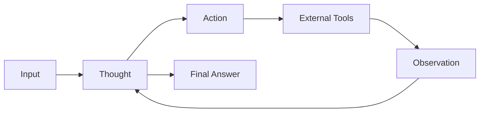
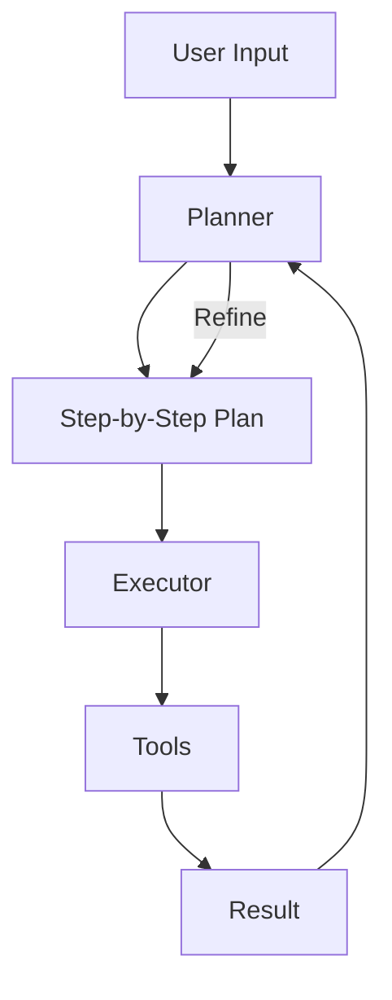
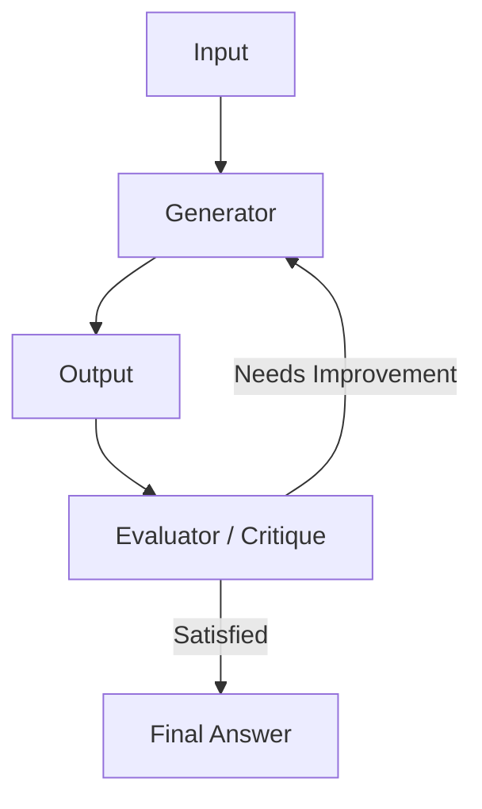
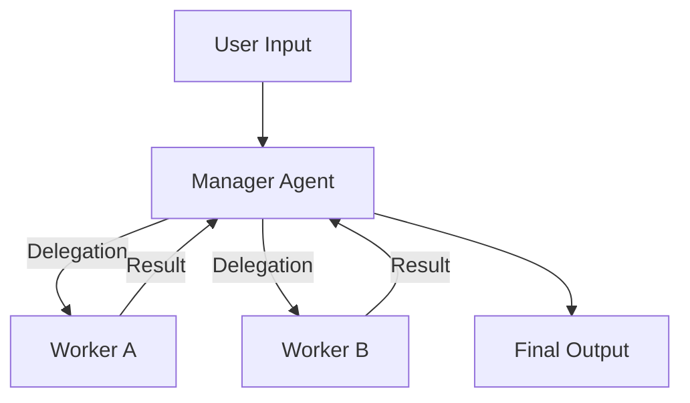
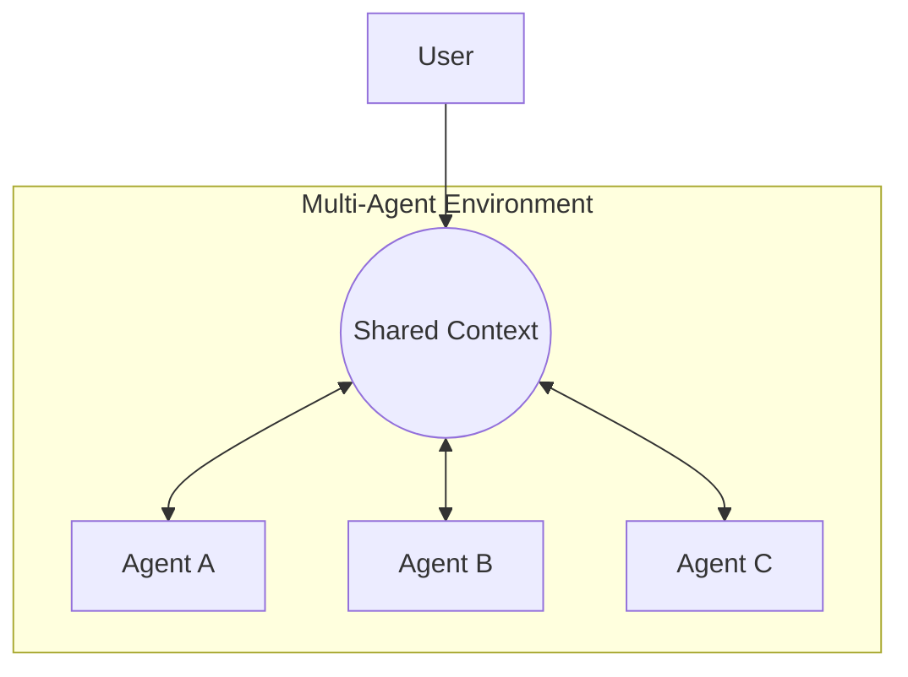

本文深入探讨各类 AI Agent 设计模式，包括 ReAct、Plan-Execute、Reflection、Multi-Agent 等，分析其原理、适用场景及代表框架，帮助开发者构建更强大的智能应用。

<!-- more -->

在 LLM（大语言模型）应用开发的演进过程中，我们正在经历从单纯的 **Prompt Engineering（提示词工程）** 向 **Agent Engineering（智能体工程）** 的范式转变。如果说 Prompt Engineering 是在教模型“如何说话”，那么 Agent Engineering 则是在教模型“如何做事”。

作为一名在 AI 领域深耕多年的开发者，我见证了 Agent 从简单的“工具调用”发展为如今复杂的“多智能体协作系统”。选择合适的 Agent 模式（Agentic Patterns）对于构建鲁棒、高效的 AI 应用至关重要。

本文将详细介绍几种核心的 Agent 设计模式，分析其优劣势，并提供选型建议。

## ReAct (Reasoning + Acting)

**ReAct** 是目前最经典、应用最广泛的 Agent 模式。它的核心思想是将**推理（Reasoning）** 和 **行动（Acting）** 交织在一起。

### 核心机制
Agent 不再直接给出答案，而是遵循一个循环：
1.  **Thought（思考）**：根据当前情况，思考下一步该做什么。
2.  **Action（行动）**：调用具体的工具（如搜索、计算器、数据库查询）。
3.  **Observation（观察）**：获取工具执行的结果。
4.  **Repeat（重复）**：根据观察结果再次思考，直到得出最终答案。

### 特点分析
*   **优点**：
    *   **减少幻觉**：通过引入外部真实数据（Observation）来支撑推理。
    *   **可解释性强**：用户可以看到 Agent 的思考路径。
    *   **灵活性**：能够处理需要多步推导的问题。
*   **缺点**：
    *   **上下文消耗**：中间步骤会占用大量 Context Window。
    *   **错误传播**：中间某一步错了，后续可能无法挽回。
    *   **延迟较高**：串行执行，每一步都需要 LLM 推理。
*   **适用场景**：
    *   需要实时数据查询的任务（如“查询昨天的股价并计算涨幅”）。
    *   中等复杂度的多步任务。
*   **代表框架**：
    *   **LangChain**: `AgentExecutor` (这是最基础的实现)。
    *   **LlamaIndex**: `ReActAgent`.

---

## Plan-and-Execute (规划与执行)

对于更复杂的任务，ReAct 模式容易迷失在细节中。**Plan-and-Execute** 模式将过程拆解为“规划师（Planner）”和“执行者（Executor）”两个阶段。

### 核心机制
1.  **Planning**：Planner Agent 接收用户指令，生成一个包含多个步骤的计划列表。
2.  **Execution**：Executor Agent 依次执行这些步骤。
3.  **Replanning (可选)**：根据执行结果，动态调整剩余的计划。

### 特点分析
*   **优点**：
    *   **长程规划能力**：适合处理步骤繁多、跨度大的任务。
    *   **关注点分离**：Planner 专注大局，Executor 专注细节，可以使用不同能力的模型（如 GPT-4 用于规划，GPT-3.5 用于执行）。
*   **缺点**：
    *   **盲目执行**：如果初始计划有误且缺乏 Replanning 机制，执行者会“一条道走到黑”。
    *   **开销**：需要更多的 API 调用。
*   **适用场景**：
    *   生成长篇报告。
    *   复杂的编码任务（先设计架构，再写代码）。
*   **代表框架**：
    *   **LangGraph**: `Plan-and-Execute` 模板。
    *   **AutoGPT**: 早期版本的核心逻辑。
    *   **BabyAGI**: 经典的迭代规划实现。

---

## Reflection / Self-Correction (反思与自修正)

在人类的工作流中，我们写完东西通常会检查一遍。**Reflection** 模式赋予了 Agent 这种“自我反思”的能力。

### 核心机制
Agent 在生成结果后，会有一个“批评者（Critique）”角色对其进行评估，如果发现错误或不足，会提出修改建议，Agent 再进行修正。这是一种典型的“System 2”慢思考模式。

### 特点分析
*   **优点**：
    *   **高质量输出**：显著提升代码生成、写作的准确性和质量。
    *   **自我修复**：能纠正一些明显的幻觉或逻辑错误。
*   **缺点**：
    *   **高延迟**：需要多轮对话才能产出结果。
    *   **成本高**：Token 消耗成倍增加。
*   **适用场景**：
    *   **代码生成**：生成代码 -> 运行报错 -> 反思错误 -> 修正代码（这是 Reflexion 论文的经典场景）。
    *   **高质量内容创作**：起草 -> 审阅 -> 修改。
*   **代表框架**：
    *   **LangGraph**: 支持构建带有循环和条件判断的反思流。
    *   **Reflexion**: 这一学术概念的具体实现。

---

## Hierarchical Agents (层级式智能体)

当任务复杂到单个 Agent 无法胜任时，我们需要组织架构。**Hierarchical** 模式采用了类似公司的“经理-员工”结构。

### 核心机制
*   **Manager / Router**：负责理解高层目标，将任务拆解并分发给下层的专家 Agent。
*   **Workers / Sub-Agents**：专注于特定领域的任务（如一个负责写 SQL，一个负责做图表，一个负责写文案）。

### 特点分析
*   **优点**：
    *   **专业化**：每个 Sub-Agent 可以挂载不同的 Prompt 和 Tools，更加专注。
    *   **上下文隔离**：Sub-Agent 的繁琐执行过程不需要完全暴露给 Manager，节省上层 Context。
*   **缺点**：
    *   **协调难度**：上下级之间的通信和指令传递容易失真。
*   **适用场景**：
    *   企业级复杂的客服系统（分流到 售前、售后、技术支持）。
    *   全栈软件开发（产品经理 -> 架构师 -> 工程师）。
*   **代表框架**：
    *   **LangChain**: 传统的 `RouterChain`。
    *   **Semantic Kernel**: 它的 Plugin 架构天然适合这种嵌套调用。

---

## Multi-Agent Collaboration (多智能体协同)

这是目前最前沿的模式。与层级式不同，**Multi-Agent** 更强调智能体之间的**平等交互**、**讨论**甚至**辩论**。

### 核心机制
多个拥有不同角色（Persona）的 Agent 共享一个环境或对话历史。它们像在一个聊天群组里一样，互相发送消息。
*   **Role-Playing**：例如一个扮演“用户”，一个扮演“开发”，一个扮演“测试”。
*   **Debate**：通过不同观点的碰撞来消除偏见。

### 特点分析
*   **优点**：
    *   **涌现能力**：多个较弱的模型通过协作可能完成强模型都做不到的任务。
    *   **解耦**：添加新功能只需增加一个新的 Agent 角色。
*   **缺点**：
    *   **死循环**：Agent 之间可能陷入无休止的客套或争论。
    *   **不可控**：交互路径难以预测，调试困难。
*   **适用场景**：
    *   模拟社会行为（如斯坦福的小镇实验）。
    *   复杂的创意工坊。
    *   全流程软件开发（如 MetaGPT）。
*   **代表框架**：
    *   **AutoGen (Microsoft)**：目前最流行的多智能体框架，支持灵活的对话流。
    *   **CrewAI**：基于 LangChain，更强调角色的扮演和任务编排。
    *   **MetaGPT**：将 SOP（标准作业程序）编码到 Agent 协作中。

---

## 模式对比与选型指南

为了帮助大家更直观地选择，我整理了以下对比图表：

| 模式 (Pattern) | 复杂度 | 延迟 (Latency) | 成本 (Cost) | 鲁棒性 (Reliability) | 最佳适用场景 (Best For) |
| :--- | :---: | :---: | :---: | :---: | :--- |
| **ReAct** | ⭐⭐ | ⭐⭐ | ⭐⭐ | ⭐⭐⭐ | 需要调用工具的实时问答、简单自动化 |
| **Plan-and-Execute** | ⭐⭐⭐ | ⭐⭐⭐ | ⭐⭐⭐ | ⭐⭐⭐ | 长流程任务、需要事先规划的复杂操作 |
| **Reflection** | ⭐⭐⭐ | ⭐⭐⭐⭐ | ⭐⭐⭐⭐ | ⭐⭐⭐⭐⭐ | 代码生成、高质量写作、不仅要做完还要做好的任务 |
| **Hierarchical** | ⭐⭐⭐⭐ | ⭐⭐⭐ | ⭐⭐⭐ | ⭐⭐⭐⭐ | 任务领域跨度大、需要专业分工的场景 |
| **Multi-Agent** | ⭐⭐⭐⭐⭐ | ⭐⭐⭐⭐⭐ | ⭐⭐⭐⭐⭐ | ⭐⭐⭐⭐ | 模拟人类团队协作、极高复杂度的开放性问题 |

### 选型建议

1.  **从简原则**：永远先从最简单的 Prompt 开始。如果 Prompt 不行，尝试 RAG。如果 RAG 不行，再考虑 ReAct Agent。
2.  **明确瓶颈**：
    *   如果 Agent 经常由着性子乱跑 -> 使用 **Plan-and-Execute** 约束它。
    *   如果 Agent 经常写出错误代码 -> 使用 **Reflection** 让它自查。
    *   如果任务太杂，一个 Prompt 写不下 -> 使用 **Hierarchical** 分拆。
3.  **拥抱生态**：不要重复造轮子。LangGraph、AutoGen 等框架已经封装了这些模式的最佳实践，建议优先使用。

## 结语

Agent 模式并非非此即彼，在实际的生产级应用中，我们往往会**混合使用**。例如，在一个 Multi-Agent 系统中，某个单独的 Agent 内部可能运行着 ReAct 循环，并在输出前进行 Reflection。
