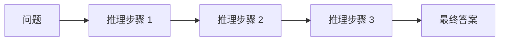
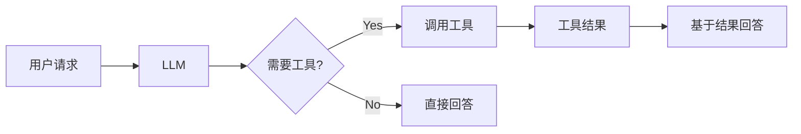
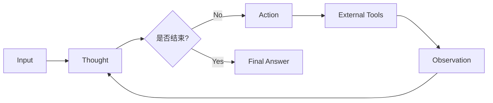
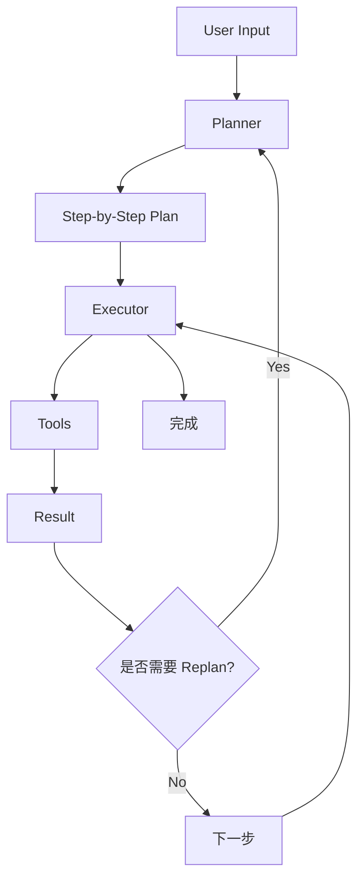
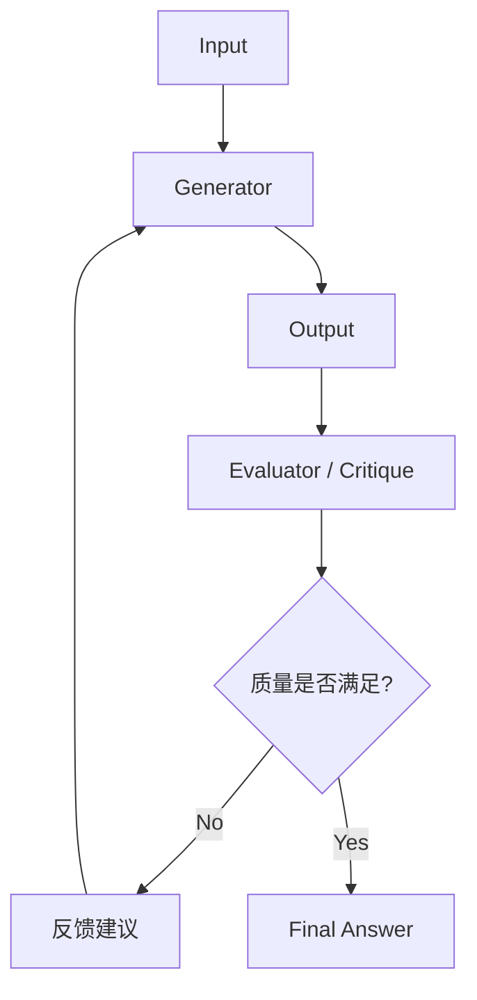
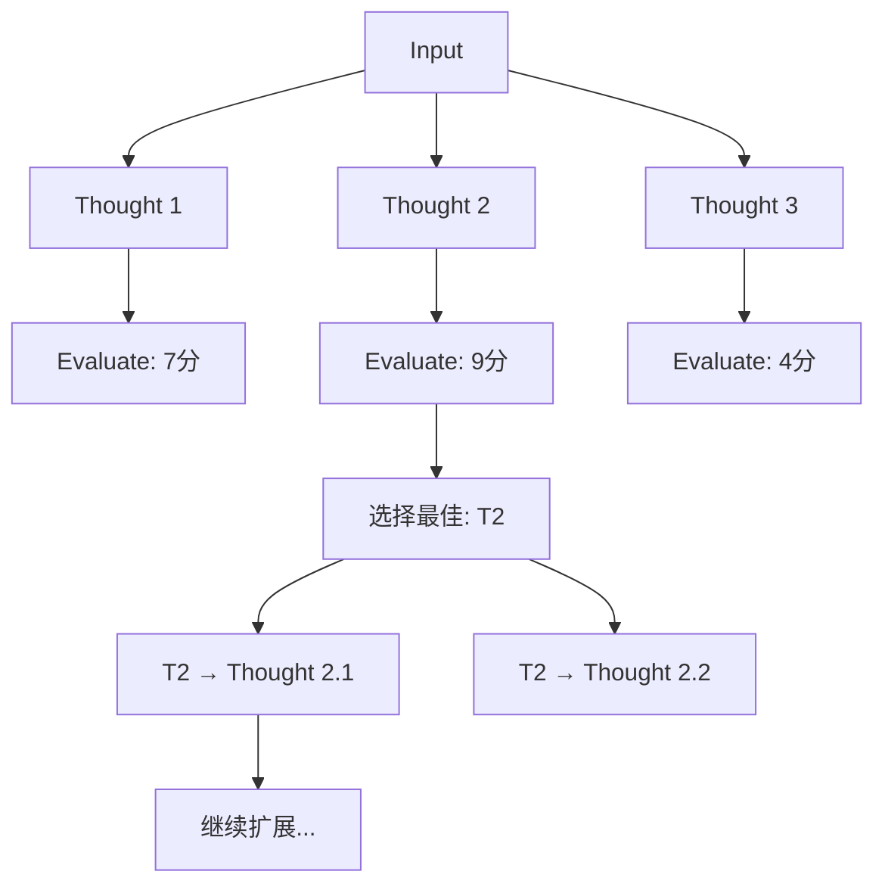
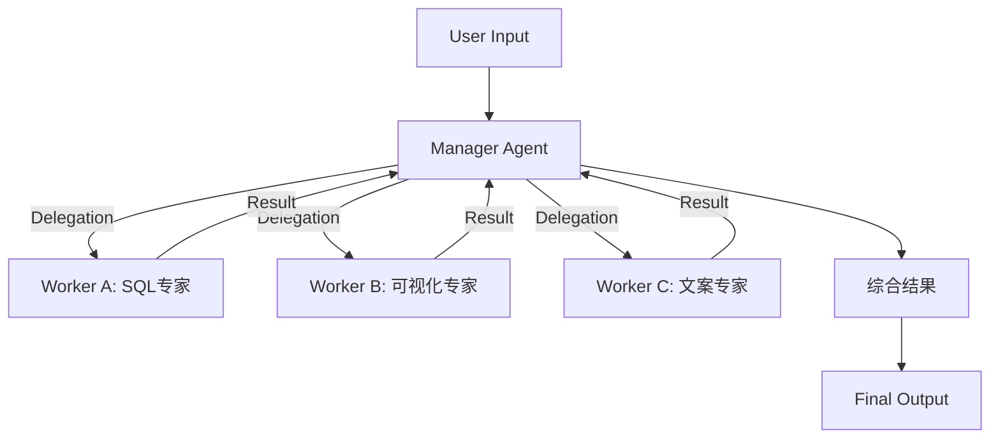
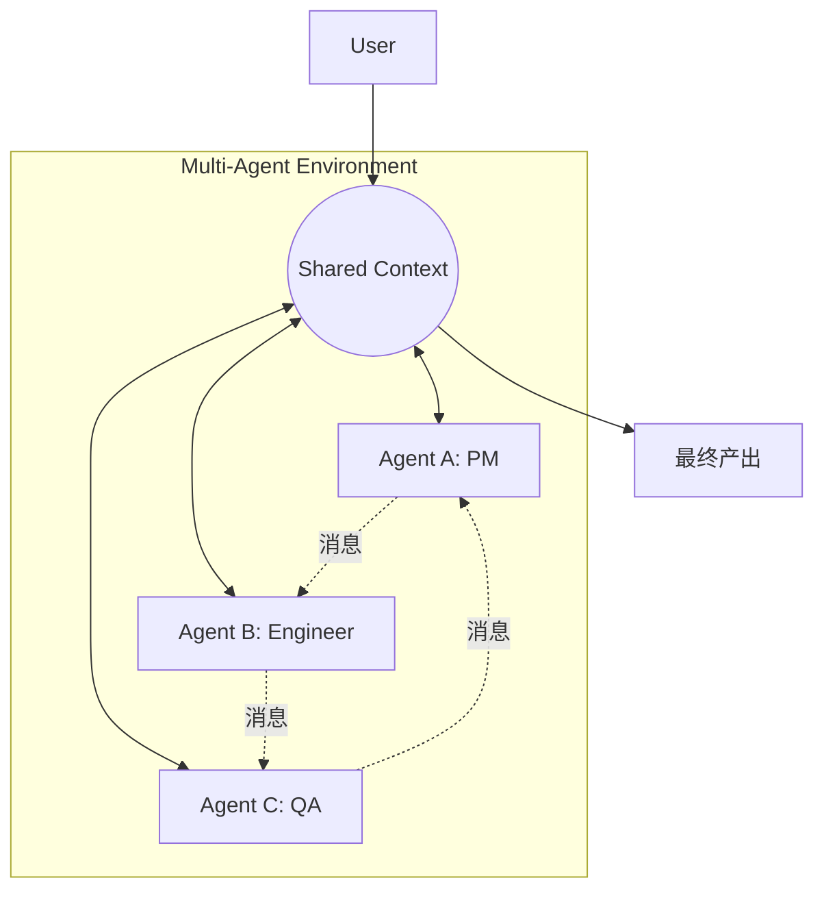

在 LLM（大语言模型）应用开发的演进过程中，我们正在经历从单纯的 **Prompt Engineering（提示词工程）** 向 **Agent Engineering（智能体工程）** 的范式转变。如果说 Prompt Engineering 是在教模型"如何说话"，那么 Agent Engineering 则是在教模型"如何做事"。

作为一名在 AI 领域深耕多年的开发者，我见证了 Agent 从简单的"工具调用"发展为如今复杂的"多智能体协作系统"。选择合适的 Agent 模式（Agentic Patterns）对于构建鲁棒、高效的 AI 应用至关重要。

本文将详细介绍 8 种核心的 Agent 设计模式，从基础到高级，从单体到协作，帮助你构建完整的 Agent 知识体系。

---

## 基础模式

### Chain-of-Thought (CoT) - 思维链

**Chain-of-Thought** 是所有推理模式的基石，也是最简单有效的 Prompt Engineering 技术。它通过引导模型"逐步思考"来提升复杂问题的解决能力。

#### 核心机制
通过在 Prompt 中添加 `"Let's think step by step"` 或提供少样本推理示例（Few-shot CoT），引导 LLM 将复杂问题分解为中间推理步骤，而非直接给出答案。



#### 学术来源
- **论文**: Wei et al., 2022, ["Chain-of-Thought Prompting Elicits Reasoning in Large Language Models"](https://arxiv.org/abs/2201.11903)
- **核心发现**: CoT 在数学、常识推理、符号操作等任务上显著提升准确率（GPT-3 从 17.7% 提升到 58.1%）

#### 特点分析
*   **优点**：
    *   **零成本**: 无需外部工具或额外 API 调用
    *   **高度可控**: 推理过程完全在模型内部
    *   **广泛适用**: 适用于几乎所有需要推理的任务
    *   **可解释性强**: 中间步骤清晰可见
*   **缺点**：
    *   **无法获取外部信息**: 只能基于模型的知识储备
    *   **幻觉风险**: 推理步骤可能看似合理但实际错误
    *   **长文本消耗**: 推理步骤会占用 token
*   **适用场景**：
    *   数学问题求解
    *   逻辑推理题
    *   常识推理
    *   不需要外部信息的复杂问题
*   **代表框架**：
    *   原生 Prompt Engineering（OpenAI, Anthropic, Google）
    *   **LangChain**: `LLMChain` 配合 CoT prompt

#### 最佳实践
```python
# Zero-shot CoT
prompt = """
问题：一个书架有 3 层，每层有 8 本书。如果我拿走了 5 本书，还剩多少本？

让我们一步步思考：
"""

# Few-shot CoT
prompt = """
问题：咖啡厅有 23 个顾客，中午来了 52 个，下午走了 15 个，现在有多少人？
思考：开始有 23 人，来了 52 人，所以是 23+52=75 人。然后走了 15 人，75-15=60 人。
答案：60 人

问题：一个书架有 3 层，每层有 8 本书。如果我拿走了 5 本书，还剩多少本？
思考：
"""
```

---

### Tool-Use / Function Calling - 工具调用

**Tool-Use** 是最基础的 Agent 模式，让 LLM 能够调用外部工具来完成无法靠自身完成的任务。它是 ReAct 的简化版，通常只进行一次工具调用。

#### 核心机制
1.  LLM 分析用户请求，判断是否需要调用工具
2.  如果需要，选择合适的工具并生成调用参数
3.  执行工具调用，获取结果
4.  基于工具返回结果生成最终答案



#### 学术来源
- **OpenAI Function Calling** ([官方文档](https://platform.openai.com/docs/guides/function-calling), 2023)
- **Toolformer** (Schick et al., 2023): [自学习使用工具的语言模型](https://arxiv.org/abs/2302.04761)

#### 特点分析
*   **优点**：
    *   **简单直接**: 最容易实现的 Agent 模式
    *   **低延迟**: 通常只需要 2 次 LLM 调用
    *   **成本低**: Token 消耗少
    *   **可靠性高**: 错误路径少
*   **缺点**：
    *   **单步限制**: 不适合需要多步推理的复杂任务
    *   **无法纠错**: 工具调用失败后难以恢复
*   **适用场景**：
    *   简单的 API 查询（天气、汇率、股价）
    *   计算器、单位转换
    *   数据库单次查询
    *   翻译、OCR 等单一功能
*   **代表框架**：
    *   **OpenAI**: `functions` / `tools` 参数
    *   **Anthropic**: `tool_use` (Claude 3+)
    *   **Google**: Gemini Function Calling
    *   **LangChain**: `create_tool_calling_agent`

#### 示例代码
```python
from openai import OpenAI

tools = [
    {
        "type": "function",
        "function": {
            "name": "get_weather",
            "description": "获取指定城市的天气",
            "parameters": {
                "type": "object",
                "properties": {
                    "city": {"type": "string", "description": "城市名称"}
                },
                "required": ["city"]
            }
        }
    }
]

response = client.chat.completions.create(
    model="gpt-4",
    messages=[{"role": "user", "content": "北京今天天气如何?"}],
    tools=tools
)

# LLM 会返回: {"name": "get_weather", "arguments": {"city": "北京"}}
```

---

### ReAct (Reasoning + Acting)

**ReAct** 是目前最经典、应用最广泛的 Agent 模式。它将 CoT 的推理能力与 Tool-Use 的行动能力结合，形成"思考-行动-观察"的循环。

#### 核心机制
Agent 不再直接给出答案，而是遵循一个循环：
1.  **Thought（思考）**：根据当前情况，思考下一步该做什么
2.  **Action（行动）**：调用具体的工具（如搜索、计算器、数据库查询）
3.  **Observation（观察）**：获取工具执行的结果
4.  **Repeat（重复）**：根据观察结果再次思考，直到满足终止条件



#### 学术来源
- **论文**: Yao et al., 2022, ["ReAct: Synergizing Reasoning and Acting in Language Models"](https://arxiv.org/abs/2210.03629)
- **核心贡献**: 将推理轨迹和任务特定行动交织，在 HotpotQA、Fever 等基准上超越 CoT

#### 特点分析
*   **优点**：
    *   **减少幻觉**：通过引入外部真实数据（Observation）来支撑推理
    *   **可解释性强**：用户可以看到 Agent 的思考路径
    *   **灵活性**：能够处理需要多步推导的问题
*   **缺点**：
    *   **上下文消耗**：中间步骤会占用大量 Context Window
    *   **错误传播**：中间某一步错了，后续可能无法挽回
    *   **延迟较高**：串行执行，每一步都需要 LLM 推理
*   **终止条件**：
    *   Agent 输出 `"Final Answer:"` 前缀
    *   达到 `max_iterations`（通常 5-10 次）
    *   连续失败超过阈值
*   **适用场景**：
    *   需要实时数据查询的任务（如"查询昨天的股价并计算涨幅"）
    *   中等复杂度的多步任务
    *   需要组合多个工具的场景
*   **代表框架**：
    *   **LangChain**: `AgentExecutor` (最基础的实现)
    *   **LlamaIndex**: `ReActAgent`
    *   **LangGraph**: `create_react_agent`

#### 实际示例
```text
用户: 比较一下特斯拉和比亚迪昨天的股价涨幅

Thought 1: 我需要先查询特斯拉昨天的股价
Action 1: stock_price(symbol="TSLA", date="2024-01-10")
Observation 1: 开盘 $238.45, 收盘 $242.84

Thought 2: 然后查询比亚迪的股价
Action 2: stock_price(symbol="BYDDY", date="2024-01-10")
Observation 2: 开盘 $52.30, 收盘 $53.12

Thought 3: 现在计算涨幅并比较
Action 3: calculate((242.84-238.45)/238.45 * 100)
Observation 3: 1.84%

Action 4: calculate((53.12-52.30)/52.30 * 100)
Observation 4: 1.57%

Thought 4: 我已经得到了所有信息，可以给出答案了
Final Answer: 特斯拉昨天涨幅为 1.84%，比亚迪为 1.57%，特斯拉涨幅更大。
```

---

## 进阶模式

### Plan-and-Execute (规划与执行)

对于更复杂的任务，ReAct 模式容易迷失在细节中。**Plan-and-Execute** 模式将过程拆解为"规划师（Planner）"和"执行者（Executor）"两个阶段。

#### 核心机制
1.  **Planning**：Planner Agent 接收用户指令，生成一个包含多个步骤的计划列表
2.  **Execution**：Executor Agent 依次执行这些步骤
3.  **Replanning (可选)**：根据执行结果，动态调整剩余的计划



#### 学术来源
- **LLM+P** (Liu et al., 2023): [使用 LLM 进行规划的框架](https://arxiv.org/abs/2304.11477)
- **AutoGPT** ([GitHub](https://github.com/Significant-Gravitas/AutoGPT)) / **BabyAGI** ([GitHub](https://github.com/yoheinakajima/babyagi)): 早期的自主 Agent 实现 (2023)

#### 计划表示方式
1.  **自然语言列表**：
    ```
    1. 搜索特斯拉 2023 年财报
    2. 提取营收和利润数据
    3. 搜索比亚迪 2023 年财报
    4. 提取营收和利润数据
    5. 对比分析并生成报告
    ```

2.  **结构化 JSON**：
    ```json
    {
      "steps": [
        {"id": 1, "action": "search", "params": {"query": "Tesla 2023 financial report"}},
        {"id": 2, "action": "extract", "params": {"fields": ["revenue", "profit"]}, "depends_on": [1]}
      ]
    }
    ```

#### 动态 Replanning 策略
*   **触发条件**：
    *   执行失败（工具调用报错）
    *   发现新信息（与原计划假设不符）
    *   用户中途修改需求
*   **调整策略**：
    *   **局部修正**：只调整后续步骤
    *   **全局重规划**：重新生成整个计划

#### 特点分析
*   **优点**：
    *   **长程规划能力**：适合处理步骤繁多、跨度大的任务
    *   **关注点分离**：Planner 专注大局，Executor 专注细节，可以使用不同能力的模型（如 GPT-4 用于规划，GPT-3.5 用于执行）
    *   **并行潜力**：独立的步骤可以并行执行
*   **缺点**：
    *   **盲目执行**：如果初始计划有误且缺乏 Replanning 机制，执行者会"一条道走到黑"
    *   **开销**：需要更多的 API 调用
    *   **计划幻觉**：LLM 可能生成不可行的计划
*   **适用场景**：
    *   生成长篇报告（调研 → 大纲 → 撰写 → 审阅）
    *   复杂的编码任务（需求分析 → 架构设计 → 编码 → 测试）
    *   数据分析工作流
*   **代表框架**：
    *   **LangGraph**: `Plan-and-Execute` 模板
    *   **TaskWeaver** (Microsoft, 2024): 面向数据分析的规划型 Agent
    *   **OpenAI Swarm** (2024): 轻量级多 Agent 编排

---

### Reflection / Self-Correction (反思与自修正)

在人类的工作流中，我们写完东西通常会检查一遍。**Reflection** 模式赋予了 Agent 这种"自我反思"的能力。

#### 核心机制
Agent 在生成结果后，会有一个"批评者（Critique）"角色对其进行评估，如果发现错误或不足，会提出修改建议，Agent 再进行修正。这是一种典型的"System 2"慢思考模式。



#### 学术来源
- **Reflexion** (Shinn et al., 2023): [通过语言反馈进行自我反思](https://arxiv.org/abs/2303.11366)
- **Self-Refine** (Madaan et al., 2023): [迭代式自我改进框架](https://arxiv.org/abs/2303.17651)

#### 反思机制类型
1.  **Self-Critique**: Agent 自己评价自己（单模型）
    ```
    Generator: [生成代码]
    Evaluator (同一个 LLM): "这段代码没有处理边界情况..."
    ```

2.  **External Critique**: 独立的 Evaluator Agent（双模型）
    ```
    Generator (GPT-3.5): [生成内容]
    Evaluator (GPT-4): "论证不够充分，需要补充数据支持..."
    ```

3.  **Tool-Based Verification**: 使用工具验证（如运行代码）
    ```
    Generator: [生成 Python 代码]
    Executor: [运行代码] --> Error: "NameError: 'x' is not defined"
    Reflection: "发现未定义的变量 x，需要在函数开头初始化"
    ```

#### 迭代终止条件
*   达到质量阈值（如测试通过、语法正确）
*   最大迭代次数（通常 3-5 次）
*   连续两次输出无显著改进（相似度 > 95%）
*   Token 预算耗尽

#### 特点分析
*   **优点**：
    *   **高质量输出**：显著提升代码生成、写作的准确性和质量
    *   **自我修复**：能纠正一些明显的幻觉或逻辑错误
    *   **持续改进**：每次迭代都基于上次的不足
*   **缺点**：
    *   **高延迟**：需要多轮对话才能产出结果
    *   **成本高**：Token 消耗成倍增加（3 轮迭代 ≈ 6x tokens）
    *   **可能陷入局部最优**：反复修改同一个小问题
*   **适用场景**：
    *   **代码生成**：生成代码 → 运行报错 → 反思错误 → 修正代码
    *   **高质量内容创作**：起草 → 审阅 → 修改
    *   **需要严格正确性的任务**（如数学证明、法律文书）
*   **代表框架**：
    *   **LangGraph**: 支持构建带有循环和条件判断的反思流
    *   **Reflexion**: 开源实现
    *   **AutoGPT**: 内置 self-critique 机制

---

### Tree-of-Thoughts (ToT) - 思维树

**Tree-of-Thoughts** 将推理过程建模为树形结构，探索多条候选路径，并通过评估选择最优路径。它适合需要"试错"和"回溯"的复杂推理任务。

#### 核心机制
1.  **生成多个候选思考路径**：对于每个问题，生成 N 个可能的下一步思考（branches）
2.  **评估每条路径**：使用 LLM 或启发式函数评估每条路径的"前景"
3.  **选择与扩展**：选择得分最高的路径继续扩展
4.  **回溯**：如果某条路径走不通，回退到上一节点尝试其他分支



#### 学术来源
- **论文**: Yao et al., 2023, ["Tree of Thoughts: Deliberate Problem Solving with Large Language Models"](https://arxiv.org/abs/2305.10601)
- **官方实现**: [princeton-nlp/tree-of-thought-llm](https://github.com/princeton-nlp/tree-of-thought-llm)
- **核心贡献**: 在 Game of 24、创意写作、迷你纵横字谜等任务上显著超越 CoT

#### 搜索策略
1.  **广度优先搜索 (BFS)**：逐层扩展，保证找到最优解
2.  **深度优先搜索 (DFS)**：快速探索深层，适合有明确目标的任务
3.  **束搜索 (Beam Search)**：每层只保留 Top-K 候选，平衡质量与效率

#### 特点分析
*   **优点**：
    *   **探索多条路径**：不会因为第一步错误而导致全盘皆输
    *   **支持回溯**：可以撤销错误决策
    *   **适合创意任务**：可以生成多个方案供选择
*   **缺点**：
    *   **成本极高**：需要生成和评估大量候选（N^D，N=分支数，D=深度）
    *   **延迟高**：需要多次 LLM 调用
    *   **实现复杂**：需要管理树结构和搜索状态
*   **适用场景**：
    *   **Game of 24**：给定 4 个数字，通过加减乘除得到 24
    *   **创意写作**：探索多个开头、多个情节发展
    *   **策略游戏**：下棋、走迷宫
    *   **数学证明**：尝试多种证明路径
*   **代表框架**：
    *   **Princeton NLP**: ToT 官方实现
    *   **LangChain**: `ToT` 实验性支持
    *   **Tree-of-Thought-Prompting**: 纯 Prompt 版本

#### 示例：Game of 24
```text
Input: 使用 4, 9, 10, 13 得到 24

Step 1 - 生成 3 个候选思考:
T1: (13 - 9) * (10 - 4) = 4 * 6 = 24 ✓
T2: (13 - 4) * 9 / 10 = ?
T3: (10 - 4) * 13 / 9 = ?

Step 2 - 评估:
Eval(T1): 10分 (已得到 24)
Eval(T2): 6分 (可能性一般)
Eval(T3): 5分 (可能性较低)

Step 3 - 选择 T1，验证正确，输出答案
```

---

## 协作模式

### Hierarchical Agents (层级式智能体)

当任务复杂到单个 Agent 无法胜任时，我们需要组织架构。**Hierarchical** 模式采用了类似公司的"经理-员工"结构。

#### 核心机制
*   **Manager / Router**：负责理解高层目标，将任务拆解并分发给下层的专家 Agent
*   **Workers / Sub-Agents**：专注于特定领域的任务（如一个负责写 SQL，一个负责做图表，一个负责写文案）



#### 通信协议
*   **Manager → Worker (任务下发)**：
    ```json
    {
      "task": "查询 2023 年销售数据",
      "context": {"database": "sales_db", "year": 2023},
      "expected_output": "JSON格式的销售统计"
    }
    ```

*   **Worker → Manager (结果上报)**：
    ```json
    {
      "status": "success",
      "result": {"total_sales": 1000000, "top_product": "iPhone"},
      "metadata": {"query_time": "0.5s"}
    }
    ```

#### 并行执行与失败处理
*   **并行执行**：独立的 Workers 可以同时工作，提升效率
    ```python
    # 并行调用
    results = await asyncio.gather(
        worker_sql.run(task_sql),
        worker_viz.run(task_viz),
        worker_writer.run(task_writer)
    )
    ```

*   **失败处理**：
    *   重试机制（最多 3 次）
    *   降级策略（使用备用 Worker）
    *   上报 Manager 重新分配

#### 层级深度
*   **推荐 2-3 层**：Manager → Workers → Sub-Workers
*   **过深的问题**：信息失真、延迟累积、调试困难

#### 特点分析
*   **优点**：
    *   **专业化**：每个 Sub-Agent 可以挂载不同的 Prompt 和 Tools，更加专注
    *   **上下文隔离**：Sub-Agent 的繁琐执行过程不需要完全暴露给 Manager，节省上层 Context
    *   **可扩展**：添加新功能只需增加新的 Worker
*   **缺点**：
    *   **协调难度**：上下级之间的通信和指令传递容易失真
    *   **单点故障**：Manager 失败会导致整个系统失败
*   **适用场景**：
    *   企业级复杂的客服系统（分流到 售前、售后、技术支持）
    *   全栈软件开发（产品经理 → 架构师 → 工程师）
    *   数据分析报告（数据采集 → 数据清洗 → 可视化 → 撰写）
*   **代表框架**：
    *   **LangChain**: 传统的 `RouterChain`
    *   **Semantic Kernel**: 它的 Plugin 架构天然适合这种嵌套调用
    *   **AutoGen**: 支持 hierarchical chat

---

### Multi-Agent Collaboration (多智能体协同)

这是目前最前沿的模式。与层级式不同，**Multi-Agent** 更强调智能体之间的**平等交互**、**讨论**甚至**辩论**。

#### 核心机制
多个拥有不同角色（Persona）的 Agent 共享一个环境或对话历史。它们像在一个聊天群组里一样，互相发送消息。
*   **Role-Playing**：例如一个扮演"用户"，一个扮演"开发"，一个扮演"测试"
*   **Debate**：通过不同观点的碰撞来消除偏见



#### 通信模式
1.  **Broadcast（广播）**：
    ```python
    agent_a.send(message="需求已确认", recipients="all")
    # 所有 Agent 都能看到这条消息
    ```

2.  **Point-to-Point（点对点）**：
    ```python
    agent_pm.send(message="请实现登录功能", recipient=agent_engineer)
    # 只有 agent_engineer 收到
    ```

3.  **Publish-Subscribe（发布订阅）**：
    ```python
    agent_a.subscribe(topic="code_review")
    agent_b.publish(topic="code_review", message="请审查我的 PR")
    # 所有订阅 code_review 的 Agent 都会收到
    ```

#### 终止条件
*   **达成共识**：所有 Agent 同意当前结果
    ```
    Agent A: "我认为这个方案可行"
    Agent B: "我同意"
    Agent C: "我也同意" → 终止
    ```

*   **最大轮次限制**：防止无休止的争论（通常 10-20 轮）
*   **人工介入**：无法自动解决时，升级给人类

#### 冲突解决机制
*   **投票**：多数 Agent 支持的方案获胜
*   **权重加权**：根据 Agent 的专业度赋予不同权重
*   **人工仲裁**：复杂冲突由人类决策

#### 特点分析
*   **优点**：
    *   **涌现能力**：多个较弱的模型通过协作可能完成强模型都做不到的任务
    *   **解耦**：添加新功能只需增加一个新的 Agent 角色
    *   **多样性**：不同 Agent 带来不同视角，减少偏见
*   **缺点**：
    *   **死循环**：Agent 之间可能陷入无休止的客套或争论
    *   **不可控**：交互路径难以预测，调试困难
    *   **成本极高**：每个 Agent 都需要独立的 LLM 调用
*   **适用场景**：
    *   模拟社会行为（如斯坦福的小镇实验）
    *   复杂的创意工坊（头脑风暴）
    *   全流程软件开发（如 MetaGPT）
    *   辩论与决策（如政策制定模拟）
*   **代表框架**：
    *   **AutoGen (Microsoft)**：目前最流行的多智能体框架，支持灵活的对话流
    *   **CrewAI**：基于 LangChain，更强调角色的扮演和任务编排
    *   **MetaGPT**：将 SOP（标准作业程序）编码到 Agent 协作中
    *   **ChatDev**: 模拟软件公司的 Agent 协作

---

## 模式对比与选型指南

为了帮助大家更直观地选择，我整理了以下对比图表：

| 模式 (Pattern) | 复杂度 | 延迟 | 成本 | 鲁棒性 | 可调试性 | 最佳适用场景 |
| :--- | :---: | :---: | :---: | :---: | :---: | :--- |
| **Chain-of-Thought** | ⭐ | ⭐ | ⭐ | ⭐⭐⭐ | ⭐⭐⭐⭐⭐ | 数学推理、逻辑问题、无需外部信息的任务 |
| **Tool-Use** | ⭐ | ⭐ | ⭐ | ⭐⭐⭐⭐ | ⭐⭐⭐⭐⭐ | 单次API调用、计算器、简单查询 |
| **ReAct** | ⭐⭐ | ⭐⭐ | ⭐⭐ | ⭐⭐⭐ | ⭐⭐⭐⭐ | 需要调用工具的实时问答、中等复杂度多步任务 |
| **Plan-and-Execute** | ⭐⭐⭐ | ⭐⭐⭐ | ⭐⭐⭐ | ⭐⭐⭐ | ⭐⭐⭐ | 长流程任务、需要事先规划的复杂操作 |
| **Reflection** | ⭐⭐⭐ | ⭐⭐⭐⭐ | ⭐⭐⭐⭐ | ⭐⭐⭐⭐⭐ | ⭐⭐⭐ | 代码生成、高质量写作、需要严格正确性的任务 |
| **Tree-of-Thoughts** | ⭐⭐⭐⭐ | ⭐⭐⭐⭐ | ⭐⭐⭐⭐⭐ | ⭐⭐⭐⭐ | ⭐⭐ | 创意任务、策略游戏、需要探索多条路径的问题 |
| **Hierarchical** | ⭐⭐⭐⭐ | ⭐⭐⭐ | ⭐⭐⭐ | ⭐⭐⭐⭐ | ⭐⭐⭐ | 任务领域跨度大、需要专业分工的场景 |
| **Multi-Agent** | ⭐⭐⭐⭐⭐ | ⭐⭐⭐⭐⭐ | ⭐⭐⭐⭐⭐ | ⭐⭐⭐ | ⭐ | 模拟人类团队协作、极高复杂度的开放性问题 |

### 选型建议

#### 1. 从简原则（由简到繁）
```
Prompt → CoT → Tool-Use → ReAct → Plan-Execute → Reflection → ToT → Multi-Agent
```
永远先从最简单的方案开始，只有在遇到瓶颈时才升级到更复杂的模式。

#### 2. 根据瓶颈选择模式

| 遇到的问题 | 推荐模式 | 原因 |
|----------|---------|-----|
| Agent 推理不够严谨 | **CoT** | 引导逐步思考 |
| 需要实时数据 | **Tool-Use** 或 **ReAct** | 调用外部工具 |
| Agent 经常"乱跑" | **Plan-and-Execute** | 事先规划，约束行为 |
| 输出质量不稳定 | **Reflection** | 自我检查与改进 |
| 第一步就错了导致全盘皆输 | **ToT** | 探索多条路径 |
| 任务领域跨度大 | **Hierarchical** | 专业分工 |
| 需要多角度思考 | **Multi-Agent** | 不同角色辩论 |

#### 3. 混合使用
在实际生产中，往往需要组合多种模式：
*   **ReAct + Reflection**: Agent 执行 ReAct 循环，每次 Action 后进行 Self-Critique
*   **Plan-Execute + Hierarchical**: Planner 生成计划，多个 Worker 并行执行
*   **Multi-Agent + Tool-Use**: 每个 Agent 都可以调用工具
*   **ToT + ReAct**: 在 ToT 的每个节点内部运行 ReAct 循环

#### 4. 框架选择建议
*   **初学者**: LangChain（生态完善、文档丰富）
*   **生产级应用**: LangGraph（更灵活、可控性强）
*   **多智能体**: AutoGen（最成熟的多智能体框架）
*   **代码生成**: Reflexion + LangGraph（支持反思循环）
*   **轻量级**: 直接使用 OpenAI / Anthropic API + 自定义逻辑

#### 5. 成本与性能权衡
*   **成本敏感**: CoT > Tool-Use > ReAct
*   **延迟敏感**: Tool-Use > ReAct > Plan-Execute
*   **质量优先**: Reflection > ToT > Multi-Agent
*   **可控性优先**: Plan-Execute > Hierarchical > ReAct

---

## 结语

Agent 模式并非非此即彼，在实际的生产级应用中，我们往往会**混合使用**。例如，在一个 Multi-Agent 系统中，某个单独的 Agent 内部可能运行着 ReAct 循环，并在输出前进行 Reflection。

### 未来趋势
1.  **Compound AI Systems**：将多种模式组合成精密系统
2.  **Agentic RAG**：结合检索增强和 Agent 推理
3.  **Human-in-the-Loop**：Agent 在关键决策点请求人类确认
4.  **可观测性**：LangSmith、Weights & Biases 等工具帮助监控和调试
5.  **Agent-as-a-Service**：云端托管的 Agent 服务（如 OpenAI Assistants API）

### 学习路径建议
1.  **Week 1-2**: 掌握 CoT 和 Tool-Use，理解基础推理和工具调用
2.  **Week 3-4**: 实践 ReAct，构建能调用多个工具的 Agent
3.  **Week 5-6**: 学习 Plan-Execute 和 Reflection，处理复杂任务
4.  **Week 7-8**: 探索 ToT 和 Hierarchical，理解高级推理和分工协作
5.  **Week 9+**: 深入 Multi-Agent，构建协同系统

### 推荐资源
*   **论文集**: [Awesome LLM Agents Papers](https://github.com/AGI-Edgerunners/LLM-Agents-Papers)
*   **框架**: LangChain, LangGraph, AutoGen, CrewAI
*   **课程**: DeepLearning.AI 的 "AI Agents in LangGraph"
*   **社区**: LangChain Discord, AutoGen GitHub Discussions
