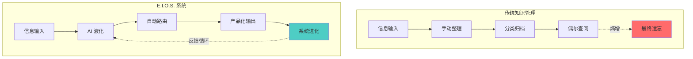
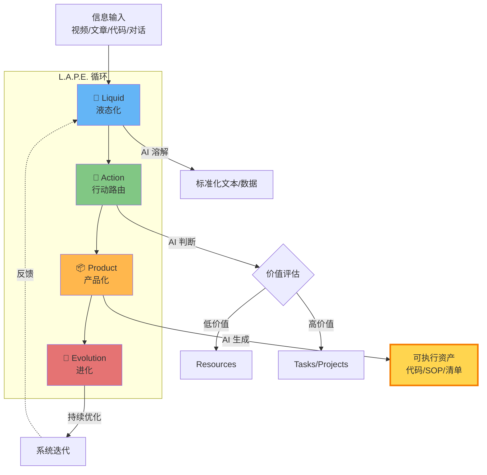
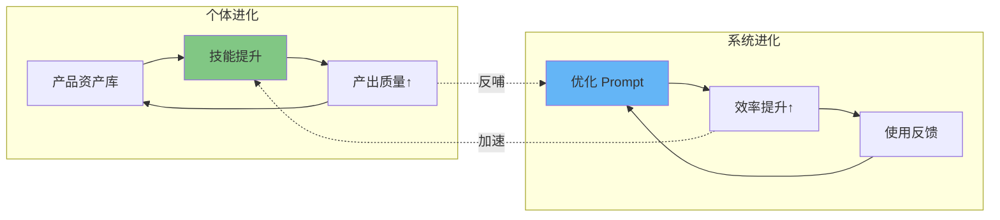
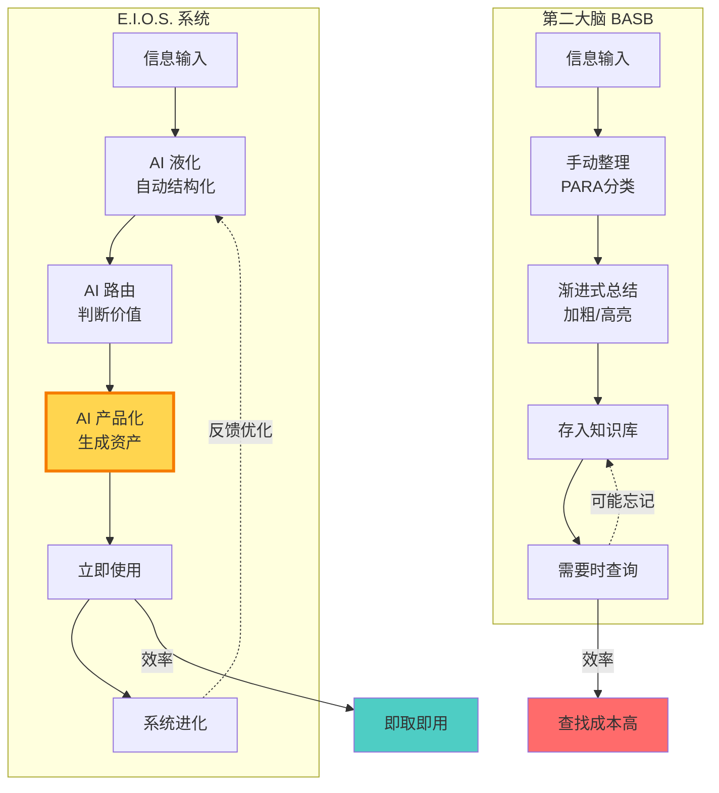

**E.I.O.S.** 是指目前在个人知识管理（PKM）和"超级个体"圈子中新兴的一套方法论，全称为 **Evolution Island Operating System（进化岛操作系统）**。

这套方法论可以被视为 **"第二大脑"的 AI 进化版**。如果说 Tiago Forte 的第二大脑（BASB）是教你如何做一个更好的"图书管理员"（整理、分类），那么 E.I.O.S. 则是教你如何利用 AI 建立一个"自动化工厂"。

---

### 为什么叫"进化岛"？

**Island（岛屿）的隐喻**：
- 在信息的海洋中，你需要一座**属于自己的岛屿**（独立的知识操作系统）
- 这座岛不是用来"堆积"信息的仓库，而是一个**可持续进化的生态系统**
- 岛上的"居民"是 AI Agent，它们帮你处理信息、生成产出

**Operating System（操作系统）的隐喻**：
- 传统知识管理是"应用软件"（你需要手动操作）
- E.I.O.S. 是"操作系统"（在后台自动运转，你只需要下指令）
- 它不是一个具体的工具，而是一套**底层的工作流和思维范式**

---

### 核心理念对比



**核心差异**：
- ❌ 传统方法：**收藏 → 整理 → 存储 → 遗忘**（单向衰减）
- ✅ E.I.O.S.：**捕获 → 液化 → 产出 → 进化**（循环增强）


### 核心定义：从"管理"到"进化"

E.I.O.S. 认为传统知识管理（如收藏、打标签、做笔记）往往陷入"**知识囤积**"的陷阱。

**典型场景**：你收藏了 1000 篇文章，做了 500 条笔记，但真正用到的不到 5%。剩下的只是心理安慰。

**E.I.O.S. 的三大转变**：
- 🎯 **目的转变**：从"存储知识"到"生产资产"
- 🤖 **手段转变**：从"人工整理"到"AI 代理驱动"  
- 💎 **价值转变**：从"拥有多少"到"产出什么"

核心理念：通过 AI Agent 将信息流**快速转化为可执行的资产**（代码、SOP、模板、清单），而非静态的笔记。

### 核心运作模型：L.A.P.E.

这是 E.I.O.S. 的灵魂，对应知识流转的四个阶段：



#### L - Liquid (液态化/溶解)

**痛点**：传统的笔记在不同软件（微信、网页、PDF）之间有壁垒，且格式固化。

**操作**：利用 AI（如 GPT/Claude）作为"溶解剂"。无论是一段 1 小时的视频、一篇长论文还是一段代码，先丢给 AI。

**目的**：将所有异构信息瞬间转化为**标准化的、可编辑的文本/数据**（结构化数据），存入统一的 Inbox。你不再手动摘抄，而是只负责"捕获"。

**实战 Prompt 示例**：

<details>
<summary>📺 处理视频内容</summary>

```
我刚看了一个关于[主题]的视频，请帮我：
1. 提取 3-5 个核心观点
2. 每个观点用一句话总结
3. 标注哪些观点可以立即应用到我的[当前项目]
4. 生成结构化的 Markdown 输出

视频文字稿/要点：
[粘贴内容或让 AI 从链接提取]
```
</details>

<details>
<summary>📄 处理学术论文</summary>

```
请将这篇论文液化为可操作的知识：
1. 核心假设是什么？
2. 关键方法论（用 3 句话）
3. 对我的[领域]有什么启发？
4. 提取 5 个可以直接引用的金句
5. 生成一个 executive summary（100字以内）

论文内容：
[粘贴 PDF 内容或关键段落]
```
</details>

<details>
<summary>💬 处理碎片想法</summary>

```
我有一些零散的想法，请帮我整理成结构化笔记：
- [想法1]
- [想法2]
- [想法3]

请：
1. 找出这些想法的共同主题
2. 按逻辑重组
3. 补充可能缺失的环节
4. 生成一个可扩展的大纲
```
</details>

#### A - Action (行动路由)

**理念**：信息不应该按"主题"分类（如"营销资料"），而应按"行动强度"分类。

**操作**：AI 或你根据内容决定它的去向：
- **低价值/未来用** → 自动沉淀入 **Resources**（作为潜在养料）
- **高价值/现在用** → 转化为 **Tasks**（具体任务）或 **Projects**（项目）

**区别**：这一步类似于 PARA 的整理，但强调由 AI 辅助判断优先级。

**行动路由矩阵**：

| 内容特征 | 行动强度 | 去向 | AI 辅助动作 |
|---------|---------|------|------------|
| 与当前项目直接相关 | ⚡⚡⚡ 极高 | **立即行动** | 生成 Task + Deadline |
| 可以改进现有流程 | ⚡⚡ 高 | **Projects** | 生成实施方案草稿 |
| 长期有用但不紧急 | ⚡ 中 | **Resources** | 打标签 + 写摘要 |
| 有趣但不确定价值 | 💤 低 | **暂存/丢弃** | AI 评估是否值得保留 |

**实战 Prompt 示例**：

```
我刚刚液化了这些信息，请帮我路由：

内容：
[粘贴液化后的笔记]

当前上下文：
- 我正在做的项目：[项目列表]
- 我近期的目标：[目标列表]
- 我的专业领域：[领域]

请分析：
1. 这个信息对我的行动价值（1-10分）
2. 如果分数 ≥7，生成具体的下一步行动（Next Action）
3. 如果分数 <7，建议存入哪个 Resource 分类
4. 是否有可以立即应用的点子？
```

#### P - Product (产品化/资产化)

**核心差异**：这是 E.I.O.S. 与传统笔记法最大的不同。

**理念**：**"不输出等于没学"**。阅读不是为了记忆，是为了生产。

**操作**：在获取信息的当下，立即利用 AI 生成一个"最小可行性产品"（MVP）：
- 读了编程文章 → 让 AI 写一段可运行的代码片段（Snippet）
- 看了营销理论 → 让 AI 生成一份针对你公司的 SOP（标准作业程序）
- 学了沟通技巧 → 让 AI 生成一个话术清单

**结果**：你得到的不是一篇"笔记"，而是一个能直接用的"工具"或"技能"。

**产品化类型矩阵**：

| 信息类型 | 传统笔记 | E.I.O.S. 产品化 |
|---------|---------|----------------|
| 技术教程 | 摘抄步骤 | ✅ 可运行的代码模板 + 注释 |
| 管理方法 | 复制理论 | ✅ 定制化的 SOP 文档 |
| 沟通技巧 | 记录要点 | ✅ 场景化话术脚本 |
| 数据分析 | 截图图表 | ✅ 可复用的分析模板（Excel/SQL） |
| 营销案例 | 保存案例 | ✅ 改编为自己的营销文案草稿 |
| 设计灵感 | 收藏图片 | ✅ 生成 Figma/CSS 实现方案 |

**实战 Prompt 示例**：

<details>
<summary>💻 技术学习 → 代码资产</summary>

```
我刚学习了[技术概念/框架]，请帮我产品化：

学习内容：
[粘贴笔记或关键点]

请生成：
1. 一个最小可运行的代码示例（< 50 行）
2. 关键部分的逐行注释
3. 3 个常见使用场景
4. 1 个可以直接复用的函数模板
5. 保存为 Snippet 的标题和标签建议

编程语言：[Python/JavaScript/etc.]
我的技术栈：[列出相关技术]
```
</details>

<details>
<summary>📊 商业方法 → SOP 文档</summary>

```
我学到了一个[商业方法论]，请帮我产品化为 SOP：

方法论内容：
[粘贴理论或步骤]

我的业务背景：
- 行业：[行业]
- 团队规模：[人数]
- 当前痛点：[描述]

请生成：
1. 标准操作流程（SOP）文档
2. 每个步骤的具体操作清单
3. 需要的工具和资源
4. 关键指标和检查点
5. 常见问题应对方案

输出格式：Markdown 表格 + 清单
```
</details>

<details>
<summary>✍️ 写作技巧 → 内容模板</summary>

```
我学了一个写作框架，请帮我产品化：

框架内容：
[描述框架要点]

请生成：
1. 可填空的写作模板（包含提示问题）
2. 针对[我的领域]的 3 个实际案例
3. 每个部分的字数建议
4. 吸引人的开头公式 × 3
5. 强有力的结尾公式 × 3

我的写作场景：[博客/营销文案/技术文档/等]
```
</details>

<details>
<summary>🎯 问题解决 → 决策清单</summary>

```
我遇到一个[问题类型]，基于这个信息请生成决策框架：

问题：[描述问题]
学到的知识：[粘贴相关信息]

请生成：
1. 决策树（用 Mermaid 语法）
2. 每个决策点的评估标准
3. 风险矩阵（高/中/低）
4. 具体的下一步行动清单
5. 需要收集的额外信息
```
</details>

**关键原则**：
- ⚡ **即时产品化**：不要等到"需要的时候"，现在就生成
- 🎯 **场景化定制**：不要通用模板，要针对你的具体情况
- ♻️ **可复用设计**：产品要能在类似场景中反复使用
- 📦 **模块化存储**：每个产品都应该是独立的、可组合的单元

#### E - Evolution (进化)

**理念**：系统和个体必须不断迭代。

**双重进化路径**：



**操作方法**：

1. **个体进化**：通过 P 阶段积累的资产，不断提升你的解决问题能力
   - 每周回顾：我产出了哪些可复用的资产？
   - 每月盘点：哪些资产被反复使用？（这些是你的核心竞争力）
   - 每季度反思：我的技能树是否在扩展？

2. **系统进化**：定期回顾（Review），优化 AI 的 Prompt（提示词）和工作流
   - 记录哪些 Prompt 效果好，建立 Prompt 库
   - 标准化高频工作流（如：技术文章 → 代码 Snippet）
   - 让系统越来越"懂你"

**进化检查清单**（每周 15 分钟）：

```markdown
## 本周进化回顾

### 📦 产出盘点
- [ ] 本周产品化了几条信息？
- [ ] 哪些产品已经被使用？效果如何？
- [ ] 哪些产品可以合并/优化？

### 🔧 系统优化
- [ ] 哪个 Prompt 特别好用？（收录到 Prompt 库）
- [ ] 哪个环节很慢？（如何自动化？）
- [ ] 发现了什么新工具/新方法？

### 🚀 下周计划
- [ ] 重点产品化哪 3 个领域的信息？
- [ ] 需要优化哪个工作流？
```

**实战 Prompt 示例**：

```
我积累了这些产品化资产，请帮我进化：

已有资产清单：
1. [资产1：类型、使用频率]
2. [资产2：类型、使用频率]
3. [资产3：类型、使用频率]
...

请分析：
1. 这些资产反映了我的什么能力矩阵？
2. 哪些是高价值资产（反复使用）？
3. 哪些资产可以组合成更强大的工具？
4. 我的知识体系有哪些空白点？
5. 下一步应该重点发展哪个方向？

输出：
- 技能地图（Mermaid mindmap）
- 资产组合建议
- 下周学习计划
```

---

### 实际应用场景

#### 场景 1：技术人员学习新框架

**传统方式**：
1. 看视频教程 → 记笔记
2. 保存到"编程学习"文件夹
3. 三个月后需要用，完全忘记了
4. 重新学一遍 ❌

**E.I.O.S. 方式**：
1. **Liquid**：看完教程后，让 AI 提取核心概念和语法要点
2. **Action**：判断是当前项目需要（高优先级）还是未来备用（Resources）
3. **Product**：让 AI 立即生成：
   - 最小可运行代码示例
   - 常用操作的 Snippet 库
   - 快速查询手册（Cheat Sheet）
4. **Evolution**：在实际项目中使用，不断优化 Snippet

**时间对比**：
- 传统方式：学习 2 小时 + 遗忘 + 重学 2 小时 = **4 小时**
- E.I.O.S.：学习 2 小时 + AI 产品化 15 分钟 = **2.25 小时**（且有可复用资产）

---

#### 场景 2：产品经理整理竞品分析

**传统方式**：
1. 截图保存竞品功能
2. 写几段文字描述
3. 存入"竞品分析"文件夹
4. 需要写 PRD 时，找不到当时的关键信息 ❌

**E.I.O.S. 方式**：
1. **Liquid**：收集竞品信息后，让 AI 结构化提取：
   - 核心功能列表
   - UI/UX 亮点
   - 用户评价关键词
2. **Action**：判断哪些功能可以立即借鉴（Projects），哪些是长期观察（Resources）
3. **Product**：让 AI 生成：
   - 功能对比矩阵表格
   - PRD 草稿（针对可借鉴功能）
   - 用户故事（User Story）清单
4. **Evolution**：每次竞品分析都积累到对比矩阵中，形成动态的竞品地图

**价值提升**：
- 传统方式：信息分散，难以对比
- E.I.O.S.：**结构化资产库，可快速生成竞品报告** ✅

---

#### 场景 3：自由职业者积累业务知识

**传统方式**：
1. 每次接项目都要重新研究
2. 过往经验散落在聊天记录、邮件、文档中
3. 无法形成可复用的知识资产 ❌

**E.I.O.S. 方式**：
1. **Liquid**：项目结束后，让 AI 提取：
   - 客户的典型需求
   - 有效的解决方案
   - 遇到的坑和应对方法
2. **Action**：分类到对应的业务领域（如"品牌设计"、"网站开发"）
3. **Product**：让 AI 生成：
   - 标准化报价模板
   - 项目交付 SOP
   - 客户沟通话术库
   - 问题解决方案库
4. **Evolution**：每个新项目都丰富这些资产，接单效率越来越高

**收益**：
- 传统方式：每次重新摸索
- E.I.O.S.：**积累可复用的业务操作系统，接单速度 ×3** ✅

---

### 快速上手：3 步启动 E.I.O.S.

#### 第 1 步：准备环境（15 分钟）

1. 注册一个 AI 账号（Claude / ChatGPT）
2. 在你的笔记工具中创建结构：
   ```
   📥 Inbox（收件箱）
   📦 Products（产品资产库）
       ├── 代码 Snippets
       ├── SOP 文档
       ├── 模板库
       └── 决策框架
   📚 Resources（参考资料）
   🗄️ Archives（归档）
   ```

#### 第 2 步：建立你的第一个产品（30 分钟）

1. 选择一篇你最近读过的对工作有用的文章
2. 使用本文的 **Liquid Prompt** 让 AI 液化内容
3. 使用 **Product Prompt** 让 AI 生成可执行资产
4. 保存到 `Products` 对应分类
5. 立即在工作中尝试使用这个产品

#### 第 3 步：建立每日习惯（持续）

每天花 **15 分钟**：
- 早上：回顾 Inbox，选择 1-2 条信息进行 L.A.P.E. 处理
- 晚上：记录今天产品化了什么，使用效果如何

**关键**：不要贪多，从每天处理 **1 条信息** 开始，养成习惯比数量重要。

---

### 常见陷阱与应对

#### ❌ 陷阱 1：AI 依赖症
**表现**：什么都让 AI 做，自己不思考。
**应对**：AI 是"放大器"不是"替代品"。你需要提供方向、判断质量、融合经验。

#### ❌ 陷阱 2：产品化过度
**表现**：为了产品化而产品化，生成一堆用不到的资产。
**应对**：只产品化**当前或近期会用**的信息。记住：**少即是多**。

#### ❌ 陷阱 3：工具焦虑
**表现**：纠结用 Notion 还是 Obsidian，花大量时间折腾工具。
**应对**：E.I.O.S. 的核心是**工作流**，不是工具。先用最熟悉的工具开始。

#### ❌ 陷阱 4：Prompt 完美主义
**表现**：花 1 小时优化 Prompt，试图让 AI 一次输出完美结果。
**应对**：接受"够用就行"。Prompt 工程本身也是进化的，不要陷入过度优化。

#### ❌ 陷阱 5：忽视 Evolution
**表现**：不断产出新资产，但从不回顾和优化。
**应对**：每周 15 分钟回顾。系统不进化，熵增依然会发生。

---

### E.I.O.S. 与 第二大脑 (BASB) 的对比

| 维度 | 第二大脑 (BASB) | E.I.O.S. 系统 |
| :--- | :--- | :--- |
| **核心工具** | 笔记软件 (Notion/Obsidian) | **AI Agent (Claude/GPT)** + 笔记软件 |
| **主要动作** | 复制、粘贴、高亮、手动总结 | **Prompt 提问、AI 转化、生成代码/SOP** |
| **分类逻辑** | PARA (项目/领域/资源/归档) | **LAPE (液化/行动/产出/进化)** |
| **对人的要求** | 需要极强的整理习惯和自律 | 需要极强的 **AI 驾驭能力 (Prompt Engineering)** |
| **最终产出** | 井井有条的知识库 | **可执行的行动方案、SOP、代码块** |

### 核心差异总览



### 何时选择 E.I.O.S.？

**适合使用 E.I.O.S. 的人**：
- ✅ 你的工作需要**快速产出**而非深度积累
- ✅ 你愿意学习 **AI Prompt 工程**
- ✅ 你重视**行动和结果**胜过完美的笔记
- ✅ 你觉得传统知识管理**维护成本太高**
- ✅ 你希望知识能**立即转化为生产力**

**更适合传统第二大脑的人**：
- 📌 你需要**深度思考和联想**（学术研究、写书）
- 📌 你享受**手动整理**的过程
- 📌 你重视**知识网络的构建**
- 📌 你对 AI 不熟悉或不信任

**最佳实践**：**混合使用**
- 用 **E.I.O.S.** 处理**工作相关、需要快速产出**的信息
- 用 **第二大脑** 管理**个人成长、长期思考**的内容

---

### 总结：从"知识管理"到"知识生产"

如果你觉得传统的"第二大脑"维护起来太累（需要手动整理太多东西），或者你觉得记了笔记却很少用到，**E.I.O.S.** 就是为你准备的进阶版本。

**本质差异**：
- **第二大脑**：教你如何成为更好的"**图书管理员**"（整理、保存、检索）
- **E.I.O.S.**：教你如何成为高效的"**知识工厂主**"（液化、路由、生产、进化）

它本质上是**利用 AI 极大地压缩了"CODE"模型中 O (Organize) 和 D (Distill) 的时间**，强迫你把精力全部集中在 **P (Product) 和 E (Evolution)** 上。

### 关键原则回顾

1. **🌊 信息要"液化"**：不要被格式困住，让 AI 统一处理
2. **🎯 分类看"行动"**：不按主题，按能否立即行动
3. **📦 知识要"产品化"**：输出可执行资产，而非静态笔记
4. **🚀 系统要"进化"**：不断优化 Prompt 和工作流

### 行动建议

**今天就开始**：
1. 打开你的 AI 工具（ChatGPT / Claude）
2. 找一篇你最近读的有价值文章
3. 复制本文的 **Liquid Prompt**，让 AI 帮你液化
4. 复制 **Product Prompt**，让 AI 生成可执行资产
5. 立即在工作中使用这个资产

记住 E.I.O.S. 的核心理念：
> **"知识的价值不在于你拥有多少，而在于你能用它生产什么。"**

不要囤积信息，去创造资产。🚀
