> 本报告以系统架构师的视角，深入分析 OpenClaw 的技术架构设计

## 整体架构设计

### 系统分层架构图

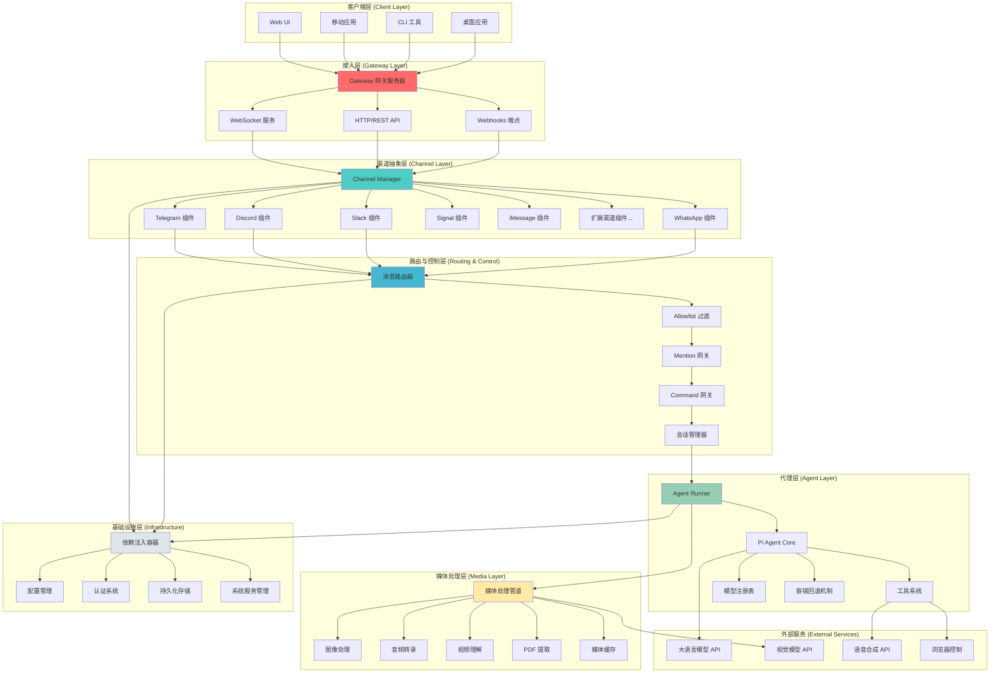

### 消息流转完整链路图

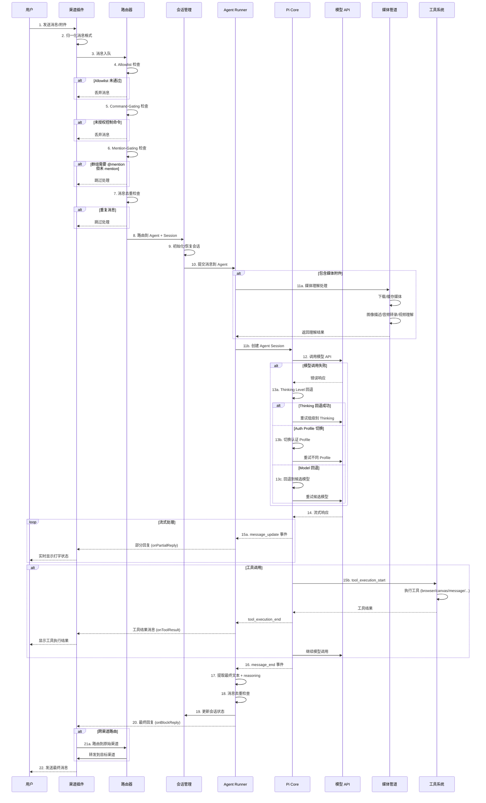

### 依赖注入与模块解耦架构

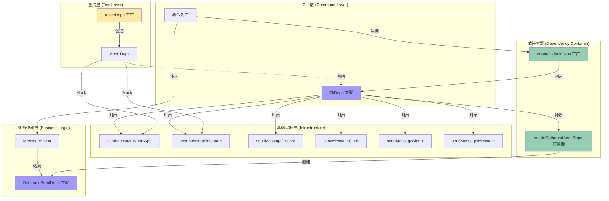

---

## 核心子系统深度分析

### Gateway 网关系统

#### 架构特性

**双协议支持**：
- **WebSocket**：用于实时双向通信、事件推送、控制台连接
  - 握手流程：`connect.challenge` → `connect` → `hello-ok`
  - 消息格式：JSON-RPC 风格 (`req`/`res`/`event`)
  - 连接管理：`GatewayWsClient` 维护连接状态
  
- **HTTP/REST**：用于 Webhooks、兼容性端点、工具调用
  - Control UI: `/`
  - Hooks: `/hooks/*` (wake, agent, mappings)
  - OpenAI 兼容: `/v1/chat/completions`
  - Tools Invoke: `/tools/invoke`

**请求路由机制**：

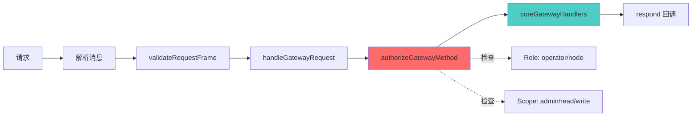

**核心特性**：
- **方法注册**：`coreGatewayHandlers` 合并核心方法与插件方法
- **权限模型**：基于角色 (operator/node) 和 scope 的细粒度授权
- **插件扩展**：`loadGatewayPlugins()` 支持动态加载插件方法

#### 会话管理策略

**两层持久化架构**：

```
1. Session Store (sessions.json)
   └─ SessionEntry: 会话元数据 + 配置覆盖
   
2. Transcript (*.jsonl)
   └─ 树形消息历史 (id + parentId)
```

**会话键格式**：

| 场景 | Session Key 格式 | 示例 |
|------|------------------|------|
| DM (main) | `agent:{agentId}:main` | `agent:assistant:main` |
| DM (per-peer) | `agent:{agentId}:dm:{peerId}` | `agent:assistant:dm:123456` |
| DM (per-channel-peer) | `agent:{agentId}:{channel}:dm:{peerId}` | `agent:assistant:telegram:dm:123456` |
| Group | `agent:{agentId}:{channel}:group:{groupId}` | `agent:assistant:telegram:group:abc` |

**会话元数据管理**：
- Token 统计：`inputTokens`, `outputTokens`, `totalTokens`, `contextTokens`
- 模型覆盖：`providerOverride`, `modelOverride`, `authProfileOverride`
- 压缩控制：`compactionCount`, `memoryFlushAt`
- 交付上下文：`deliveryContext`, `lastChannel`, `lastTo`

#### 配置热重载机制

```typescript
// 重载策略: off | restart | hot | hybrid (默认)
const hotReloadRules = {
  "hooks.*": "reload_hooks",           // 热重载 hooks
  "cron.*": "restart_cron",            // 重启 cron
  "gateway.*": "restart_gateway",      // 重启整个 Gateway
  "channels.*": "reload_channels",     // 热重载渠道配置
};
```

**防抖机制**：默认 300ms，避免频繁重载

#### 系统服务集成

| 平台 | 服务管理器 | 服务标签 | 安装路径 |
|------|-----------|---------|---------|
| macOS | launchd | `bot.molt.gateway` | `~/Library/LaunchAgents/` |
| Linux | systemd | `openclaw-gateway.service` | `~/.config/systemd/user/` |

**服务抽象层**：
- `src/daemon/service.ts` 提供统一接口
- 支持：`install`, `uninstall`, `stop`, `restart`, `isLoaded`

---

### Channel 渠道抽象层

#### 插件化架构设计

**核心接口 - ChannelPlugin**：

```typescript
type ChannelPlugin<ResolvedAccount = any> = {
  id: ChannelId;                           // 渠道标识
  meta: ChannelMeta;                       // 元数据（标签、文档）
  capabilities: ChannelCapabilities;       // 能力声明
  config: ChannelConfigAdapter;            // 配置管理
  outbound: ChannelOutboundAdapter;        // 出站消息
  status: ChannelStatusAdapter;            // 状态检查
  gateway: ChannelGatewayAdapter;          // 生命周期管理
  security: ChannelSecurityAdapter;        // 安全策略
  groups: ChannelGroupAdapter;             // 群组策略
  mentions: ChannelMentionAdapter;         // 提及处理
  threading: ChannelThreadingAdapter;      // 线程处理
  messaging: ChannelMessagingAdapter;      // 消息目标解析
  // ... 更多适配器
};
```

**适配器模式优势**：
- 统一接口，不同实现
- 可选适配器，按需实现
- 类型安全，泛型约束

#### 消息归一化流程

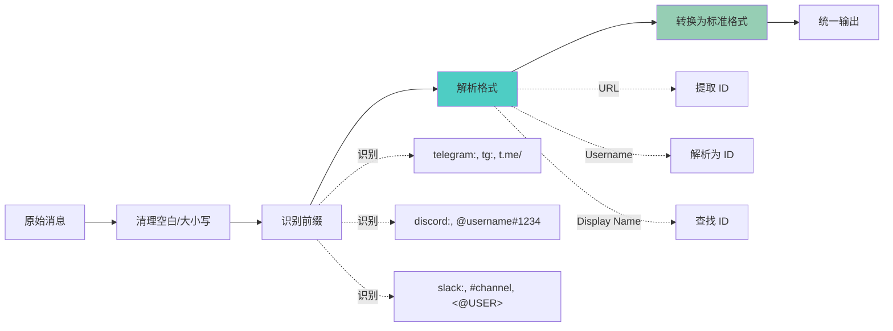

**归一化示例**：

| 渠道 | 原始输入 | 归一化输出 |
|------|---------|-----------|
| Telegram | `t.me/username` | `telegram:username` |
| Discord | `@user#1234` | `discord:user:1234` |
| Slack | `<@U123ABC>` | `slack:U123ABC` |
| WhatsApp | `+1234567890` | `whatsapp:1234567890` |

#### 权限控制三层机制

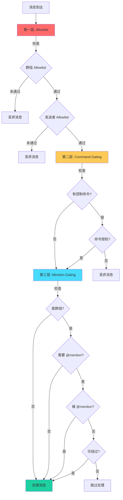

**Mention-Gating Bypass 条件**：
```typescript
shouldBypass = 
  isGroup &&
  requireMention &&
  !wasMentioned &&
  !hasAnyMention &&
  allowTextCommands &&
  commandAuthorized &&
  hasControlCommand;
```

#### 插件发现与注册

**发现流程**：

```
1. 扫描 extensions/ 目录
   └─ 查找 openclaw.plugin.json
   
2. 加载配置路径插件
   └─ 从 config.plugins.paths 读取
   
3. 优先级去重
   ├─ Workspace 插件 (优先级最高)
   ├─ Extensions 插件
   └─ External 插件 (优先级最低)
   
4. 排序
   └─ 按 meta.order 和 meta.label 排序
```

**插件清单格式**：
```json
{
  "id": "telegram",
  "type": "channel",
  "meta": {
    "label": "Telegram",
    "order": 10,
    "docsPath": "/channels/telegram"
  }
}
```

---

### Agent 代理引擎

#### Pi Agent Core 集成架构

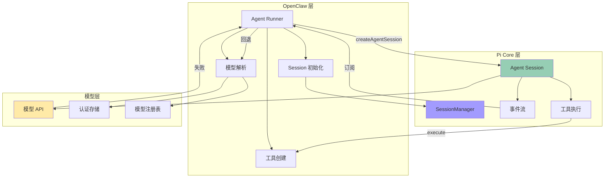

**集成流程代码**：

```typescript
// 1. 模型解析
const { model, authStorage, modelRegistry } = resolveModel(
  provider, modelId, agentDir, config
);

// 2. 会话管理器初始化
sessionManager = SessionManager.open(sessionFile);

// 3. 创建 Agent Session (Pi Core)
const { session } = await createAgentSession({
  cwd: workspace,
  agentDir,
  authStorage,
  modelRegistry,
  model,
  thinkingLevel: mapThinkingLevel(thinkLevel),
  tools: [...builtInTools, ...customTools],
  sessionManager,
});

// 4. 订阅事件流
const subscription = subscribeEmbeddedPiSession({
  session,
  onPartialReply: (payload) => { /* 流式回复 */ },
  onBlockReply: (payload) => { /* 块回复 */ },
  onToolResult: (payload) => { /* 工具结果 */ },
});
```

#### 多级容错机制

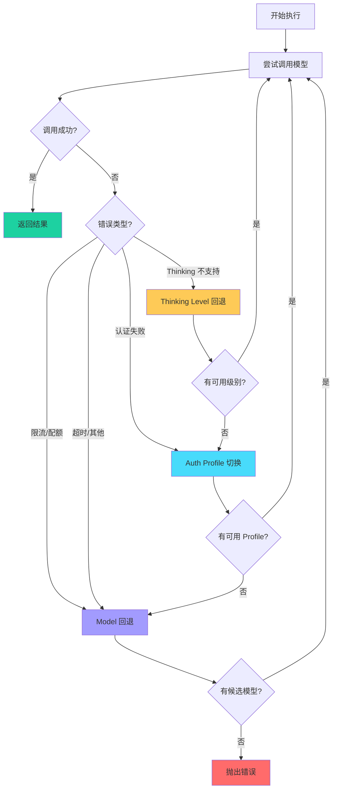

**Thinking Level 回退序列**：
```
xhigh → high → medium → low → minimal → off
```

**Model 回退配置**：
```typescript
{
  agents: {
    defaults: {
      model: "openai/gpt-4o",
      fallbacks: [
        "anthropic/claude-3-5-sonnet-20241022",
        "google/gemini-2.0-flash-exp",
        "openai/gpt-4o-mini"
      ]
    }
  }
}
```

**错误分类机制**：

| 错误类型 | 触发条件 | 回退策略 |
|---------|---------|---------|
| `rate_limit` | 429 状态码 | 切换 Auth Profile 或回退模型 |
| `quota` | 配额耗尽 | 回退模型 |
| `auth` | 401/403 状态码 | 切换 Auth Profile |
| `timeout` | 请求超时 | 回退模型 |
| `context_overflow` | 上下文溢出 | 压缩会话或回退模型 |

#### Thinking 模式技术实现

**Thinking Level 映射**：

| Level | 用途 | 成本 | 适用场景 |
|-------|------|------|---------|
| `off` | 无推理 | 最低 | 简单对话 |
| `minimal` | 最小推理 | 低 | 日常任务 |
| `low` | 低级推理 | 中低 | 编码任务 |
| `medium` | 中级推理 | 中等 | 复杂分析 |
| `high` | 高级推理 | 高 | 深度思考 |
| `xhigh` | 极高推理 | 最高 | 研究级任务 |

**Reasoning Mode 处理**：

```typescript
const reasoningMode = params.reasoningMode ?? "off";

if (reasoningMode === "stream") {
  // 流式输出 reasoning
  ctx.emitReasoningStream(
    extractThinkingFromTaggedStream(deltaBuffer)
  );
} else if (reasoningMode === "on") {
  // 在消息结束时发送完整 reasoning
  const reasoning = extractAssistantThinking(message);
  void onBlockReply({ text: formatReasoningMessage(reasoning) });
}
```

**提取与格式化**：
```typescript
// 从 <thinking>...</thinking> 标签中提取
extractAssistantThinking(msg: AssistantMessage): string

// 格式化为用户可读格式
formatReasoningMessage(rawThinking: string): string
```

#### Canvas 实时渲染能力

**Canvas 工具架构**：

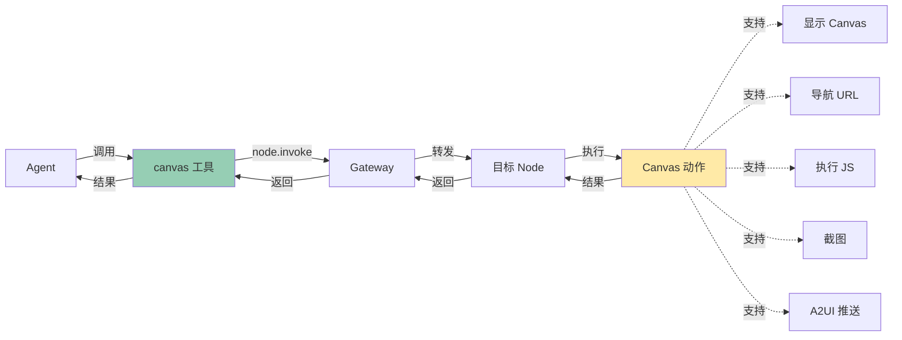

**Canvas 操作类型**：

| 操作 | 参数 | 返回 | 用途 |
|------|------|------|------|
| `present` | `position`, `size` | - | 显示 Canvas |
| `hide` | - | - | 隐藏 Canvas |
| `navigate` | `url` | - | 导航到 URL |
| `eval` | `code` | `result` | 执行 JavaScript |
| `snapshot` | `format`, `quality` | `base64` | 截图 |
| `a2ui_push` | `jsonl` | - | 推送 UI 定义 |
| `a2ui_reset` | - | - | 重置 A2UI |

**A2UI 集成**：
- JSONL 格式的声明式 UI
- 支持表单、按钮、列表等组件
- 实时响应用户交互

#### 工具系统与插件架构

**工具分类体系**：

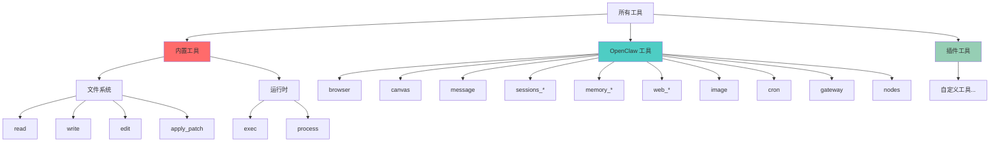

**工具策略系统**：

```typescript
// 工具 Profile 定义
type ToolProfileId = "minimal" | "coding" | "messaging" | "full";

const TOOL_PROFILES: Record<ToolProfileId, ToolProfilePolicy> = {
  minimal: {
    allow: ["session_status"]
  },
  coding: {
    allow: [
      "group:fs",           // 文件系统组
      "group:runtime",      // 运行时组
      "group:sessions",     // 会话组
      "browser",
      "canvas",
      "web_search",
      "web_fetch"
    ]
  },
  messaging: {
    allow: [
      "group:messaging",    // 消息组
      "sessions_list",
      "web_search",
      "web_fetch"
    ]
  },
  full: {}  // 允许所有工具
};
```

**工具策略层级**：
```
1. 全局策略: tools.global.allow/deny
2. Provider 策略: tools.providers[provider].allow/deny
3. Agent 策略: agents[agentId].tools.allow/deny
4. Group 策略: channels[channel].groups[groupId].tools.allow/deny
5. Subagent 策略: 继承父会话策略
```

**插件工具解析**：
```typescript
const pluginTools = resolvePluginTools({
  context: {
    config,
    workspaceDir,
    agentDir,
    agentId,
    sessionKey,
    messageChannel,
    sandboxed,
  },
  existingToolNames: new Set(tools.map(t => t.name)),
  toolAllowlist: options?.pluginToolAllowlist,
});
```

---

### Media 媒体理解管道

#### 多模态处理架构

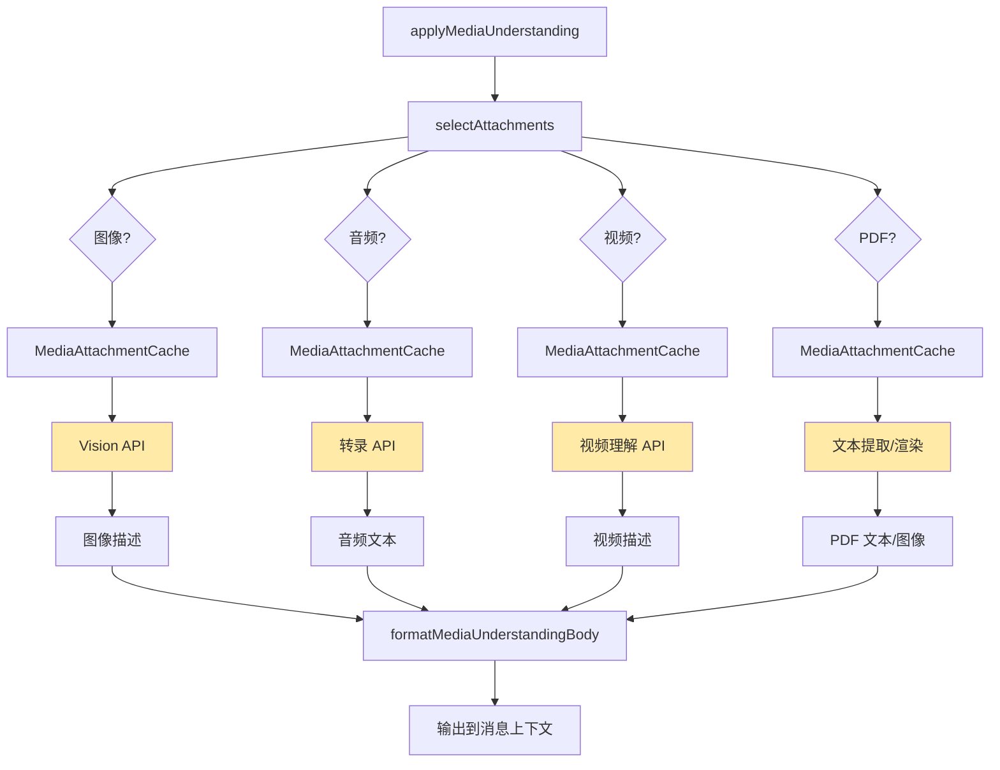

**处理能力顺序**：
```typescript
const CAPABILITY_ORDER: MediaUnderstandingCapability[] = 
  ["image", "audio", "video"];
```

**并发控制**：
- 默认并发数：2
- 使用 `runWithConcurrency()` 限制并发
- Worker 池模式，任务队列

#### 提供商适配策略

**提供商注册表**：

| 提供商 | 图像 | 音频 | 视频 | 默认模型 |
|--------|------|------|------|---------|
| OpenAI | ✅ | ✅ | ❌ | gpt-4o-mini |
| Anthropic | ✅ | ❌ | ❌ | claude-3-5-sonnet |
| Google | ✅ | ✅ | ✅ | gemini-2.0-flash-exp |
| Deepgram | ❌ | ✅ | ❌ | nova-3 |
| Groq | ❌ | ✅ | ❌ | whisper-large-v3-turbo |
| Minimax | ✅ | ❌ | ❌ | - |

**统一接口抽象**：

```typescript
type MediaUnderstandingProvider = {
  id: string;
  capabilities: MediaUnderstandingCapability[];
  
  describeImage?: (req: ImageDescriptionRequest) 
    => Promise<ImageDescriptionResult>;
  
  transcribeAudio?: (req: AudioTranscriptionRequest) 
    => Promise<AudioTranscriptionResult>;
  
  describeVideo?: (req: VideoDescriptionRequest) 
    => Promise<VideoDescriptionResult>;
};
```

#### SSRF 攻击防护体系

**多层防护架构**：

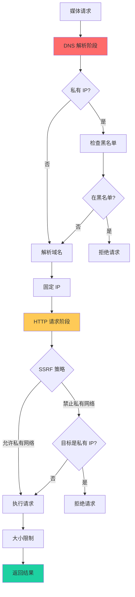

**私有 IP 检测**：
```typescript
const PRIVATE_IP_RANGES = [
  "10.0.0.0/8",           // 私有 A 类
  "172.16.0.0/12",        // 私有 B 类
  "192.168.0.0/16",       // 私有 C 类
  "127.0.0.0/8",          // 本地回环
  "169.254.0.0/16",       // 链路本地
  "100.64.0.0/10",        // 共享地址空间
  "fc00::/7",             // IPv6 唯一本地
  "fe80::/10",            // IPv6 链路本地
  "::1/128",              // IPv6 回环
];
```

**主机名黑名单**：
```typescript
const BLACKLIST_HOSTNAMES = [
  "localhost",
  "metadata.google.internal",
  "169.254.169.254",      // AWS/Azure 元数据
  ".local",
  ".internal",
  ".localhost"
];
```

**防护点**：
1. DNS 解析前检查主机名
2. DNS 解析后检查 IP
3. 固定 IP 防止 DNS 重绑定
4. HTTP 请求前再次检查
5. 响应大小限制

#### 媒体转换与压缩

**图像处理管道**：

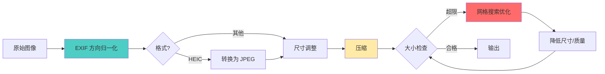

**压缩策略**：

| 格式 | 质量范围 | 最大尺寸 | 优化策略 |
|------|---------|---------|---------|
| JPEG | 70-90 | 2048px | 质量降级 |
| PNG | 压缩级别 6-9 | 2048px | 网格搜索 |
| WebP | 70-90 | 2048px | 质量降级 |

**PNG 网格搜索优化**：
```typescript
// 尺寸候选: 2048, 1600, 1200, 1000, 800
// 压缩级别: 6, 7, 8, 9
// 目标: 找到第一个满足大小限制的组合
for (const maxDim of [2048, 1600, 1200, 1000, 800]) {
  for (const compressionLevel of [6, 7, 8, 9]) {
    const result = await resizeToPng({ maxDim, compressionLevel });
    if (result.size <= maxBytes) return result;
  }
}
```

**PDF 处理策略**：
```typescript
// 1. 文本优先
const textContent = await extractPdfText(buffer);
if (textContent.length >= MIN_TEXT_LENGTH) {
  return { text: textContent };
}

// 2. 图像回退
const images = await renderPdfPages(buffer, {
  maxPages: 4,
  maxPixels: 4_000_000,
  scale: calculateScale(pdfWidth, pdfHeight, maxPixels),
});
return { images };
```

#### 缓存策略

**三级缓存架构**：

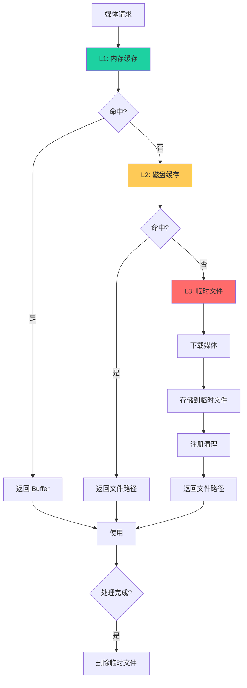

**MediaAttachmentCache 结构**：
```typescript
type AttachmentCacheEntry = {
  buffer?: Buffer;          // 内存 Buffer
  resolvedPath?: string;    // 已解析的本地路径
  tempPath?: string;        // 临时下载路径
  statSize?: number;        // 文件大小
};

const cache = new Map<number, AttachmentCacheEntry>();
```

**媒体服务器缓存**：
- 存储目录：`~/.openclaw/media/`
- TTL：默认 2 分钟
- 单次使用：响应后延迟 50ms 删除
- 大小限制：5MB
- 自动清理：定期清理过期文件

**清理策略**：
```typescript
// 1. 响应后清理
setTimeout(() => fs.unlink(mediaPath), 50);

// 2. 定期清理
setInterval(() => cleanOldMedia(), CLEANUP_INTERVAL);

// 3. 进程退出清理
process.on("exit", () => cleanup());
```

---

### 路由与控制层

#### 路由决策树

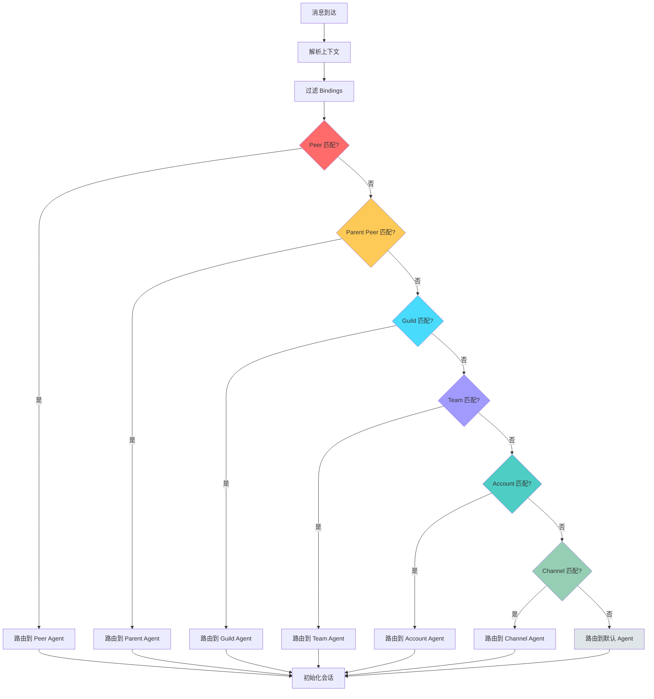

**路由优先级表**：

| 优先级 | 匹配类型 | 匹配字段 | 使用场景 | 示例 |
|--------|---------|---------|---------|------|
| 1 | Peer | `match.peer` | 特定对话绑定 | `{ kind: "dm", id: "123" }` |
| 2 | Parent Peer | `match.peer` (parent) | Thread 继承 | 回复线程消息 |
| 3 | Guild | `match.guildId` | Discord 服务器 | `guild-abc123` |
| 4 | Team | `match.teamId` | MS Teams | `team-xyz789` |
| 5 | Account | `match.accountId` (非 `*`) | 账户级别 | `default` |
| 6 | Channel | `match.accountId` = `*` | 通道级别 | 所有 Telegram 账户 |
| 7 | Default | 无匹配 | 默认 Agent | `main` |

#### 消息去重机制

**去重键格式**：
```typescript
const dedupeKey = 
  `${provider}|${accountId}|${sessionKey}|${peerId}|${threadId}|${messageId}`;
```

**去重缓存配置**：
```typescript
{
  ttl: 20 * 60 * 1000,      // 20 分钟
  maxEntries: 5000,          // 最大 5000 条
  cleanupInterval: 60000     // 1 分钟清理一次
}
```

**去重检查时机**：
```typescript
// 在 dispatchReplyFromConfig 入口
if (shouldSkipDuplicateInbound(ctx)) {
  recordProcessed("skipped", { reason: "duplicate" });
  return; // 跳过处理
}
```

#### 会话隔离策略

**隔离级别对比**：

| 隔离级别 | Session Key 格式 | DM 隔离 | 群组隔离 | 跨渠道 |
|---------|------------------|---------|---------|--------|
| `main` | `agent:{id}:main` | 所有共享 | 按群组 | 是 |
| `per-peer` | `agent:{id}:dm:{peerId}` | 按发送者 | 按群组 | 否 |
| `per-channel-peer` | `agent:{id}:{ch}:dm:{peerId}` | 按渠道+发送者 | 按渠道+群组 | 否 |
| `per-account-channel-peer` | `agent:{id}:{ch}:{acc}:dm:{peerId}` | 按账户+渠道+发送者 | 按账户+渠道+群组 | 否 |

**身份链接**：
```typescript
{
  session: {
    identityLinks: {
      canonical: [
        "telegram:123456",
        "discord:user#1234",
        "slack:U123ABC"
      ]
    }
  }
}
```

当消息来自链接的身份时，会路由到同一个会话。

#### 回复分发流程

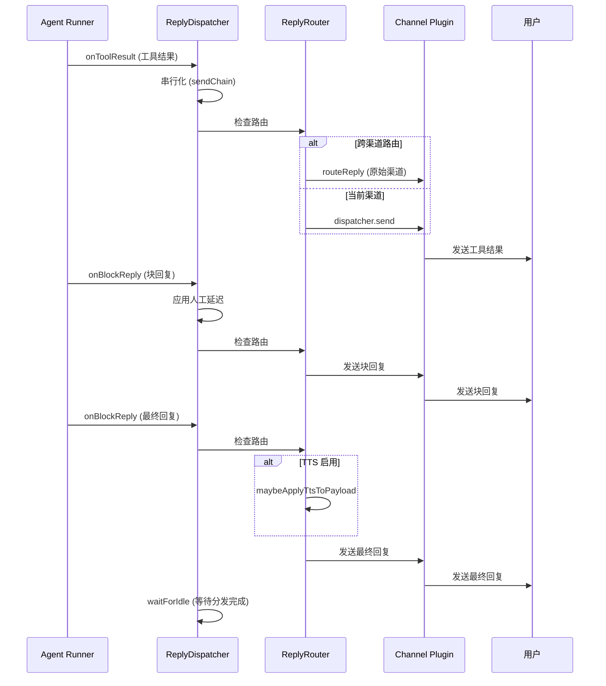

**ReplyDispatcher 特性**：
- **串行化分发**：`sendChain` Promise 链确保顺序
- **人工延迟**：block 回复之间插入延迟（模拟打字）
- **响应前缀**：`responsePrefix` 模板化前缀
- **心跳条带**：`onHeartbeatStrip` 处理长时间等待

**跨渠道路由条件**：
```typescript
const shouldRouteToOriginating =
  isRoutableChannel(originatingChannel) &&
  originatingTo &&
  originatingChannel !== currentSurface;
```

当用户在 Telegram 发起对话，但当前回复渠道是 Slack 时，会路由回 Telegram。

---

## 设计亮点与技术特色

### 架构设计亮点

#### 分层解耦架构
- **清晰的职责边界**：Gateway、Channel、Agent、Media 各司其职
- **依赖注入模式**：通过 `CliDeps` 和 `OutboundSendDeps` 实现模块解耦
- **适配器模式**：`ChannelPlugin` 适配器统一不同渠道的接口
- **工厂模式**：`createDefaultDeps` 和 `createOutboundSendDeps` 管理依赖创建

#### 插件化扩展能力
- **渠道插件**：`extensions/` 目录支持动态加载新渠道
- **工具插件**：Agent 工具系统支持插件工具
- **Gateway 插件**：Gateway 方法可通过插件扩展
- **模型插件**：模型注册表支持自定义模型

#### 容错与高可用
- **三级回退机制**：Thinking Level → Auth Profile → Model
- **错误分类**：精确识别错误类型并采取相应策略
- **配置热重载**：部分配置变更无需重启
- **健康检查**：Gateway 健康端点、Channel 状态探测

#### 安全防护体系
- **多层 SSRF 防护**：DNS 固定 + 私有 IP 检测 + 主机名黑名单
- **权限控制三层机制**：Allowlist → Command-Gating → Mention-Gating
- **会话隔离**：支持多级隔离策略
- **路径遍历防护**：`openFileWithinRoot` 和 ID 格式验证

#### 性能优化
- **并发控制**：媒体处理并发限制
- **流式处理**：大文件流式读取、Agent 流式回复
- **三级缓存**：内存 + 磁盘 + 临时文件
- **智能压缩**：PNG 网格搜索优化

### 技术创新点

#### 消息流转编排
- **统一归一化**：不同渠道消息统一为标准格式
- **智能路由**：7 级优先级路由决策
- **去重机制**：基于组合键的 TTL 缓存去重
- **跨渠道路由**：支持消息在不同渠道间路由

#### Agent 执行引擎
- **Pi Core 深度集成**：无缝集成 Pi Agent Core
- **事件驱动架构**：基于事件订阅的流式处理
- **Block Reply 系统**：支持中间回复和最终回复
- **消息去重**：避免 messaging tool 重复发送

#### 媒体理解管道
- **多模态统一抽象**：图像/音频/视频/PDF 统一处理
- **提供商适配**：支持多种 Vision/Audio API
- **智能压缩**：自动优化媒体大小
- **SSRF 防护**：多层次安全防护

#### 工具系统设计
- **工具策略分级**：全局 → Provider → Agent → Group → Subagent
- **工具组抽象**：`group:fs`、`group:runtime` 等组概念
- **插件工具**：支持外部插件提供工具
- **Canvas 集成**：实时渲染和 A2UI 支持

### 可扩展性

#### 新增渠道
```typescript
// 1. 创建插件目录
extensions/new-channel/
  ├── openclaw.plugin.json
  ├── index.ts
  └── src/
      ├── channel.ts
      └── runtime.ts

// 2. 实现 ChannelPlugin 接口
export const newChannelPlugin: ChannelPlugin = {
  id: "new-channel",
  capabilities: { chatTypes: ["dm", "group"] },
  config: { /* 配置适配器 */ },
  outbound: { /* 出站适配器 */ },
  // ... 其他适配器
};

// 3. 自动发现和注册
// 无需修改核心代码
```

#### 新增工具
```typescript
// 在插件中定义工具
export function createMyTool(): AnyAgentTool {
  return {
    name: "my_tool",
    description: "My custom tool",
    parameters: MyToolSchema,
    execute: async (toolCallId, params) => {
      // 工具实现
      return jsonResult({ status: "ok" });
    },
  };
}

// 工具会自动被 resolvePluginTools 发现
```

#### 新增媒体提供商
```typescript
// 在 src/media-understanding/providers/ 添加
export const myProvider: MediaUnderstandingProvider = {
  id: "my-provider",
  capabilities: ["image", "audio"],
  describeImage: async (req) => {
    // 实现图像描述
  },
  transcribeAudio: async (req) => {
    // 实现音频转录
  },
};

// 在 buildMediaUnderstandingRegistry 中注册
```

### 可测试性

#### 依赖注入测试
```typescript
// 轻松替换依赖
const makeDeps = (overrides: Partial<CliDeps> = {}): CliDeps => ({
  sendMessageWhatsApp: vi.fn(),
  sendMessageTelegram: vi.fn(),
  ...overrides,
});

const deps = makeDeps({
  sendMessageWhatsApp: vi.fn().mockResolvedValue({ success: true }),
});
```

#### Mock 替换
```typescript
// 在测试中 Mock 整个模块
vi.mock("../cli/deps.js", async () => {
  const actual = await vi.importActual("../cli/deps.js");
  return {
    ...actual,
    createDefaultDeps: () => mockDeps,
  };
});
```

#### 单元测试覆盖
- Gateway：请求路由、会话管理、权限检查
- Channel：消息归一化、权限控制、路由决策
- Agent：模型回退、工具执行、流式处理
- Media：SSRF 防护、压缩优化、提供商适配

### 运维友好

#### 系统服务集成
- **macOS launchd**：自动启动、日志管理
- **Linux systemd**：用户服务、自动重启
- **Docker 支持**：容器化部署

#### 可观测性
- **健康检查**：Gateway `/health` 端点
- **状态探测**：Channel `status --probe`
- **日志系统**：统一日志格式、macOS 统一日志集成
- **事件广播**：Gateway 事件实时推送

#### 配置管理
- **热重载**：部分配置无需重启
- **配置迁移**：自动迁移旧版本配置
- **配置验证**：加载时验证配置正确性
- **环境变量**：支持环境变量覆盖

---

## 总结

### 核心优势

1. **架构清晰**：分层设计，职责明确，易于理解和维护
2. **高度解耦**：依赖注入和适配器模式实现模块解耦
3. **强扩展性**：插件化架构，支持渠道/工具/模型扩展
4. **容错健壮**：多级回退机制，确保系统稳定运行
5. **安全可靠**：多层安全防护，权限控制完善
6. **性能优化**：并发控制、流式处理、多级缓存
7. **可测试性**：依赖注入支持，单元测试覆盖完善

### 技术栈特点

- **语言**：TypeScript (ESM)，类型安全
- **运行时**：Node 22+，Bun 支持
- **AI 集成**：Pi Agent Core，多模型支持
- **消息渠道**：10+ 种渠道，插件化扩展
- **媒体处理**：多模态统一处理，多提供商适配
- **系统集成**：launchd、systemd、Docker

### 适用场景

- **AI 助手平台**：多渠道统一接入的 AI 助手
- **自动化工具**：支持复杂工作流的自动化
- **多模态应用**：需要处理图像/音频/视频的应用
- **企业集成**：需要集成多种通讯工具的企业应用

OpenClaw 的架构设计展现了现代 AI 应用的最佳实践，通过清晰的分层、强大的扩展能力和完善的安全机制，构建了一个健壮、灵活、易于维护的 AI 工具链平台。

---

## 附录

### 关键文件索引

#### Gateway 网关系统
- `src/gateway/server.impl.ts` - Gateway 主实现
- `src/gateway/server-methods.ts` - 请求路由与授权
- `src/gateway/server-ws-runtime.ts` - WebSocket 运行时
- `src/gateway/session-utils.ts` - 会话管理工具

#### Channel 渠道抽象层
- `src/channels/plugins/types.plugin.ts` - ChannelPlugin 接口定义
- `src/channels/plugins/catalog.ts` - 插件发现与加载
- `src/channels/allowlist-match.ts` - Allowlist 匹配逻辑
- `src/channels/command-gating.ts` - Command-Gating 实现
- `src/channels/mention-gating.ts` - Mention-Gating 实现

#### Agent 代理引擎
- `src/agents/pi-embedded-runner/run.ts` - Agent Runner 主入口
- `src/agents/pi-embedded-runner/model.ts` - 模型解析
- `src/agents/failover-error.ts` - 容错错误分类
- `src/agents/model-fallback.ts` - 模型回退机制
- `src/agents/pi-tools.ts` - 工具创建
- `src/agents/tools/canvas-tool.ts` - Canvas 工具

#### Media 媒体理解管道
- `src/media-understanding/apply.ts` - 媒体理解入口
- `src/media-understanding/providers/index.ts` - 提供商注册表
- `src/infra/net/ssrf.ts` - SSRF 防护
- `src/media/image-ops.ts` - 图像处理
- `src/media/fetch.ts` - 媒体获取

#### 路由与控制层
- `src/routing/resolve-route.ts` - 路由决策
- `src/auto-reply/reply/session.ts` - 会话初始化
- `src/auto-reply/reply/dispatch-from-config.ts` - 回复分发
- `src/auto-reply/reply/reply-dispatcher.ts` - ReplyDispatcher
- `src/auto-reply/reply/inbound-dedupe.ts` - 消息去重

#### 依赖注入
- `src/cli/deps.ts` - CliDeps 定义
- `src/cli/outbound-send-deps.ts` - 依赖转换
- `src/infra/outbound/deliver.ts` - OutboundSendDeps

### 参考链接

- 官方文档：https://docs.openclaw.ai
- GitHub 仓库：https://github.com/openclaw/openclaw
- Pi Agent Core：https://github.com/badlogic/pi-mono
