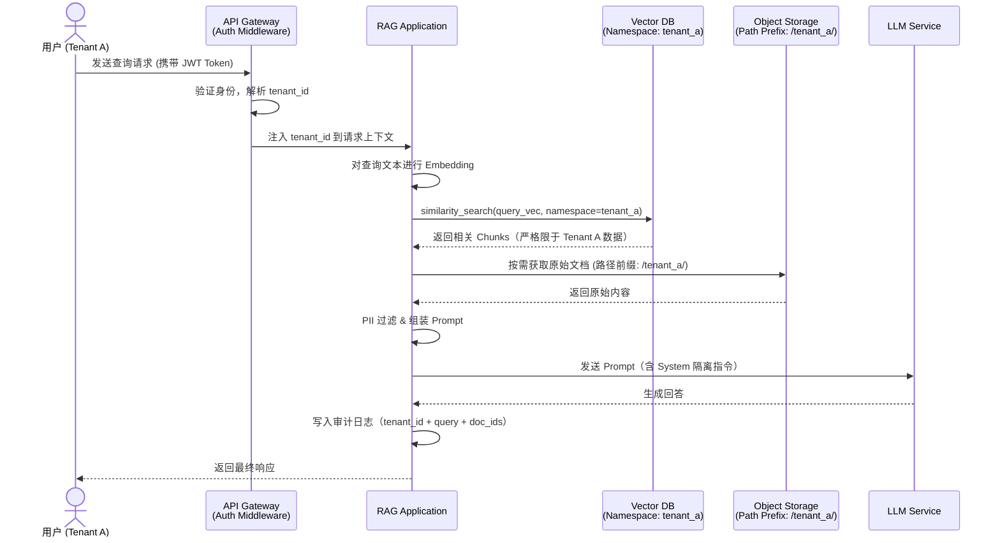

随着企业级 AI 应用的爆发，RAG（Retrieval-Augmented Generation）已成为连接私有数据与大模型的标准架构。然而，当我们将 RAG 从 Demo 推向 SaaS 生产环境时，最大的挑战并非来自模型的智能程度，而是 **数据安全与多租户隔离**。

想象一下，用户 A 询问"我的合同条款是什么？"，RAG 系统检索到的却是用户 B 的工资单。这不仅是 Bug，更是灾难性的合规事故。

如何在保证系统性能和成本效益的同时，实现"滴水不漏"的严格多租户隔离？本文将深入拆解 RAG 系统中多租户隔离的技术手段与最佳实践。

---

## RAG 的隔离维度

在传统 CRUD 应用中，多租户隔离通常通过数据库字段 `tenant_id` 解决。但在 RAG 系统中，链路更长、组件更复杂，隔离需要在以下三个层面同时生效：

1.  **存储层（Storage Layer）：** 向量数据库与原始文档的物理或逻辑隔离。
2.  **检索层（Retrieval Layer）：** 确保语义搜索范围严格限定在租户命名空间内。
3.  **生成层（Generation Layer）：** 防止 Prompt 注入导致的跨租户数据泄露，以及上下文污染。

下图展示了一次多租户 RAG 请求的完整链路，以及隔离机制发生的关键节点：



---

## 技术方案详解

我们将隔离方案由轻量到严格分为三个等级，企业应根据业务场景（如：内部工具 vs 金融级 SaaS）选择合适的策略。

### 策略一：逻辑隔离 —— 经济高效

这是最常见的 SaaS 模式。所有租户的数据存储在同一个向量索引（Index）或集合（Collection）中，通过元数据（Metadata）进行区分。

*   **实现方式：**
    *   在 Data Ingestion（数据写入）阶段，为每个 Document Chunk 强制附加 `tenant_id` 标签。
    *   在 Query（检索）阶段，通过向量数据库的 `filter` 参数强制进行预过滤（Pre-filtering）。
*   **代码示例 (伪代码)：**
    ```python
    # 写入时
    vector_store.add_documents(
        texts=["合同内容..."], 
        metadatas=[{"tenant_id": "tenant_001", "doc_type": "contract"}]
    )

    # 检索时（必须强制注入 Filter）
    results = vector_store.similarity_search(
        query="我的合同规定",
        filter={"tenant_id": "tenant_001"} # 核心隔离逻辑
    )
    ```
*   **优点：** 资源利用率极高，运维成本低，无需频繁创建资源。
*   **缺点：** 属于"软隔离"。如果代码逻辑出现 Bug（如忘记加 Filter），会导致数据泄露。且当 Collection/Index 的数据量达到亿级时，过滤性能可能下降（需要在检索结果上做后置过滤，降低 ANN 召回效率）。
*   **适用场景：** 中小企业 SaaS，非敏感数据场景。

### 策略二：命名空间隔离 —— 性能平衡

许多现代向量数据库提供了 Namespace 或 Partition 的概念，这是一种介于逻辑和物理之间的隔离。不同数据库的实现机制略有差异：

*   **Pinecone Namespace：** 在同一 Index 的底层存储中按 Namespace 做数据分片，查询时必须指定 Namespace，引擎仅在该分片内执行 ANN 搜索，有效缩小搜索范围。
*   **Milvus Partition：** 将一个 Collection 物理切分为多个分区，查询时加载指定分区，资源隔离效果更明显，内存占用可精确控制。
*   **Weaviate Tenant（Multi-tenancy API）：** 从 v1.20 起原生支持 Multi-tenancy，每个租户的数据存储在独立的磁盘分片上，可按需冷热切换（active/inactive）。

*   **实现方式：**
    *   在同一个物理索引（Index）下，为每个租户创建一个独立的 Namespace。
    *   查询时必须指定 Namespace，否则无法访问任何数据，这一约束由数据库层强制执行。
*   **技术优势：**
    *   **查询速度：** 引擎只需在特定分区内进行 ANN（近似最近邻）搜索，有效减少参与计算的向量数量。
    *   **安全性：** 比纯元数据过滤更安全，查询范围由数据库层而非应用层决定。
*   **适用场景：** 大多数企业级 RAG 应用，租户数量在千/万级别。

### 策略三：物理隔离 —— 极致安全

为每个租户创建独立的 Collection，甚至独立的 Database 实例/集群。

*   **实现方式：**
    *   租户 A 使用 `Collection_A`，租户 B 使用 `Collection_B`。
    *   配合 RBAC（基于角色的访问控制），为不同租户分配不同的数据库连接凭证（User/Password）。
*   **优点：** 物理层面的"硬隔离"。即使应用层代码写错，也不可能查到隔壁租户的数据。支持针对大客户做独立的资源扩容和性能调优。
*   **缺点：** 
    *   **资源浪费：** 即使是空闲租户也会占用索引内存资源。
    *   **运维噩梦：** 维护数万个 Collection 的 Schema 变更和版本升级非常困难；同时需要管理大量数据库连接，连接池爆炸问题需要专门的连接代理（如 PgBouncer 类方案）来处理。
    *   **冷启动问题：** 新租户需要动态创建资源，有一定初始化延迟。
*   **适用场景：** 银行、医疗、政府项目，或付费意愿极高的 VIP 客户。

---

## 进阶：构建零信任 RAG 架构

仅仅依靠数据库隔离是不够的，我们需要在架构层面实施纵深防御。

### 应用层的中间件拦截

不要在每个业务函数里手动写 `filter={"tenant_id": ...}`，这是 Bug 的温床。
应在 Service 层或 DAO 层实现拦截器：

*   **Context 传递：** 从 HTTP Request Header（JWT）中解析 `tenant_id`，并存入请求上下文。在 Python 中，同步服务使用 `threading.local()`，异步服务（FastAPI/asyncio）应使用 `contextvars.ContextVar` 以避免协程间上下文串扰。
*   **自动注入：** 封装向量数据库 Client，重写 `search` 方法，自动从上下文读取 `tenant_id` 并注入过滤条件，业务代码完全无感知。

```python
import contextvars
from functools import wraps

# 请求上下文变量（适用于 asyncio）
_current_tenant: contextvars.ContextVar[str] = contextvars.ContextVar("current_tenant")

class TenantAwareVectorStore:
    def __init__(self, client):
        self._client = client

    def search(self, query_vec, **kwargs):
        tenant_id = _current_tenant.get()  # 自动从上下文获取，无需调用方传入
        return self._client.search(query_vec, filter={"tenant_id": tenant_id}, **kwargs)
```

### 原始文档存储隔离

RAG 系统中除向量数据库外，还需存储原始文档（PDF、Word 等）用于引用或 Re-ranking。对象存储（如 S3、OSS）的隔离同样不可忽视：

*   **路径前缀隔离：** 所有文档写入 `s3://your-bucket/{tenant_id}/...`，通过 IAM Policy 或 Presigned URL 限制跨前缀访问。
*   **独立 Bucket（高安全）：** 为 VIP 租户分配独立 Bucket，配置独立的加密 Key 和访问策略，满足 GDPR/数据本地化合规要求。
*   **删除联动：** 租户注销时，向量数据和原始文档需要同步清理，建议通过任务队列异步执行，并记录清理审计日志。

### 密钥管理

针对高敏感场景，可以结合加密技术：
*   **静态加密（at-rest encryption）：** 每个租户拥有独立的数据加密 Key（DEK），DEK 由租户自己的主密钥（KEK）加密后存储，即 BYOK 模式。云厂商（AWS KMS、阿里云 KMS）原生支持此模式。
*   **向量层加密：** 向量本身理论上难以精确还原原文，但在极高安全等级下，仍需关注成员推断攻击（Membership Inference Attack）风险。高安全场景可在向量入库前结合租户 Key 进行加盐混淆（需定制算法，成本较高，需权衡必要性）。

### LLM 上下文隔离

虽然 LLM 本身是无状态的，但必须防止 Prompt 注入攻击窃取上下文。
*   **系统提示词（System Prompt）：** 明确指令模型"仅使用提供的上下文回答，严禁通过已知训练数据回答其他租户信息"。
*   **PII 过滤：** 在将检索到的 Chunks 发送给 LLM 之前，使用 NLP 模型识别并掩盖敏感信息（如身份证号、手机号），防止其出现在公有云 LLM 的服务日志中。

### 审计日志

审计日志是合规（GDPR、SOC2、等保）的刚性要求，也是事后溯源的唯一依据：

*   **记录内容：** 每次检索应记录 `tenant_id`、`user_id`、查询原文（或其哈希）、命中的 `doc_id` 列表、响应时间、时间戳。
*   **存储要求：** 审计日志必须与业务数据物理隔离，写入专用的不可篡改存储（如 append-only 日志系统），并设置合理的保留期（通常 ≥ 6 个月）。
*   **异常告警：** 对异常访问模式（如高频跨文档访问、深夜批量查询）设置实时告警，及早发现数据侦察行为。

### 速率限制与配额管理

多租户场景下，"嘈杂邻居"（Noisy Neighbor）问题会导致一个租户的突发流量影响其他租户的服务质量：

*   **Query 级限流：** 在 API Gateway 层按 `tenant_id` 做请求速率限制（如 Token Bucket 算法）。
*   **存储配额：** 限制每个租户可写入的向量数量上限，防止恶意或失控的数据写入。
*   **资源隔离（高级）：** 对 VIP 租户分配独立的推理资源（如独立 Embedding 服务实例），从根本上消除资源竞争。

---

## 架构选型建议表

| 维度 | 方案 A：元数据过滤 | 方案 B：命名空间/分区 | 方案 C：物理分库/分表 |
| :--- | :--- | :--- | :--- |
| **隔离级别** | 低 (代码级) | 中 (数据库逻辑级) | 高 (资源级) |
| **成本** | $ | $$ | $$$$ |
| **性能** | 数据量大时下降 | 稳定 | 极佳 (无干扰) |
| **运维复杂度** | 低 | 中 | 极高 |
| **推荐场景** | 免费用户、小微企业 | 标准企业版 SaaS | 金融/政企私有化部署 |

---

## 最佳实践清单

在上线你的多租户 RAG 系统前，请核对以下几点：

- [ ] **强制性 Filter：** 是否在最底层的数据访问代码中强制注入了 Tenant ID？（通过中间件自动注入，禁止业务层手动传参）
- [ ] **索引设计：** 向量数据库的索引是否对 `tenant_id` 字段建立了过滤索引？（能显著提升元数据过滤性能）
- [ ] **Object Storage：** 原始文档存储是否也按租户进行了路径/Bucket 隔离，并配置了相应的访问策略？
- [ ] **数据清理：** 当租户注销时，是否有机制能通过 `tenant_id` 快速物理删除其所有向量数据与原始文档？
- [ ] **审计日志：** 每次检索操作是否写入了包含 tenant_id、user_id、命中 doc_id 的不可篡改审计日志？
- [ ] **速率限制：** 是否在 API Gateway 层按 `tenant_id` 配置了请求速率限制，防止嘈杂邻居问题？
- [ ] **渗透测试：** 是否尝试过构造恶意 Query 试图检索其他租户数据？（包括 Prompt 注入攻击测试）
- [ ] **权限隔离：** 知识库的管理接口（上传、删除）是否也校验了租户权限？

---

## 结语

RAG 的多租户隔离不是一个单一的功能，而是一套贯穿数据存储、检索逻辑和模型交互的防御体系。在设计之初选择正确的隔离策略（通常推荐 **命名空间/分区隔离** 作为默认起点），辅以应用层中间件、审计日志和速率限制，可以避免后期重构的巨大痛苦。

**安全是 AI 落地的基石，别让你的 RAG 系统成为数据泄露的漏洞。**
