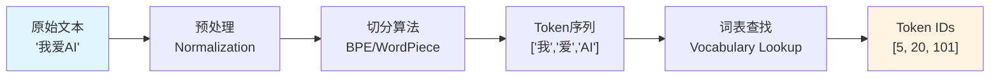
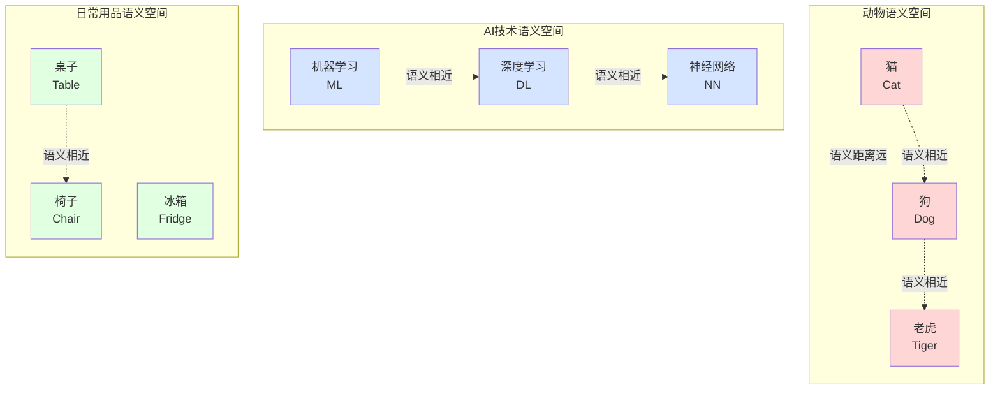
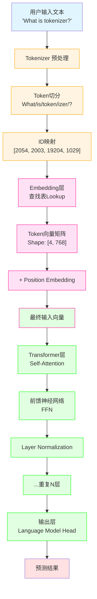
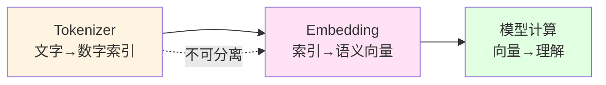

在接触大语言模型（LLM）或自然语言处理（NLP）时，**Tokenizer（分词器）** 和 **Embedding（嵌入）** 是两个出现频率极高，却常被初学者混淆的概念。它们似乎都在做“把文字变成数字”的工作，但它们在模型中的角色、原理和目的却截然不同。

简单来说：**Tokenizer 负责“认字”（将文本切分为离散的符号），而 Embedding 负责“理解”（将符号转化为包含语义的数学向量）。**

---

## Tokenizer（分词器）：LLM 的“字典”

大模型无法直接阅读我们看到的文字（如中文汉字或英文字母），它只能处理数字。Tokenizer 的工作就是充当**翻译前的“查字典”步骤**。

### 核心任务
Tokenizer 的作用是将非结构化的 **原始文本（Raw Text）** 切分成模型能处理的最小单位——**Token**，并将这些 Token 映射为唯一的整数索引（Input IDs）。

### 工作流程
1.  **切分（Splitting）：** 依据特定的规则（如空格、标点、或更高级的算法如 BPE、WordPiece），将句子切开。
2.  **映射（Mapping）：** 在一个预先构建好的词表（Vocabulary）中查找每个片段对应的编号。

### 举个例子
假设我们的输入是：“**我爱AI**”

*   **Tokenizer 切分：** `["我", "爱", "AI"]`
*   **查表映射：** 假设在词表中，“我”是 5，“爱”是 20，“AI”是 101。
*   **Tokenizer 输出：** `[5, 20, 101]`

### 关键特征
*   **输出是离散的整数：** 比如 `101` 代表 "AI"，`102` 可能就代表完全不相关的 "香蕉"。在 Tokenizer 的阶段，数字之间没有数学上的关联（101 和 102 仅仅是索引的先后，没有语义上的远近）。
*   **它不包含语义：** Tokenizer 不知道"我"和"你"是相似的代词，它只知道它们在词表中位于不同的位置。

### 工作流程可视化



### 常见的Tokenizer算法

现代大语言模型主要使用以下几种分词算法：

| 算法 | 代表模型 | 特点 | 优势 |
| :--- | :--- | :--- | :--- |
| **BPE (Byte Pair Encoding)** | GPT系列 | 基于字节对频率合并 | 能有效处理未登录词，压缩率高 |
| **WordPiece** | BERT | 基于似然最大化 | 平衡了词汇量和表达能力 |
| **SentencePiece** | Llama、T5 | 直接处理原始文本 | 语言无关，支持多语言 |
| **Unigram** | mBART | 基于概率模型 | 可以生成多种分词方案 |

### 特殊Token说明

在词表中，除了普通词汇，还有一些特殊的Token用于控制模型行为：

*   **`[PAD]`**：填充符，用于对齐不同长度的序列
*   **`[UNK]`**：未知词，处理词表外的词汇
*   **`[CLS]`**：句子开始符（BERT）
*   **`[SEP]`**：句子分隔符
*   **`[MASK]`**：掩码符（用于MLM任务）
*   **`<|endoftext|>`**：文本结束符（GPT）

---

## Embedding（嵌入层）：LLM 的“大脑连接”

如果说 Tokenizer 只是把文字变成了身份证号，那么 Embedding 就是把这些身份证号变成了**包含丰富特征的个人档案**。

### 核心任务
Embedding 是一个查找表（Lookup Table）或神经网络层，它将 Tokenizer 输出的**整数 ID** 转换为一个**高维稠密向量（Dense Vector）**。这个向量是一串浮点数，代表了该词在语义空间中的位置。

### 工作流程
1.  **接收输入：** 拿到 Tokenizer 传来的 ID（例如 `101`）。
2.  **向量化：** 在高维空间中找到 `101` 对应的向量表示。

### 举个例子
继续上面的“**我爱AI**”，输入 ID 为 `[5, 20, 101]`。

*   **Embedding 转化：**
    *   `5` ("我") → `[0.12, -0.58, 0.99, ...]`
    *   `20` ("爱") → `[0.77, 0.23, -0.11, ...]`
    *   `101` ("AI") → `[-0.45, 0.88, 0.02, ...]`

### 关键特征
*   **输出是连续的浮点数向量：** 比如 768 维或 4096 维的数组。
*   **它包含语义（Semantic Meaning）：** 这是 Embedding 最神奇的地方。在训练过程中，模型学会了将含义相近的词放在向量空间中靠近的位置。
    *   例如：在向量空间中，"猫"和"狗"的距离会非常近，而"猫"和"冰箱"的距离会很远。
    *   经典的例子：**King（国王） - Man（男人） + Woman（女人） ≈ Queen（女王）**。这种数学运算只有在 Embedding 层之后才能实现，在 Tokenizer 阶段的整数 ID 上是做不到的。

### 语义空间可视化



### Embedding 维度的选择

不同模型使用不同的向量维度，这是性能与效率的权衡：

| 模型 | Embedding维度 | 参数量影响 |
| :--- | :--- | :--- |
| BERT-base | 768 | 较小，训练快 |
| BERT-large | 1024 | 中等 |
| GPT-3 | 12288 | 极大，表达能力强 |
| Llama-2-7B | 4096 | 平衡性能与效率 |

**维度越大**：
*   ✅ 表达能力越强，能捕捉更细微的语义差异
*   ✅ 模型容量更大，理解能力更强
*   ❌ 计算成本更高，内存占用更大
*   ❌ 更容易过拟合（在小数据集上）

### Position Embedding

值得注意的是，除了词嵌入（Token Embedding），模型还会加入 **位置嵌入（Position Embedding）** 来告诉模型词的先后顺序：

```
最终输入 = Token Embedding + Position Embedding
```

这是因为 Transformer 架构本身不具备序列顺序的概念，需要通过位置编码来补充位置信息。

---

## 核心区别对比表

为了更直观地理解，我们可以从以下几个维度对比：

| 维度 | Tokenizer (分词器) | Embedding (嵌入层) |
| :--- | :--- | :--- |
| **输入** | 原始文本字符串 (Text) | 整数索引 (Token IDs) |
| **输出** | 整数索引列表 (如 `[101, 205]`) | 高维浮点数向量 (如 `[0.1, -0.9...]`) |
| **数据性质** | **离散的 (Discrete)**：数字仅代表位置 | **连续的 (Continuous)**：数字代表特征 |
| **是否包含语义** | **不包含**：只做硬性映射 | **包含**：捕捉词义、词性、关联 |
| **可训练性** | 通常在预训练前固定 (如 BPE 算法统计得出) | 是模型参数的一部分，随模型训练不断优化 |
| **类比** | **字典索引**：查到“苹果”在第 10 页 | **对苹果的理解**：圆的、红的、水果、甜的 |

---

## 它们是如何协作的？（Pipeline）

在任何一个现代大语言模型（如 GPT-4, Llama 3, BERT）中，数据流向都是固定的串行关系：

1.  **用户输入：** `What is tokenizer?`
2.  **Tokenizer 层：** 切分并映射为 ID → `[2054, 2003, 19204, 1029]`
3.  **Embedding 层：** 将 ID 转化为向量 → `[[0.1, ...], [0.5, ...], ...]`
4.  **Transformer 层（Attention）：** 模型在向量基础上进行复杂的数学运算（注意力机制等），理解上下文。

### 完整数据流转过程



### 数据形状变化

让我们追踪一个具体的例子，看数据是如何逐步变化的：

| 阶段 | 数据内容 | 数据类型 | 数据形状 |
| :--- | :--- | :--- | :--- |
| **原始输入** | `"What is tokenizer?"` | String（字符串） | - |
| **Tokenizer输出** | `[2054, 2003, 19204, 1029]` | List[int]（整数列表） | `[4]` |
| **Embedding输出** | `[[0.12, -0.58, ...], [...], ...]` | Tensor（浮点张量） | `[4, 768]` |
| **+Position Embedding** | `[[0.15, -0.50, ...], [...], ...]` | Tensor（浮点张量） | `[4, 768]` |
| **经过Transformer** | `[[0.88, 0.23, ...], [...], ...]` | Tensor（浮点张量） | `[4, 768]` |
| **输出层** | `[[0.01, 0.85, 0.03, ...]]` | Tensor（概率分布） | `[4, 50257]` |

**关键观察：**
*   **Tokenizer → Embedding**：从**离散**变为**连续**
*   **Embedding → Transformer**：维度保持不变，但语义理解加深
*   **最后输出**：从隐藏表示转换为词表概率分布（用于预测下一个词）

---

## 常见误区与易混淆点

在学习过程中，很多初学者会产生以下误解：

### ❌ 误区1：认为 Tokenizer 的输出已经包含语义

**错误理解：** "既然 Token ID `101` 代表 'AI'，那它不就已经有意义了吗？"

**正确理解：** Token ID 只是**索引编号**，就像身份证号一样。身份证号 `330106` 和 `330107` 相邻，但这不代表这两个人有任何关系。只有经过 Embedding 层，模型才能理解词与词之间的语义关联。

### ❌ 误区2：混淆 Token ID 和 Embedding 向量

**错误理解：** "Token ID `[101, 102]` 不就是二维向量吗？"

**正确理解：** 
*   Token ID `[101, 102]` 是**两个整数**，不是向量
*   Embedding 后是 **两个高维向量**，如 `[[0.1, 0.2, ..., 0.9], [0.5, 0.3, ..., 0.1]]`，每个向量有 768 或更多维度

### ❌ 误区3：认为 Embedding 是固定不变的

**错误理解：** "Embedding 就是个查找表，训练前就确定好了。"

**正确理解：** Embedding 层的**权重矩阵是可训练的**。在模型训练过程中，它会不断调整，使得语义相近的词在向量空间中越来越接近。这是模型"学习"语义的核心机制。

### ❌ 误区4：认为 Tokenizer 和 Embedding 可以互换

**错误理解：** "我可以用不同的 Tokenizer 配同一个模型吗？"

**正确理解：** **不可以！** Tokenizer 的词表和 Embedding 层的权重矩阵必须严格对应：
*   词表中第 101 个位置是 "AI"
*   Embedding 矩阵的第 101 行存储的就是 "AI" 的向量表示
*   如果 Tokenizer 改变，Embedding 矩阵也必须重新训练

### ✅ 正确的理解框架



*   Tokenizer 和模型的 Embedding 层是**绑定的**，不能分离
*   Tokenizer 处理的是**符号映射**（Symbol Mapping）
*   Embedding 处理的是**语义表示**（Semantic Representation）
*   两者配合完成从"文字"到"机器可理解的数学对象"的转换

---

## 总结

**Tokenizer 和 Embedding 缺一不可，但分工明确：**

*   **Tokenizer** 解决了 **"如何把无限的自然语言文本映射到有限的数字集合"** 的问题。它是数据进入模型的入口。
*   **Embedding** 解决了 **"如何让计算机理解这些数字背后的含义和关系"** 的问题。它是模型进行思考的基础。

---

## 实践：用代码看清两者

理论理解后，让我们用实际代码演示整个过程：

### 使用 Transformers 库演示：

```python
from transformers import AutoTokenizer, AutoModel
import torch

# 1. 加载预训练的Tokenizer和模型（以BERT为例）
model_name = "bert-base-uncased"
tokenizer = AutoTokenizer.from_pretrained(model_name)
model = AutoModel.from_pretrained(model_name)

# 2. 原始文本
text = "What is tokenizer?"

# 3. Tokenizer阶段：文本 → Token IDs
tokens = tokenizer.tokenize(text)  # 切分
print(f"切分后的Tokens: {tokens}")
# 输出: ['what', 'is', 'token', '##izer', '?']

token_ids = tokenizer.encode(text, add_special_tokens=False)
print(f"Token IDs: {token_ids}")
# 输出: [2054, 2003, 19204, 17629, 1029]

print(f"数据类型: {type(token_ids)}, 数据形状: {len(token_ids)}")
# 输出: 数据类型: <class 'list'>, 数据形状: 5

# 4. Embedding阶段：Token IDs → 向量
input_ids = torch.tensor([token_ids])  # 转为Tensor
with torch.no_grad():
    # 模型内部会自动调用Embedding层
    outputs = model(input_ids)
    embeddings = outputs.last_hidden_state  # 获取Embedding输出

print(f"\nEmbedding向量形状: {embeddings.shape}")
# 输出: Embedding向量形状: torch.Size([1, 5, 768])
# 解释: [batch_size=1, sequence_length=5, hidden_dim=768]

print(f"第一个词'what'的向量前10维: {embeddings[0][0][:10]}")
# 输出: tensor([ 0.1234, -0.5678, 0.9012, ...])

# 5. 验证语义相似性
text1 = "cat"
text2 = "dog"
text3 = "car"

def get_embedding(text):
    ids = tokenizer.encode(text, add_special_tokens=False)
    with torch.no_grad():
        output = model(torch.tensor([ids]))
    return output.last_hidden_state[0][0]  # 获取第一个token的向量

vec_cat = get_embedding(text1)
vec_dog = get_embedding(text2)
vec_car = get_embedding(text3)

# 计算余弦相似度
from torch.nn.functional import cosine_similarity

sim_cat_dog = cosine_similarity(vec_cat.unsqueeze(0), vec_dog.unsqueeze(0))
sim_cat_car = cosine_similarity(vec_cat.unsqueeze(0), vec_car.unsqueeze(0))

print(f"\n'cat' 和 'dog' 的相似度: {sim_cat_dog.item():.4f}")
print(f"'cat' 和 'car' 的相似度: {sim_cat_car.item():.4f}")
# 输出示例:
# 'cat' 和 'dog' 的相似度: 0.8234
# 'cat' 和 'car' 的相似度: 0.3521
```

### 关键观察

1.  **Tokenizer 输出是列表**：`[2054, 2003, ...]` - 简单的整数
2.  **Embedding 输出是张量**：`torch.Size([1, 5, 768])` - 高维浮点向量
3.  **语义相似性只在Embedding之后才有意义**：cat和dog的向量相似度明显高于cat和car

### 直接访问Embedding层：

```python
# 直接获取模型的Embedding矩阵
embedding_matrix = model.embeddings.word_embeddings.weight
print(f"Embedding矩阵形状: {embedding_matrix.shape}")
# 输出: Embedding矩阵形状: torch.Size([30522, 768])
# 解释: [词表大小=30522, 向量维度=768]

# 查看特定Token的Embedding
token_id = 2054  # 'what'
embedding_vector = embedding_matrix[token_id]
print(f"Token ID {token_id} 的Embedding向量: {embedding_vector[:10]}")
```

这个矩阵就是**Embedding层的本质**：一个 `[词表大小 × 向量维度]` 的查找表，每一行对应词表中一个词的向量表示。

---

## 延伸阅读与资源

*   **经典论文：**
    *   [Word2Vec: Efficient Estimation of Word Representations](https://arxiv.org/abs/1301.3781)
    *   [BERT: Pre-training of Deep Bidirectional Transformers](https://arxiv.org/abs/1810.04805)
    *   [Attention Is All You Need (Transformer)](https://arxiv.org/abs/1706.03762)

*   **推荐工具：**
    *   [Hugging Face Transformers](https://huggingface.co/docs/transformers/) - 最流行的预训练模型库
    *   [SentencePiece](https://github.com/google/sentencepiece) - Google的语言无关Tokenizer
    *   [tiktoken](https://github.com/openai/tiktoken) - OpenAI的高效Tokenizer

*   **可视化工具：**
    *   [Embedding Projector](https://projector.tensorflow.org/) - 可视化词向量空间
    *   [BertViz](https://github.com/jessevig/bertviz) - 可视化注意力机制
