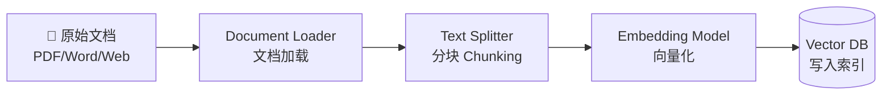
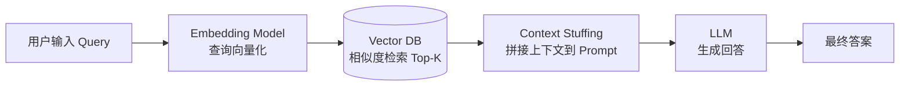
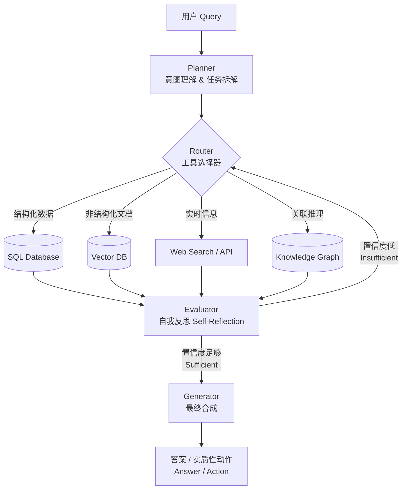
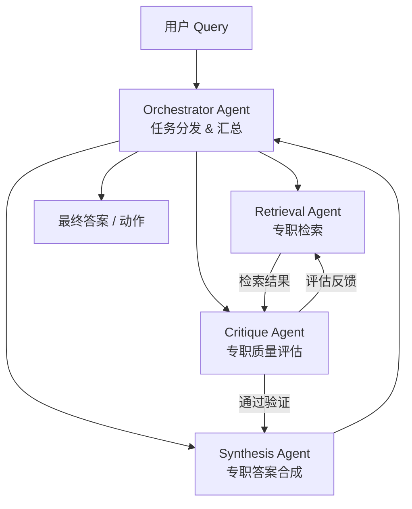
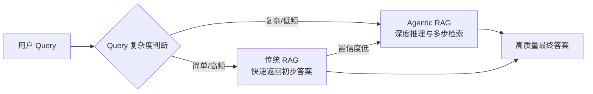

## 摘要

检索增强生成（RAG）技术最初的目的是为了解决大型语言模型（LLM）的幻觉问题并接入外部私有知识。然而，随着业务需求从"简单的知识问答"演进为"复杂的任务解决"，传统RAG暴露出线性流程的局限性。**Agentic RAG** 应运而生，它不仅仅是RAG的升级版，而是将传统RAG的"单向流水线（Pipeline）"重构为了一个基于智能体（AI Agent）的"动态控制循环（Control Loop）"。通过引入推理、规划、记忆和多工具调用能力，Agentic RAG 能够实现更高质量的回答和自主的任务执行。

---

## RAG 技术演进路径

在深入对比两种架构之前，有必要先明确 RAG 技术的完整演进脉络，以便准确理解"传统 RAG"和"Agentic RAG"各自处于哪个阶段：

```
Naive RAG  →  Advanced RAG  →  Modular RAG  →  Agentic RAG
（基础检索）  （Pre/Post处理）  （模块化组合）   （Agent控制循环）
```

| 阶段 | 核心特征 | 代表改进 |
| :--- | :--- | :--- |
| **Naive RAG** | 最基础的"检索-生成"管道，一次检索、一次生成 | 最早期实现，奠定基本范式 |
| **Advanced RAG** | 在检索前后引入增强步骤 | Pre-retrieval（Query Rewrite）、Post-retrieval（Reranking） |
| **Modular RAG** | 将各环节模块化，可灵活组合替换 | Hybrid Search、Routing、自定义 Pipeline |
| **Agentic RAG** | 引入 Agent 控制循环，具备自主决策与多步执行能力 | ReAct、Self-RAG、CRAG、Plan-and-Execute |

> 本文中"传统 RAG"泛指 Naive RAG 至 Advanced RAG 阶段，与 Agentic RAG 形成对比。

---

## 概念界定

### 传统 RAG
传统RAG是一种**被动式、线性的检索系统**。其核心逻辑是：接收用户查询 $\rightarrow$ 在向量数据库中进行一次性相似度检索 $\rightarrow$ 将检索到的文档片段（Context）与原问题拼接 $\rightarrow$ 交由LLM生成最终回答。
* **特点**：单次传递（One-pass）、无记忆、流程固定、完全依赖单次检索的质量。
* **瓶颈**：流程中没有任何反馈机制，一旦检索结果质量差，下游生成质量几乎无法挽救，即"垃圾进，垃圾出（Garbage In, Garbage Out）"。

### Agentic RAG
Agentic RAG 是一种**主动式、自主的决策系统**。它将LLM视为具备"大脑"的智能体（Agent），在检索和生成过程中引入了自主规划（Planning）、工具使用（Tool Use）、反思（Reflection）和迭代重试（Iteration）机制。
* **特点**：多步推理（Multi-step reasoning）、支持多种检索策略（向量、图谱、SQL等）、具备自我纠错与长效记忆（Memory）。
* **本质区别**：从"数据流"转变为"控制流"，LLM 不再只是最后的生成器，而是整个任务的调度者和决策者。

---

## 核心差异对标分析

| 维度 | 传统 RAG (Traditional RAG) | Agentic RAG |
| :--- | :--- | :--- |
| **工作流模式** | **静态单向管道** (Pipeline)：查询 $\rightarrow$ 检索 $\rightarrow$ 生成 | **动态控制循环** (Control Loop)：查询 $\rightarrow$ 思考 $\rightarrow$ 规划 $\rightarrow$ 检索/工具调用 $\rightarrow$ 评估 $\rightarrow$ (循环或输出) |
| **任务拆解与推理** | 无。将整个用户问题作为一个查询语句直接去检索。 | 强。面对复杂问题（如多跳查询），Agent会将其拆解为多个子任务逐步解决。 |
| **信息源与工具** | 通常局限于单一的向量数据库（Vector DB）。 | 支持多工具调度：可同时调用向量库、图数据库、SQL数据库、Web搜索、外部API（如CRM系统）等。 |
| **容错与纠错机制** | **"垃圾进，垃圾出"**：如果检索到无关信息，LLM大概率会生成错误回答。 | **闭环评估**：Agent会评估检索到的信息是否足够。如果置信度低，它会修改检索词或更换数据源重新检索（Re-query）。 |
| **上下文与记忆** | 通常是无状态的（Stateless）：会话内可维持短期上下文，但无法跨会话保留用户历史。 | 具备持久化记忆层（如 Mem0、Zep 等），能够跨会话记住用户偏好和历史交互，实现持续学习与个性化。 |
| **人工干预** | 高度依赖开发者预设好的提示词模板和检索策略（如Top-K设置）。 | 高度自主（Autonomy），由AI动态决定如何执行检索、何时停止检索。 |
| **幻觉率（Hallucination）** | 较高，无法识别"检索到的内容与问题无关"的情形。 | 显著更低，反思机制可主动过滤低相关性内容后再生成。 |

---

## 架构对比

### 传统 RAG 架构

传统 RAG 由**离线构建**和**在线查询**两个阶段组成，文档必须先经过 Ingestion Pipeline 写入向量库，才能在查询时被检索到。

**阶段一：离线 Ingestion Pipeline（数据构建）**



> Chunking 策略（如固定大小、语义分块、递归分块）对最终检索质量有决定性影响，是传统 RAG 调优的核心抓手之一。

**阶段二：在线 Query Pipeline（推理查询）**



**架构特点**：流程清晰、延迟低、成本可预测，但检索结果与生成质量之间没有任何反馈回路。

---

### Agentic RAG 架构

Agentic RAG 的架构复杂度显著提升，通常基于 LangChain、LlamaIndex 或专用平台（如 Vellum）构建。其本质是将检索过程嵌入到 Agent 的"思考-行动-观察"循环中。

**核心控制循环：**



**核心模块说明：**

1. **Query Understanding & Planner（意图理解与规划器）**：识别用户意图，重构问题或拆分多步任务（Sub-tasks）。这是 Agentic RAG 与传统 RAG 的第一个本质分叉点。
2. **Router / Tool Selector（路由与工具选择）**：决定去哪里找信息（如：财报查SQL，规章制度查向量库，实时股价查API）。
3. **Iterative Execution（迭代执行）**：执行工具调用并获取返回结果。
4. **Evaluator（验证与反思器）**：Agent 对获得的数据进行自我提问（Self-reflection）：*"这些信息足以回答用户的问题吗？"* 如果置信度不足，修改策略重新回到路由步骤。
5. **Generator & Action（生成与行动）**：最终合成高精度答案，甚至可以触发实质性动作（如替用户发送邮件、在系统中提交申请）。

---

## Agentic RAG 核心设计模式

Agentic RAG 并非单一实现，而是一类架构模式的统称。以下是四种主流设计模式，代表了工程实现的不同侧重点：

### 1. ReAct（Reason + Act）

**最基础、最通用**的 Agentic RAG 实现范式，出自论文 *"ReAct: Synergizing Reasoning and Acting in Language Models"（Yao et al., 2022）*。

LLM 在每一步交替进行三种操作，形成闭环：

```
Thought（思考）→ Action（执行工具调用）→ Observation（观察结果）→ Thought（继续思考）→ ...
```

**示例轨迹：**
> **Thought**: 用户问"2023年Q4苹果的营收增长率"，需要先查财报数据再计算。
> **Action**: `search_database(query="Apple Q4 2023 revenue")`
> **Observation**: `{"Q4 2023": 119.6B, "Q4 2022": 117.2B}`
> **Thought**: 增长率 = (119.6 - 117.2) / 117.2 ≈ 2.05%，可以回答了。
> **Final Answer**: 苹果2023年Q4营收同比增长约2.05%。

### 2. CRAG（Corrective RAG）

**核心创新**：在检索结果进入 LLM 之前，引入一个轻量级 **相关性评估器（Relevance Evaluator）** 对每个检索到的文档打分，根据置信度决定下一步行动：

| 置信度 | 决策 |
| :--- | :--- |
| **高（Correct）** | 直接使用检索结果生成 |
| **中（Ambiguous）** | 对文档进行知识精炼（Knowledge Refinement）后使用 |
| **低（Incorrect）** | 降级到 Web Search 获取实时信息 |

CRAG 相比 Naive RAG 显著降低了因"检索到错误文档"导致的幻觉率，同时比完整的 ReAct 循环有更低的延迟。

### 3. Self-RAG（Self-Reflective RAG）

**核心创新**：训练 LLM 在生成过程中主动发出特殊的**反思 Token（Reflection Tokens）**，对自身的检索决策和生成内容进行批判性评分：

* `[Retrieve]`：是否需要检索（动态决定是否触发检索，而非每次强制检索）
* `[IsRel]`：检索到的段落是否与问题相关
* `[IsSup]`：生成的内容是否被检索结果支撑
* `[IsUse]`：最终答案对用户是否有用

Self-RAG 将"评估"内化到模型参数本身，而非依赖外部评估器，推理效率更高，但需要专门的微调（Fine-tuning）。

### 4. Plan-and-Execute（计划-执行分离）

**适用于长链路、多阶段任务**。与 ReAct 的"边想边做"不同，Plan-and-Execute 将任务明确分为两个角色：

* **Planner（规划器）**：一次性生成完整的任务分解计划，列出所有子任务和执行顺序。
* **Executor（执行器）**：按照计划逐步调用工具并执行，每步结果可反馈给 Planner 进行计划修订。

**优势**：任务逻辑更清晰，适合需要人工审查中间步骤的企业场景（Human-in-the-loop）。

---

## 多智能体（Multi-Agent）RAG 架构

当任务复杂度进一步提升时，单 Agent 内部循环已经不够，需要引入**多 Agent 协作架构**。这是 Agentic RAG 的最高阶形态：



**各 Agent 职责分工：**

| Agent | 职责 |
| :--- | :--- |
| **Orchestrator Agent** | 接收用户任务，拆解后分发给各专职 Agent，最终汇总结果 |
| **Retrieval Agent** | 专门负责多源检索（向量库 + SQL + Web），不做推理 |
| **Critique Agent** | 专门负责对检索结果进行 RAGAS 评分，决定是否需要重新检索 |
| **Synthesis Agent** | 专门负责将多路检索结果合并，生成结构化最终答案 |

这种架构的核心优势在于**职责隔离**：每个 Agent 只做一件事，便于独立优化和替换，系统整体鲁棒性大幅提升。

---

## 质量评估体系：RAGAS 指标对比

量化两种架构的质量差异，需要借助 **RAGAS（RAG Assessment）** 评估框架。RAGAS 提供了四个正交的核心指标，覆盖检索和生成两个维度：

| 指标 | 说明 | 传统 RAG | Agentic RAG |
| :--- | :--- | :---: | :---: |
| **Faithfulness（忠实度）** | 答案中的每一个声明是否都能从检索上下文中找到依据，衡量幻觉率 | 一般 | **显著更高**（反思机制主动过滤不相关内容） |
| **Answer Relevancy（答案相关性）** | 生成的答案对用户提出的问题的回答程度 | 对简单问题良好 | **显著更高**（多步推理后更准确理解意图） |
| **Context Precision（上下文精准率）** | 所有检索到的文档中，真正与问题相关的文档占比 | 较低（Top-K 中混有噪声） | **更高**（路由器过滤 + 评估器剔除低质量文档） |
| **Context Recall（上下文召回率）** | 回答问题所需的所有关键信息是否都被检索到 | 对单跳问题尚可 | **显著更高**（迭代检索弥补单次遗漏） |

> **实践建议**：在上线 Agentic RAG 系统前，应建立基于 RAGAS 的 Offline Evaluation Pipeline，定期使用测试集对系统进行回归测试，防止因 Prompt 调整或模型升级引入质量退化（Quality Regression）。

---

## 工程与运维代价

企业在选择从传统RAG升级到Agentic RAG时，必须考量以下工程代价：

* **成本 (Cost)**：
  * **传统 RAG**：成本可控且具有高度可预测性。每次查询固定消耗一次大模型请求（Token数量固定）。
  * **Agentic RAG**：由于内部包含循环思考（Reasoning）、多次调用工具和反复验证，Token 消耗量倍增，且单次查询的成本难以精准预测。以 GPT-4o 为例，一次 Agentic RAG 查询的 Token 消耗通常是传统 RAG 的 3-8 倍。

* **延迟 (Latency)**：
  * **传统 RAG**：响应速度快，通常在数百毫秒到几秒之间。
  * **Agentic RAG**：存在长尾延迟（P95 Latency 较高）。因为大模型需要"思考（Thinking）"并经历多轮往返操作（Round-trips），可能会导致用户需要等待更长时间（通常需要搭配流式输出（Streaming）或过程步骤展示来缓解用户等待焦虑）。

* **系统复杂性与调试 (Debugging)**：
  * **传统 RAG**：出错点明确（要么是检索命中率低，要么是Prompt没写好），易于调试。
  * **Agentic RAG**：是一个复杂的黑盒状态机。失败可能源于：规划失败、工具调用失败、陷入死循环等。需要引入专业的**可观测性工具**（如 **LangSmith**、**Langfuse**）追踪多步 Agent 的执行轨迹（Trace），以及 **LLM 评估框架**（如 **RAGAS**、**Patronus AI**）对答案质量进行定量评估。

---

## 适用场景建议

### 适合【传统 RAG】的场景：
* **静态文档问答**：如内部员工手册查询、固定流程的FAQ机器人。
* **对延迟极度敏感的应用**：需要在1-2秒内必须返回结果的实时C端应用。
* **开发预算与算力有限**：不需要复杂的逻辑推理，仅需基础知识锚定。

### 适合【Agentic RAG】的场景：
* **复杂的企业级跨域检索**：如金融合规助手（需要调取财报数据库、比对内部政策文档、抓取最新监管网页，并交叉验证以生成研报）。
* **主动式客户支持 (Action-oriented Support)**：不仅要回答"退货政策是什么"，还需要Agent根据用户的账户权限，自主调取CRM数据，判断是否符合退换条件，并**直接在系统内触发退货工单**。
* **模糊查询与多跳推理 (Multi-hop Queries)**：如"对比过去三年我们在亚太区和欧洲区遇到最多的客诉问题及解决方案"，传统RAG无法一次性拼凑这些分散数据，而Agentic RAG可以分步拆解执行。

### 【混合架构（Hybrid）】：工程实践中的过渡方案

在"成本/延迟"与"智能水平"之间寻求最优平衡的企业，往往会采用**混合部署策略**：



**核心思路**：先由传统 RAG 快速返回初步答案（解决延迟问题），同时在后台判断该问题是否需要 Agent 深度处理。若 Agent 的结果置信度更高，则通过流式更新替换初步答案。这种"先出草稿，再精修"的模式在 C 端产品中用户体验更佳。

---

## 结论

传统RAG解决的是AI的 **"信息获取问题（What）"**，它将大模型变成了开卷考试的学生；而Agentic RAG解决的则是 **"问题解决能力（How）"**，它将大模型升级为一个具备思考能力、拥有工具箱并懂得自我检查的"研究员兼执行者"。

两者并非简单的替代关系，而是面向不同任务复杂度的**工程选择**。在实际落地中，企业需要根据具体的**容错率（Error Tolerance，即业务能接受多少比例的错误答案）**和**任务复杂度（Query Complexity）**，在成本、延迟与智能水平之间做出合理的工程取舍。

随着大模型基础推理能力的不断提升和推理成本（Inference Cost）的持续下降（GPT-4 级别模型的推理成本在过去两年已下降超过90%），**Agentic RAG 将成为企业级复杂 AI 应用的必然架构趋势**，而今天的工程权衡，将随着成本曲线的下降而逐渐消解。
