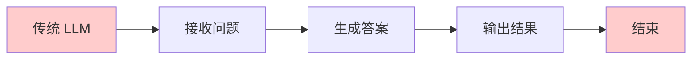
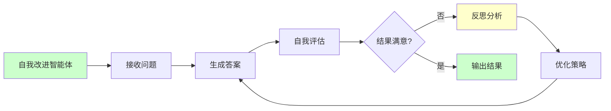
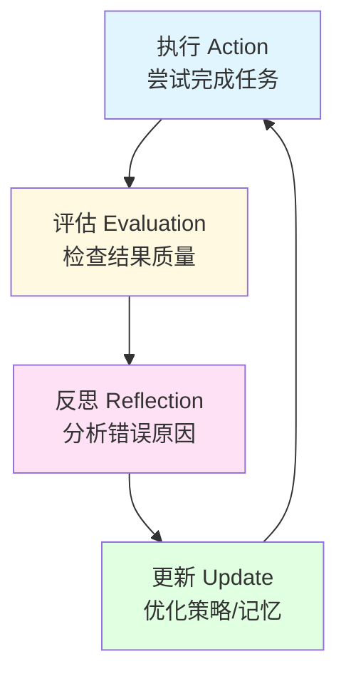
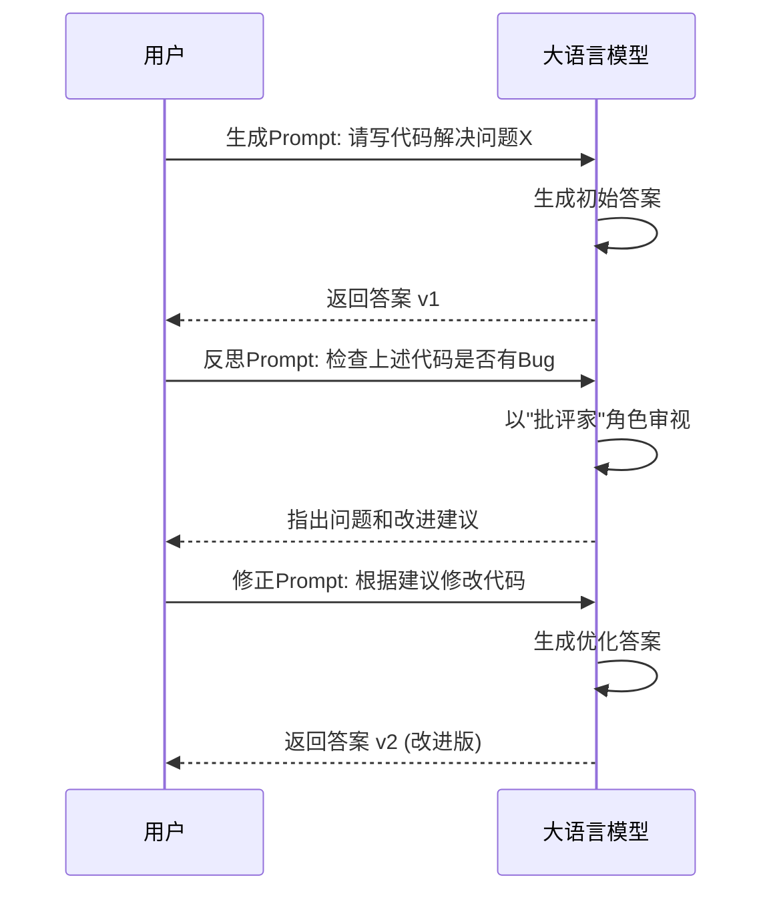
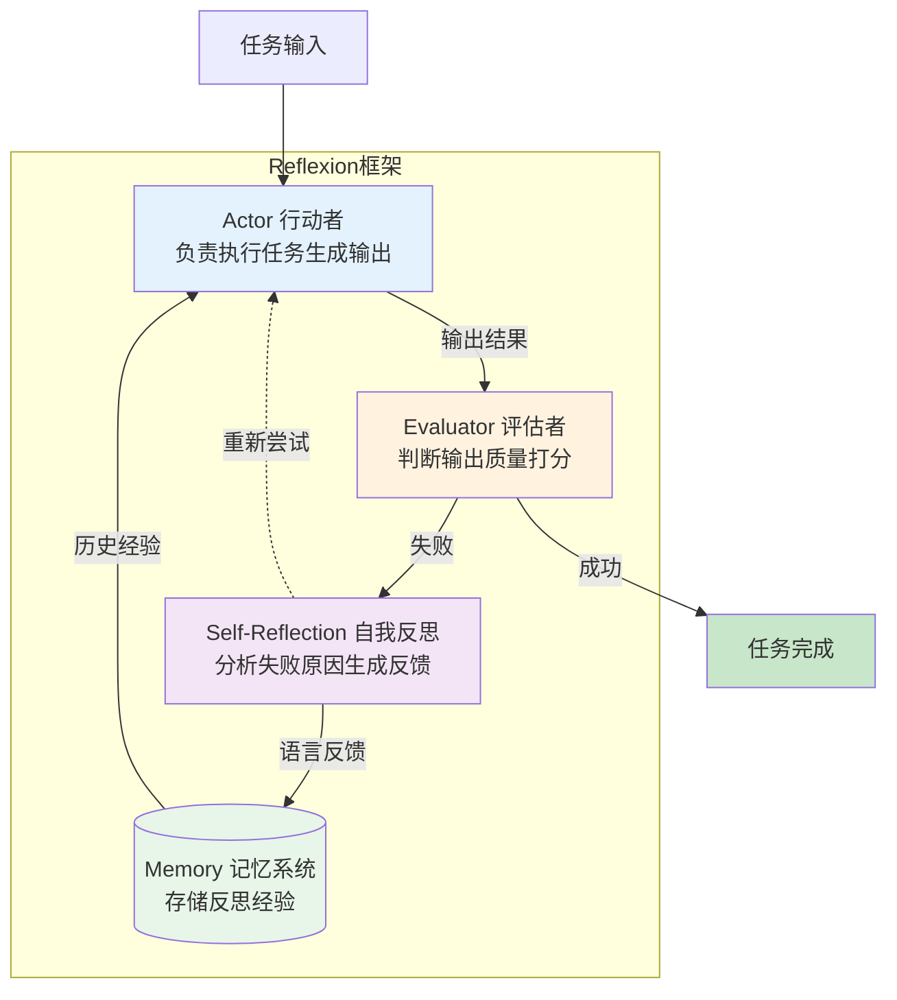
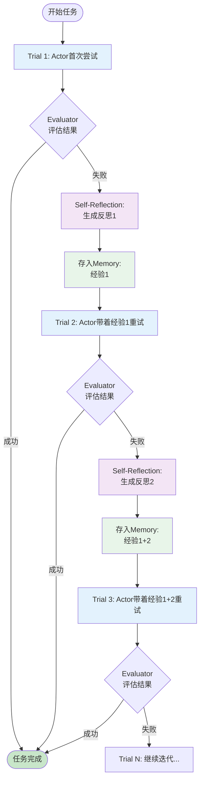
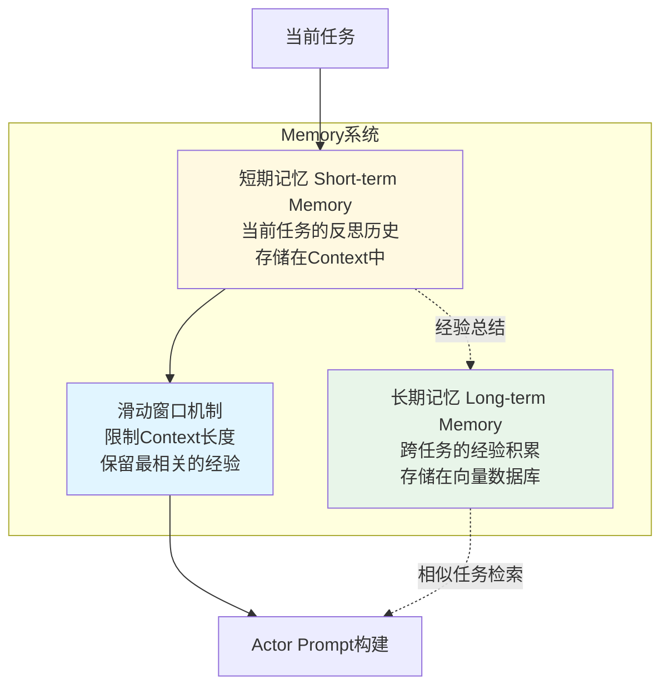
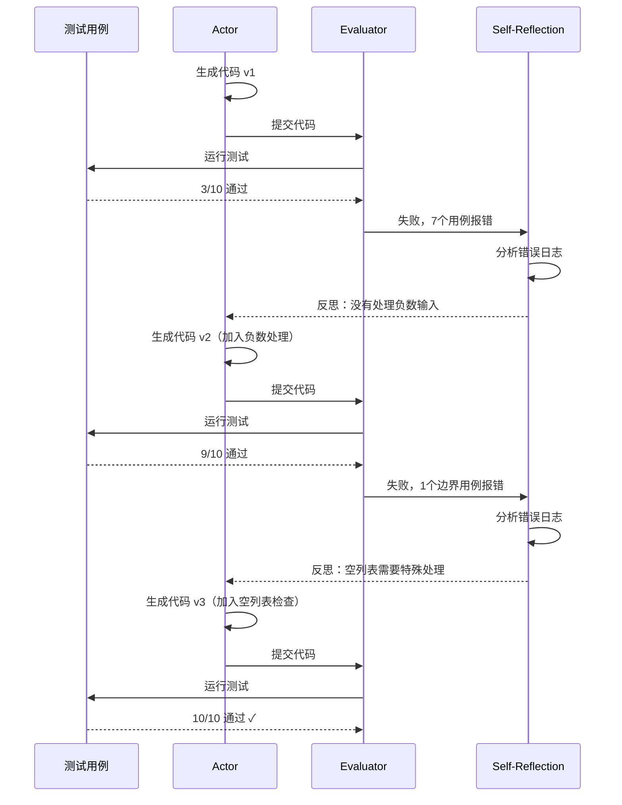
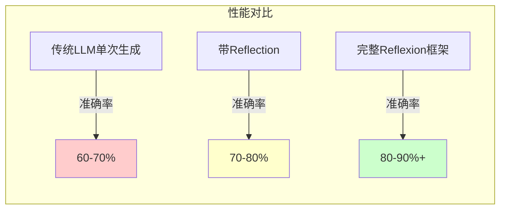
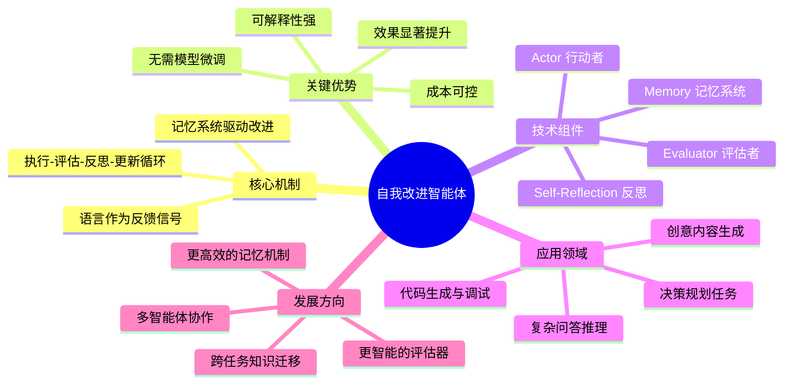

传统的 LLM 就像一个答题速度极快但从不检查的学生——它拿到问题，凭直觉写下答案，然后立即交卷。如果错了，它就错了。

但如果这个学生学会了**自我反思**呢？如果它写完答案后，自己检查一遍，发现错误并修正，然后再交卷呢？

这就是**自我改进智能体（Self-Improving Agents）** 的核心理念。今天，我们将深入探讨这一领域，特别是让 Agent 拥有“自省”能力的 **Reflection** 机制与 **Reflexion** 框架。

---

## 什么是自我改进智能体？

**自我改进智能体**是指那些不仅能执行任务，还能评估自身表现、并利用反馈来优化后续行动的 AI 系统。

与传统的一次性问答（One-shot QA）不同，自我改进智能体引入了一个**闭环**：

1.  **执行（Action）：** 尝试完成任务。
2.  **评估（Evaluation）：** 检查结果是对是错。
3.  **反思（Reflection）：** 分析为什么错了，如何改进。
4.  **更新（Update/Refine）：** 利用反思的结果，重新尝试或在下一次任务中做得更好。

这种机制让 AI 从"概率生成器"进化为了具备**慢思考**能力的推理者。

### 传统 LLM vs 自我改进智能体

让我们通过流程图直观对比两者的差异：





传统 LLM 是一个**单向流水线**，而自我改进智能体是一个**闭环系统**。

### 自我改进的核心循环



这个循环的关键在于：**每次迭代都会累积经验**，智能体不会在同一个地方跌倒两次。

---

## Reflection（自我反思）

在深入复杂的框架之前，我们需要理解最基础的原子能力：**Reflection（反思）**。

简单来说，Reflection 就是通过 Prompt Engineering（提示工程），让大模型扮演“批评家”的角色来审视自己生成的“演员”剧本。

### 它是如何工作的？



通常包含两个步骤的 Prompt：

**第一步 - 生成：**
```
请帮我写一段 Python 代码，实现二分查找算法。
```

**第二步 - 反思：**
```
请检查上面生成的代码：
1. 是否存在边界条件处理的Bug？
2. 逻辑是否完全正确？
3. 是否有性能优化空间？
4. 如果有错误，请指出并给出修正建议。
```

### 实际案例

**初始生成的代码（可能有问题）：**
```python
def binary_search(arr, target):
    left, right = 0, len(arr)  # Bug: 应该是 len(arr) - 1
    while left < right:
        mid = (left + right) // 2
        if arr[mid] == target:
            return mid
        elif arr[mid] < target:
            left = mid + 1
        else:
            right = mid
    return -1
```

**Reflection 发现的问题：**
> "right 的初始值应该是 `len(arr) - 1` 而不是 `len(arr)`，否则会导致数组越界。同时，循环条件应该是 `left <= right`，当前写法会遗漏最后一个元素的检查。"

**修正后的代码：**
```python
def binary_search(arr, target):
    left, right = 0, len(arr) - 1  # 修正
    while left <= right:  # 修正
        mid = (left + right) // 2
        if arr[mid] == target:
            return mid
        elif arr[mid] < target:
            left = mid + 1
        else:
            right = mid - 1  # 修正
    return -1
```

### 为什么它有效？
研究发现，LLM 生成正确答案的概率，往往低于“判断答案是否正确”的概率。**模型通常具备“识别自己错误”的能力，即使它第一次没能做对。**

通过 Reflection，我们强迫模型跳出单纯的“续写文本”模式，进入“逻辑校验”模式。这不仅能减少幻觉，还能显著提升代码生成和复杂推理的准确率。

---

## 进阶架构：Reflexion 框架

如果说 Reflection 是一种技巧，那么 **Reflexion** 就是一套完整的、系统化的**强化学习（Reinforcement Learning）** 替代方案。

Reflexion 是 Shinn 等人在 2023 年提出的一个重要框架（论文：[*Reflexion: Language Agents with Verbal Reinforcement Learning*](https://arxiv.org/abs/2303.11366)）。它的核心突破在于：**它不需要更新模型的权重（参数），而是通过语言反馈来更新“记忆”。**

### Reflexion 的三驾马车



Reflexion 框架由三个核心模块组成：

#### Actor（行动者）
这是干活的模型（比如 GPT-4）。它负责生成文本、代码或执行搜索动作。
*   **输入：** 任务描述 + 历史反思记忆
*   **输出：** 具体的执行结果（代码、答案、行动序列等）
*   **特点：** 可以是任何大型语言模型，无需特殊训练

#### Evaluator（评估者）
这是打分的老师。它负责评估 Actor 的输出质量。
*   **在代码任务中：** 评估者可以是单元测试（Unit Tests）或代码执行器
*   **在推理任务中：** 它可以是另一个 LLM，用来判断答案是否准确
*   **在游戏任务中：** 它可以是游戏引擎返回的成功/失败信号
*   **输出：** 二元信号（成功/失败）或连续分数（0-1）

#### Self-Reflection（自我反思模型）
这是 Reflexion 的灵魂。当 Evaluator 判定任务失败时，Self-Reflection 模型会介入。

它不会只给一个冷冰冰的"0分"，而是会生成一段**人类可读的语言反馈（Verbal Feedback）**。

> **实际例子：**
> ```
> 我上次失败是因为没有考虑到边界条件 x=0 的情况，
> 导致程序除零错误。下次我需要在函数开头添加一个 
> if x == 0: return 0 的语句来处理这个特殊情况。
> 同时，对于所有的除法操作，都应该检查分母是否为零。
> ```

**反思内容通常包括：**
1.  **错误识别：** 什么地方出错了？
2.  **原因分析：** 为什么会出错？
3.  **改进策略：** 下次应该怎么做？
4.  **通用经验：** 这个错误能推广到什么场景？

### 工作流程：从试错中学习



Reflexion 的运行流程是一个迭代的循环：

1.  **Trial（尝试）：** Actor 尝试解决问题。
2.  **Error（报错）：** Evaluator 发现结果不对（例如：代码报错，答案错误）。
3.  **Reflect（反思）：** Self-Reflection 模型分析错误，生成一段文本摘要，解释"为什么错了"以及"该怎么改"。
4.  **Memory（记忆）：** 这段反思被存入短期记忆（Context）。
5.  **Next Trial（再尝试）：** Actor 再次尝试。**关键点在于：** 这一次，Actor 的 Prompt 里包含了之前的"反思内容"。它不仅仅是重试，而是**带着经验重试**。

### Memory 机制详解

Memory（记忆系统）是 Reflexion 区别于简单重试的核心。它维护着智能体的"经验数据库"。



#### 短期记忆（Episodic Memory）
*   **作用域：** 单个任务内
*   **内容：** 当前任务所有失败尝试的反思
*   **格式：** 直接拼接在 Prompt 中
*   **示例：**
    ```
    Previous Attempts:
    Attempt 1: Failed - 原因是没有处理空列表情况
    Reflection 1: 需要在函数开头添加 if not arr: return -1
    
    Attempt 2: Failed - 原因是循环边界条件错误
    Reflection 2: right应该初始化为len(arr)-1而不是len(arr)
    ```

#### 长期记忆（Long-term Memory）
*   **作用域：** 跨任务
*   **内容：** 通用的经验和模式
*   **存储：** 向量数据库（如 FAISS、Pinecone）
*   **检索：** 通过语义相似度匹配
*   **示例：** "处理列表问题时，始终要考虑空列表、单元素、重复元素等边界情况"

#### 滑动窗口（Sliding Window）
由于 LLM 的 Context 长度有限（如 GPT-4 的 8k tokens），Reflexion 使用滑动窗口机制：
*   保留最近的 N 次反思
*   丢弃过早的、可能不相关的经验
*   确保最关键的经验始终在 Context 中

---

## 为什么 Reflexion 比单纯的 Reflection 更强？

你可能会问：*“这不就是多问几遍吗？”* 不完全是。Reflexion 的精髓在于**长期记忆与语言强化的结合**。

1.  **语言即奖励（Language as Reward）：**
    传统的强化学习（RL）使用标量奖励（比如 +1, -1）来调整参数，这非常低效且难以解释。Reflexion 使用**语言**作为反馈信号。这种反馈包含的信息量极大，能精准指导模型“哪里”出了问题。

2.  **跨步记忆（Episodic Memory）：**
    Reflexion 允许智能体在解决一个长任务的过程中，积累多个步骤的反思。它维护了一个“反思缓冲区”，确保智能体不会在同一个坑里跌倒两次。

3.  **无需微调（Training-free）：**
    它不需要昂贵的 GPU 资源去重新训练模型。只要有一个足够强的基座模型（Base Model），通过架构设计就能实现性能的飞跃。

---

## 实际应用场景

Reflexion 框架已经在多个领域展现出强大的能力，以下是几个典型应用：

### 代码生成与调试（HumanEval）

**任务：** 根据函数描述生成正确的 Python 代码。

**传统方法的问题：**
*   一次生成经常有 Bug（语法错误、逻辑错误、边界条件遗漏）
*   即使重新生成，也可能犯同样的错误

**Reflexion 的优势：**


**实验结果：** 在 HumanEval 基准测试中，Reflexion 使 GPT-4 的通过率从 68% 提升到 **91%**。

### 复杂问答推理（HotPotQA）

**任务：** 回答需要多步推理的复杂问题。

**示例问题：** "哪位导演的电影获得了奥斯卡最佳影片，同时他的配偶也曾获得奥斯卡最佳女演员？"

**Reflexion 如何工作：**
1.  **首次尝试：** "斯皮尔伯格"（错误）
2.  **反思：** "我忽略了'配偶也获奖'这个条件，需要检索导演配偶信息"
3.  **二次尝试：** 检索配偶信息 → "詹姆斯·卡梅隆"（错误）
4.  **反思：** "卡梅隆的配偶没有获奖，需要同时满足两个条件"
5.  **三次尝试：** 交叉检索 → "乔尔·科恩"（正确，配偶Frances McDormand获奥斯卡）

**实验结果：** 在 HotPotQA 上，Reflexion 使 GPT-3.5 的准确率从 54% 提升到 **76%**。

### 决策任务（AlfWorld）

**任务：** 在虚拟环境中完成家务任务（如"把杯子放到冰箱里"）。

**挑战：** 需要多步探索和规划。

**Reflexion 的优势：**
*   **记住失败的路径：** "上次在卧室找杯子失败了，这次应该去厨房"
*   **优化行动序列：** "直接拿杯子再去冰箱，而不是先开冰箱"

**实验结果：** 成功率从 38% 提升到 **83%**。

### 数学问题求解（GSM8K）

**任务：** 小学数学应用题。

**Reflexion 应用：**
*   发现计算错误：反思检查每一步的算术
*   发现理解错误：反思题意是否理解正确
*   发现逻辑错误：反思解题思路是否合理

**示例：**
*   **初始答案：** 15个苹果（错误）
*   **反思：** "我遗漏了题目中'给了朋友3个'这个条件"
*   **修正答案：** 12个苹果（正确）

### 生产环境实际应用

*   **智能客服：** 通过反思改进回答质量，减少"答非所问"
*   **代码审查助手：** 自动发现和修正代码中的潜在问题
*   **自动化测试生成：** 根据失败的测试案例，生成更全面的测试
*   **智能写作助手：** 自我检查文章的逻辑性、连贯性和准确性

---

## 实验效果对比

以下是 Reflexion 论文中的关键数据对比：

| 任务 | 基准模型 | 传统方法 | Reflexion | 提升幅度 |
|------|---------|---------|-----------|----------|
| **HumanEval**<br/>（代码生成） | GPT-4 | 68.0% | **91.0%** | +33.8% |
| **MBPP**<br/>（代码生成） | GPT-4 | 72.5% | **89.5%** | +23.4% |
| **HotPotQA**<br/>（多跳推理） | GPT-3.5 | 54.0% | **76.0%** | +40.7% |
| **AlfWorld**<br/>（决策任务） | GPT-3.5 | 38.0% | **83.0%** | +118.4% |



**关键发现：**
1.  **迭代次数越多，效果越好：** 大多数任务在 2-3 次迭代后达到最佳性能
2.  **复杂任务提升更明显：** 需要多步推理的任务（如 AlfWorld）提升幅度最大
3.  **成本可控：** 虽然需要多次调用 LLM，但总 token 消耗通常在 3-5 倍，相比性能提升是值得的
4.  **基座模型越强，效果越好：** GPT-4 + Reflexion 的效果显著优于 GPT-3.5 + Reflexion

---

## 挑战与局限性

虽然 Reflexion 非常强大，但它也面临一些挑战：

### 成本问题
*   **多次调用 LLM：** 每次反思和重试都需要额外的 API 调用
*   **Token 消耗：** 长期记忆存储会占用大量 Context
*   **时间延迟：** 多次迭代导致响应时间变长

**缓解方案：**
*   使用更小的模型做 Self-Reflection（如 GPT-3.5 做反思，GPT-4 做执行）
*   设置最大迭代次数（如 3-5 次）
*   使用缓存机制，避免重复的反思

### 依赖强大的基座模型
*   反思质量取决于模型的理解能力
*   弱模型可能产生无效或错误的反思
*   "垃圾进，垃圾出"的问题依然存在

### 评估器的准确性
*   如果 Evaluator 本身有 Bug（如测试用例不完善），会误导反思
*   在主观任务中（如创意写作），很难定义好的评估标准

### 无限循环风险
*   某些困难任务可能永远无法成功
*   智能体可能在同一个错误上反复循环
*   需要设计终止条件和"放弃"机制

### 反思的有效性
*   并非所有反思都对改进有帮助
*   模型可能产生"正确但无用"的反思（如"我需要更仔细"）
*   需要过滤低质量的反思

**最佳实践：**
```python
# 伪代码示例
max_iterations = 5
success_threshold = 0.9

for i in range(max_iterations):
    result = actor.generate(task, memory)
    score = evaluator.evaluate(result)
    
    if score >= success_threshold:
        return result  # 成功退出
    
    if i == max_iterations - 1:
        return result  # 达到最大次数，返回最佳结果
    
    reflection = self_reflect.reflect(task, result, score)
    
    # 过滤低质量反思
    if reflection.quality_score < 0.5:
        continue
    
    memory.add(reflection)
```

---

## 总结

自我改进智能体，特别是以 Reflexion 为代表的架构，标志着 AI 开发范式的转变：**从追求"更强的模型"，转向构建"更强的系统"。**

### 核心洞察



### 关键 Takeaways

1.  **Reflection（反思）技术**
    *   通过 Prompt Engineering 让模型自我审视
    *   是提升质量的低成本、高效益手段
    *   利用了 LLM"识别错误"能力强于"避免错误"的特性

2.  **Reflexion（架构）**
    *   将反思结构化为系统级框架
    *   利用语言反馈循环，实现"吃一堑长一智"
    *   通过记忆系统积累经验，避免重复错误

3.  **实验效果**
    *   代码生成任务提升 23-34%
    *   复杂推理任务提升 40%+
    *   决策任务提升超过 100%
    *   在多个基准测试中达到 SOTA（当时）

4.  **范式转变**
    *   从"单次生成"到"迭代优化"
    *   从"参数训练"到"系统设计"
    *   从"黑盒推理"到"可解释循环"
    *   从"孤立任务"到"经验积累"

5.  **实践建议**
    *   优先在高价值、可评估的任务上应用
    *   设计好评估器是关键（单元测试、标准答案、人类反馈）
    *   控制迭代次数，避免无限循环
    *   记录和分析反思质量，持续优化 Prompt
    *   考虑成本-收益平衡，不是所有任务都需要反思

### 未来展望

Reflexion 开启了自我改进智能体的新时代，未来可能的发展方向包括：

*   **层次化反思：** 不仅反思单步错误，还反思整体策略
*   **元学习集成：** 结合少样本学习，从更少的试错中学习
*   **多智能体协作：** 多个 Reflexion 智能体互相反思和学习
*   **自动化评估器：** 通过 AI 自动生成和优化评估标准
*   **跨任务迁移：** 将一个领域的反思经验迁移到其他领域

**最重要的是：** Reflexion 证明了**系统设计**和**认知架构**比单纯追求更大的模型参数更重要。这为资源有限的团队提供了一条可行的技术路线——你不需要训练 GPT-5，只需要更聪明地使用 GPT-4。

---

## 参考资源

### 核心论文
1.  **Reflexion: Language Agents with Verbal Reinforcement Learning**
    *   作者：Noah Shinn, Federico Cassano, Ashwin Gopinath, et al.
    *   链接：[https://arxiv.org/abs/2303.11366](https://arxiv.org/abs/2303.11366)
    *   发表：NeurIPS 2023

### 相关论文
2.  **Self-Refine: Iterative Refinement with Self-Feedback**
    *   探索自我反馈的迭代改进机制
    *   [https://arxiv.org/abs/2303.17651](https://arxiv.org/abs/2303.17651)

3.  **ReAct: Synergizing Reasoning and Acting in Language Models**
    *   结合推理和行动的智能体框架
    *   [https://arxiv.org/abs/2210.03629](https://arxiv.org/abs/2210.03629)

4.  **Tree of Thoughts: Deliberate Problem Solving with Large Language Models**
    *   思维树搜索方法
    *   [https://arxiv.org/abs/2305.10601](https://arxiv.org/abs/2305.10601)

### 开源实现
*   **Reflexion GitHub Repo:** [https://github.com/noahshinn024/reflexion](https://github.com/noahshinn024/reflexion)
*   **LangChain Reflexion Integration:** [https://python.langchain.com/docs/use_cases/more/agents/reflexion](https://python.langchain.com/docs/use_cases/more/agents/reflexion)

### 相关资源
*   **[Lilian Weng's Blog - LLM Powered Autonomous Agents](https://lilianweng.github.io/posts/2023-06-23-agent/):** 全面介绍 Agent 技术
*   **[OpenAI Cookbook - Agents](https://cookbook.openai.com/topic/agents):** 实践指南和代码示例

---


