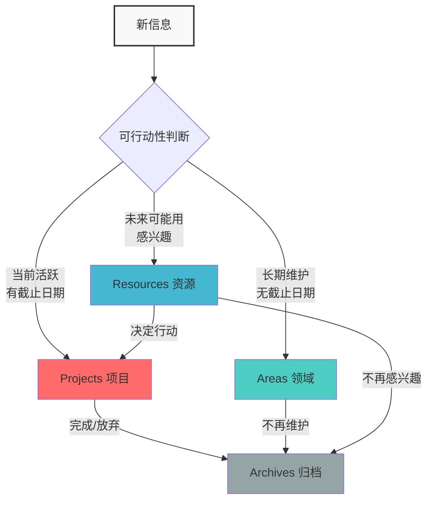
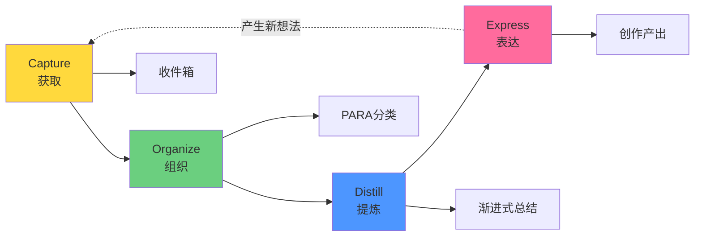
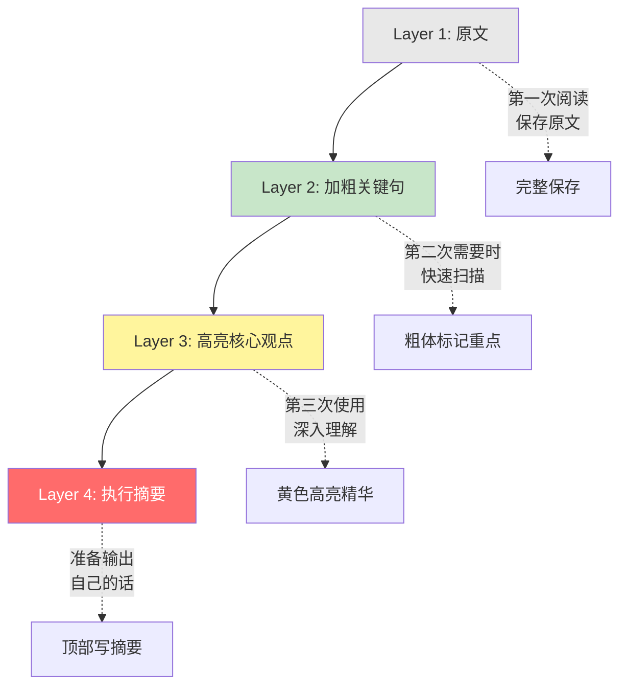
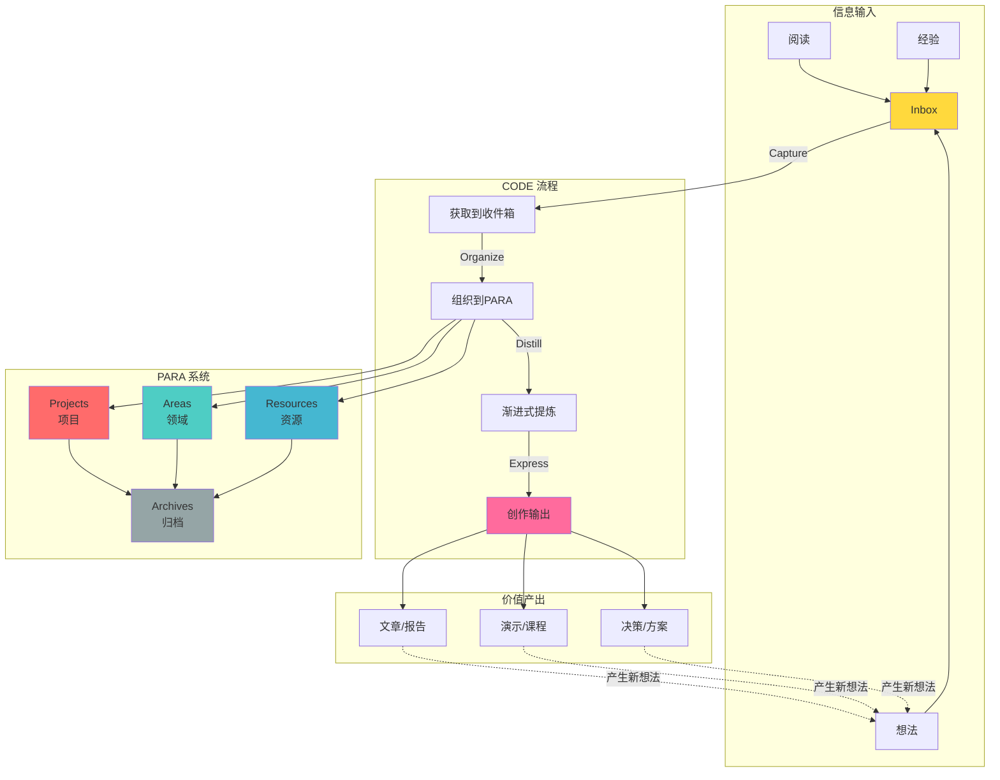

**“第二大脑”（Building a Second Brain, 简称 BASB）** 是近年来在个人知识管理（PKM）领域最流行、最系统化的一套方法论。

它由美国的生产力专家 **Tiago Forte** 提出，其核心理念可以概括为一句话：**“你的大脑是用来产生想法的，而不是用来保存想法的。”**

该方法论主要由 **核心哲学**、**CODE 流程** 和 **PARA 系统** 三部分组成。

---

### 核心哲学：为什么要建立第二大脑？

生物大脑擅长联想、创造和直觉判断，但非常不擅长记忆大量细节。
**第二大脑**就是利用数字工具（笔记软件），构建一个外部的存储和检索系统。

*   **生物大脑（第一大脑）**：负责 CPU 的工作（思考、决策、创意）。
*   **数字大脑（第二大脑）**：负责硬盘的工作（记忆、保存、索引）。

**目标**：将记忆外包给计算机，从而减轻焦虑，专注于创造性产出。

---

### 核心组织架构：PARA 系统

这是第二大脑的“静态”部分，即**如何分类和存放文件**。Tiago Forte 认为大多数人整理笔记之所以失败，是因为按“主题”分类（如图书馆），而实际上我们应该按 **"可行动性"**（Actionability）分类。

PARA 将所有信息分为四类，优先级从高到低：

1.  **P - Projects（项目）**
    *   **定义**：有明确的**截止日期**和**具体目标**的任务。
    *   *例子*：写年度报告、策划一次旅行、装修书房。
    *   *特点*：这是你当前最关注、最活跃的信息，应该最容易访问。
2.  **A - Areas（领域）**
    *   **定义**：没有截止日期，但需要**长期维护**的责任范围。
    *   *例子*：健康、财务、职业发展、家庭、汽车保养。
    *   *特点*：只要你还活着或还在工作，这些领域就一直存在。
3.  **R - Resources（资源）**
    *   **定义**：你感兴趣的主题或未来可能用到的素材库。
    *   *例子*：咖啡制作、网页设计灵感、心理学笔记、食谱。
    *   *特点*：这是你的知识储备库。
4.  **A - Archives（归档）**
    *   **定义**：已完成的项目、不再维护的领域、不再感兴趣的资源。
    *   *例子*：2025年的项目文件、前任工作的资料。
    *   *特点*：不要删除，而是存入冷库，以备不时之需，保持前三个文件夹的清爽。

**核心原则**：信息是流动的。一个"项目"完成后，归档到"归档"；一个"资源"如果你决定对其采取行动，它就变成了"项目"。

#### PARA 系统可视化

**信息流动示例**：
- 你在阅读时发现一篇关于时间管理的好文章 → 存入 **Resources**（时间管理）
- 你决定改进自己的时间管理习惯 → 创建 **Project**（建立时间管理系统）
- 项目持续三个月完成 → 归入 **Archives**（2026年项目）
- 但时间管理成为你的日常责任 → 在 **Areas**（个人效能）中持续维护

---

### 核心运作流程：CODE 模型

这是第二大脑的“动态”部分，即**如何处理知识的生命周期**。

1.  **C - Capture（获取）**
    *   不要试图记录所有信息，只记录**产生共鸣**的信息。
    *   不要在获取时整理，先扔进“收件箱”（Inbox），避免打断心流。
2.  **O - Organize（组织）**
    *   将收件箱的信息分发到 PARA 系统中。
    *   **关键问题**：不要问“这属于哪一类？”，而要问**“我在哪个项目中会用到它？”**
    *   以**项目**为导向进行组织，确保知识能转化为行动。
3.  **D - Distill（提炼）**
    *   这是 BASB 最独特的地方。不要只存原文，要进行**渐进式总结（Progressive Summarization）**。
    *   **Layer 1**：保存原文。
    *   **Layer 2**：加粗关键句子。
    *   **Layer 3**：高亮核心观点（在加粗中选优）。
    *   **Layer 4**：用自己的话写一段"执行摘要"（Executive Summary）在笔记之首。
    *   *目的*：未来的你看到这篇笔记时，能在几秒钟内抓住重点，而不需要重读全文。
4.  **E - Express（表达）**
    *   知识管理的最终目的不是"拥有知识"，而是"应用知识"。
    *   通过写作、演示、解决问题，将"中间产物"（Intermediate Packets）组合起来，形成产出。

#### CODE 循环流程

#### 渐进式总结（Progressive Summarization）详解

这是第二大脑最具创新性的技术，通过多次阅读逐层提炼：

**实例说明**：
假设你保存了一篇 10 页的关于"深度工作"的文章：
- **Layer 1**：保存全文（稍后阅读）
- **Layer 2**（某天需要写文章时）：加粗 15 个关键句子（耗时 5 分钟）
- **Layer 3**（准备演讲时）：在加粗中高亮 5 个核心观点（耗时 2 分钟）
- **Layer 4**（写演讲稿时）：在笔记顶部写："深度工作的核心是消除分心，通过时间块和环境设计来保护专注力。"（耗时 1 分钟）

下次再看这篇笔记，你只需读顶部的摘要，就能决定是否需要深入。

---

### 关键技术概念

在实践第二大脑时，有两个非常实用的微观技巧：

1.  **中间产物 (Intermediate Packets)**
    *   不要试图一口气完成一个大项目。
    *   把工作拆解成小的模块（如：一个清单、一段草稿、一张图表）。
    *   这些模块既服务于当前项目，也可以被未来的项目复用。
2.  **海明威桥 (Hemingway Bridge)**
    *   结束一天工作时，不要彻底写完，留一点显而易见的开头给第二天。
    *   在笔记中写下"下一步该做什么"或"当前的思路"，这样第二天可以迅速进入状态，减少启动摩擦。
    *   **命名由来**：海明威写小说时，会在写到最兴奋的地方突然停笔，第二天能轻松续写。

**案例**：你正在写一份项目报告，下午 5 点时：
- ❌ **错误做法**：拼命写完"结论"部分才下班，第二天面对空白页不知从何开始。
- ✅ **正确做法**：在"结论"部分写下："明天先总结三个关键发现：1）用户留存率提升 25%；2）..."，第二天打开文件就能立即进入状态。

---

### 推荐工具与选择

根据不同需求，以下是主流的第二大脑工具：

| 工具 | 优势 | 适合人群 | PARA支持 |
|------|------|----------|----------|
| **Notion** | 灵活强大，数据库+页面，团队协作好 | 项目经理、团队协作 | ⭐⭐⭐⭐⭐ |
| **Obsidian** | 本地存储，双向链接，Markdown，插件丰富 | 隐私敏感、技术用户 | ⭐⭐⭐⭐ |
| **Logseq** | 大纲式+双链，开源，本地优先 | 喜欢大纲思维的用户 | ⭐⭐⭐⭐ |
| **Evernote** | 稳定成熟，全平台，强大的剪藏功能 | 传统笔记用户 | ⭐⭐⭐ |
| **Apple Notes** | 简单轻便，苹果生态无缝 | 轻量级用户、苹果用户 | ⭐⭐ |

**选择建议**：
- 如果追求**灵活性和美观**：Notion
- 如果重视**数据安全和可控性**：Obsidian
- 如果喜欢**网状思维和知识联想**：Obsidian 或 Logseq
- 如果想要**简单上手快速见效**：Notion 或 Evernote

---

### 如何开始实践第二大脑

很多人失败的原因是一开始就想建立完美系统。正确的做法是**从小处开始，逐步迭代**。

#### 5 步入门指南

**第 1 周：搭建基础结构**

1. 在你选择的工具中创建四个文件夹：`Projects`、`Areas`、`Resources`、`Archives`
2. 添加一个 `Inbox`（收件箱）文件夹，作为临时存放区

**第 2-3 周：开始捕获**

3. 每当你遇到有价值的信息（文章、想法、图片）时，快速存入 `Inbox`
4. 不要在捕获时整理，保持快速记录

**第 4 周：学习组织**

5. 每周抽出 30 分钟，将 `Inbox` 中的内容分发到 PARA 四个文件夹
6. 关键问题：**"我会在哪个项目中用到它？"**

**第 5-8 周：开始提炼**

7. 当你再次打开一篇笔记时，花 2 分钟加粗关键句子（Layer 2）
8. 不要一次性处理所有笔记，只处理你需要用到的

**第 9 周及以后：产生输出**

9. 尝试从你的笔记库中提取素材，完成一个小项目（写一篇文章、做一次分享）
10. 体会"中间产物"的价值，感受知识复用的快感

#### 关键原则
- ⚡ **快速捕获** 优于完美整理
- 🎯 **以项目为导向** 而非以分类为导向
- 🔄 **渐进式完善** 而非一次性做到完美
- 📤 **创造输出** 而非仅仅积累

---

### 常见误区与建议

#### 误区 1：试图记录一切
**问题**：把第二大脑当成档案馆，什么都往里存。
**建议**：只保存**产生共鸣**（resonate）的内容，或与当前项目直接相关的素材。

#### 误区 2：过度整理而不产出
**问题**：花大量时间美化笔记、调整分类，但从不使用。
**建议**：记住 Tiago Forte 的口号："**笔记的价值在于它帮你完成的工作，而非笔记本身。**"

#### 误区 3：PARA 分类强迫症
**问题**："这个笔记到底属于 Areas 还是 Resources？"纠结半天。
**建议**：如果不确定，默认放 `Resources`。PARA 是流动的，随时可以移动。

#### 误区 4：从不归档
**问题**：Projects 文件夹越来越臃肿，几年前的项目还在里面。
**建议**：每月回顾一次，将完成的项目移到 `Archives`。保持 Projects 轻盈才能聚焦当下。

#### 误区 5：工具选择焦虑
**问题**：反复在 Notion、Obsidian、Roam 之间切换，陷入"工具陷阱"。
**建议**：选一个工具用 3 个月再评估。**方法论比工具重要。**

---

### 第二大脑整体架构

最后，让我们用一张图总览第二大脑的完整系统：

---

### "第二大脑" vs "卡片盒笔记法"

很多用户容易混淆这两者，以下是详细对比：

| 维度 | 卡片盒笔记法 (Zettelkasten) | 第二大脑 (BASB) |
|------|---------------------------|-----------------|
| **核心理念** | 通过链接发现新知识 | 以项目为导向快速行动 |
| **思维方式** | 自下而上（从细节到整体） | 自上而下（从目标到细节） |
| **组织结构** | 网状结构，强调卡片间连接 | 文件夹结构（PARA），强调分类 |
| **适用场景** | 学术研究、写书、深度思考 | 项目管理、职场工作、快速产出 |
| **核心技术** | 双向链接、永久笔记、索引笔记 | PARA分类、渐进式总结、中间产物 |
| **时间投入** | 前期投入高，长期收益 | 立即可用，快速见效 |
| **工具推荐** | Obsidian、Logseq、Roam Research | Notion、Evernote、Obsidian |
| **理想用户** | 研究者、作家、知识工作者 | 项目经理、创作者、职场人士 |

**能否结合？**
完全可以！很多高级用户采用混合策略：
- 用 **PARA** 管理项目和待办（行动层）
- 用 **Zettelkasten** 建立知识网络（思考层）
- 在 Obsidian 中同时实现两者

---

### 延伸阅读与资源

**官方资源**：
- 📘 《Building a Second Brain》— Tiago Forte 著（有中文版《打造第二大脑》）
- 🌐 [Forte Labs 官方博客](https://fortelabs.com/) — 大量免费文章和案例
- 🎥 [Building a Second Brain 官方课程](https://www.buildingasecondbrain.com/)

**相关方法论**：
- 📌 **GTD（Getting Things Done）** — 任务管理，与 PARA 互补
- 📌 **Zettelkasten（卡片盒笔记法）** — 知识联想，与 CODE 互补
- 📌 **PARA + GTD + Zettelkasten** — 三者结合的混合方案

**社区与讨论**：
- Reddit: [r/PKMS](https://www.reddit.com/r/PKMS/)、[r/Notion](https://www.reddit.com/r/Notion/)、[r/ObsidianMD](https://www.reddit.com/r/ObsidianMD/)
- Discord: Building a Second Brain 官方社区

---

### 结语

**第二大脑不是目的，而是手段。**

它的价值不在于你积累了多少笔记，而在于：
- ✅ 你因此**完成了多少项目**
- ✅ 你因此**减少了多少焦虑**
- ✅ 你因此**释放了多少创造力**

记住 Tiago Forte 的核心理念：
> **"你的大脑是用来产生想法的，而不是用来保存想法的。"**
